# Dark Matter as Topological Electromagnetic Structures

*Mathematical Framework for H = 0 Stable Configurations and SO(4,2) Dark Representations*

*Building on the Toroidal Electron Model*

**Alexander Novickis**
alex.novickis@gmail.com
February 2026

---

**Abstract.** *We extend the toroidal electron model---where electric charge emerges as the Hopf linking number ($H = \pm 1$) of electromagnetic field configurations---to propose a framework for dark matter as stable, uncharged ($H = 0$) topological EM structures. Working within the Faddeev-Niemi nonlinear sigma model, we classify candidate configurations using knot theory (trefoil, figure-8, Whitehead link) and conformal group $\mathrm{SO}(4,2)$ representation theory. We prove that the Hopf charge is exactly conserved (topological stability), that the transverse magnetic dipole moment vanishes by $C_N$ symmetry for $N \geq 3$, and that the comoving free-streaming length satisfies $\lambda_{\text{fs}} < 10^{-2}$ Mpc (cold dark matter behavior). A ropelength-based mass spectrum, validated against Battye-Sutcliffe numerical soliton calculations, yields a best estimate of $m_{\text{trefoil}} = 2.0^{+0.7}_{-0.8}$ MeV. The structural relationship between the Faddeev-Niemi and Skyrme models provides a unified topological classification of leptons ($H \neq 0$), baryons ($B \neq 0$ Skyrmions), and dark matter ($H = 0$ knotted solitons). The framework predicts: (1) null results in nuclear recoil experiments, (2) monoenergetic MeV gamma-ray lines from annihilation into photon pairs, (3) multiple discrete dark matter species with specific mass ratios, and (4) consistency with BBN, Bullet Cluster, and structure formation constraints. Numerical simulations of the Boltzmann freeze-out, gamma-ray flux predictions, and sensitivity comparisons with current (INTEGRAL/SPI, COMPTEL) and projected (COSI, AMEGO-X) instruments are presented. The upcoming COSI mission (2027) will provide a decisive test.*

---

## Contents

1. Introduction and Motivation
2. Observational Evidence for Dark Matter
3. Current Dark Matter Candidates and Constraints
4. Review: The Electron as H = 1 Hopf Structure
    - 4.3 The Dynamical Theory: Beyond Maxwell
    - 4.4 Topological Conservation Law (Theorem 1)
5. Classification of Topological EM Configurations
6. H = 0 Stable Structures: Mathematical Analysis
7. Conformal Group SO(4,2) Representation Theory
8. Dark Particle Representations
9. Mass Spectrum of Dark Particles
10. Coupling Properties and Detectability
11. Cosmological Implications
    - 11.4 Extension to Baryons: The Skyrme Connection
12. Experimental Predictions
13. Experimental Methods to Test the Framework
14. Creating Topological Dark Matter Particles
15. Conclusions
References
Appendix A: Dark Energy in the Topological Framework

---

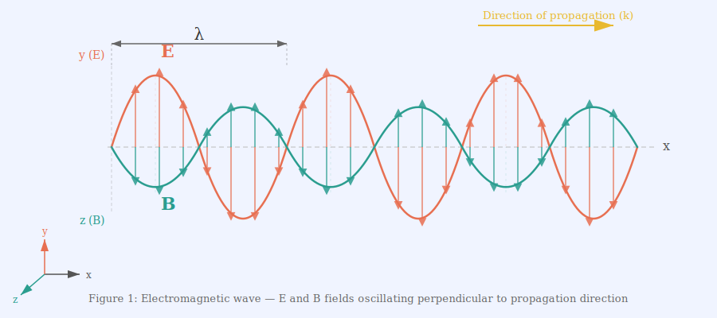
*Figure 1: Electromagnetic wave --- E and B fields oscillating perpendicular to the direction of propagation, with wavelength $\lambda$.*

## 1. Introduction and Motivation

The toroidal electron model proposes that electrons are electromagnetic energy trapped in a topologically non-trivial configuration characterized by Hopf linking number $H = \pm 1$ [1-4,36]. The electric charge emerges as a topological invariant—specifically, the linking number of E and B field lines in the Hopf fibration structure. This approach, building on work by Rañada [5], Williamson and van der Mark [2], and Hestenes [3,4], offers a geometric interpretation of fundamental particle properties.

This raises a fundamental question: **Are there other stable topological EM configurations with different properties?** In particular:

- Can $H = 0$ configurations (no electric charge) be stable?
- What other topological invariants might characterize stable EM structures?
- How do different representations of the conformal group $\mathrm{SO}(4,2)$ relate to particle properties?

If such structures exist, they would have mass (trapped EM energy) but no electric charge—matching the signature of dark matter. This paper develops the mathematical framework for such particles and explores their potential connection to the dark matter problem.

**The classical radiation problem.** An immediate objection is that classical electromagnetic field configurations in vacuum disperse: Derrick's theorem [50] forbids static, finite-energy solitons in linear field theories in three or more dimensions, and the linearity of Maxwell's equations means that any localized configuration --- knotted or not --- will radiate and spread. The resolution, developed in Section 4.3, is that stable topological solitons require *nonlinear* field equations. Two physically motivated extensions are identified: the Faddeev-Niemi model [28] (a nonlinear sigma model that provably admits stable knotted solitons with topological energy bounds) and the Euler-Heisenberg effective Lagrangian [43] (derived from QED, providing quartic self-interactions from vacuum polarization). The framework's dark matter candidates are solutions of these nonlinear theories, not of free Maxwell equations.

**Scope of the framework.** This paper restricts attention to topological structures in the electromagnetic field exclusively. In the Standard Model, electromagnetism is not a standalone theory---it is the unbroken $\mathrm{U}(1)_{\text{em}}$ remnant of the electroweak $\mathrm{SU}(2)_L \times \mathrm{U}(1)_Y$ gauge group. Above the electroweak scale ($T \gtrsim 100$ GeV), the distinction between electromagnetic and weak fields dissolves, and any topological freeze-out occurring above this temperature would involve the full electroweak gauge field, not just $\mathrm{U}(1)_{\text{em}}$. Furthermore, the non-abelian gauge fields $\mathrm{SU}(2)$ and $\mathrm{SU}(3)$ admit richer topological structures than the abelian $\mathrm{U}(1)$---instantons ($\pi_3(\mathrm{SU}(N)) = \mathbb{Z}$), monopoles, and sphalerons. If topological configurations of the EM field constitute dark matter, one must explain why analogous configurations of the weak and strong fields do not, or, if they do, what they correspond to.

The justification for the electromagnetic restriction is that the EM field is long-range (massless photon) while the weak and strong fields are short-range (massive $W/Z$, confined gluons), so only EM configurations can form macroscopic topological structures. At energies below $\sim 100$ GeV, the electroweak symmetry is broken, $W/Z$ bosons are massive, and the EM field is the only massless gauge field that can support long-range, topologically non-trivial configurations at scales $\gg \frac{\hbar}{M_W c} \sim 10^{-18}$ m. The present framework is therefore best understood as applying to the low-energy, broken-symmetry phase of the Standard Model.

---

## 2. Observational Evidence for Dark Matter

Before presenting our theoretical framework, we review the extensive observational evidence for dark matter. The evidence comes from multiple independent lines of observation spanning scales from individual galaxies to the entire observable universe.

### 2.1 Galaxy Rotation Curves

The first compelling evidence for dark matter came from observations of galaxy rotation curves [6,7]. In a galaxy where mass is concentrated in the visible disk and bulge, Newtonian dynamics predicts that orbital velocities should decrease with distance from the center following $v(r) \propto r^{-1/2}$ (Keplerian decline). Instead, observations consistently show flat rotation curves extending far beyond the visible disk.

> [!info] Key Observations
> - Vera Rubin's 1970s observations of Andromeda and other spirals showed flat rotation curves to large radii [7]
> - Persic, Salucci & Stel (1996) analyzed 967 spiral galaxies, finding universal rotation curve shapes requiring dark matter [8]
> - The implied mass-to-light ratios exceed 10-100 times what can be accounted for by luminous matter
> - Dark matter halos extend to at least 200 kpc from galaxy centers

### 2.2 Gravitational Lensing

Einstein's general relativity predicts that mass bends light—gravitational lensing. This provides a direct probe of total mass independent of its luminosity [9,10].

**Strong lensing:** Massive galaxy clusters create multiple images, arcs, and Einstein rings of background galaxies. The first strong gravitational lens was discovered in 1979 [11]. Mass reconstructions consistently require 5-10 times more mass than visible matter.

**Weak lensing:** Statistical analysis of small distortions in background galaxy shapes maps the total mass distribution. The Sloan Digital Sky Survey used weak lensing to confirm that galaxies, including the Milky Way, are more massive than previously thought, requiring dark matter halos extending to great distances [12].

> [!note] The Bullet Cluster (1E 0657-56)
> This collision of two galaxy clusters provides particularly compelling evidence [13]. X-ray observations (Chandra) show the baryonic matter (hot gas) concentrated at the collision center, slowed by electromagnetic friction. Gravitational lensing maps show the total mass distribution has separated from the gas, passing through the collision largely unaffected. This demonstrates:
>
> - Dark matter and baryonic matter have different interaction properties
> - Dark matter is weakly or non-interacting with itself
> - Modified gravity theories struggle to explain the spatial separation

### 2.3 Cosmic Microwave Background

The cosmic microwave background (CMB), remnant radiation from ~380,000 years after the Big Bang, contains temperature fluctuations that encode information about the early universe's composition [14,15].

The acoustic peaks in the CMB power spectrum arise from oscillations in the baryon-photon fluid before recombination. Dark matter, not coupled to photons, provides gravitational potential wells that:

- Enhance density perturbations leading to structure formation
- Modify the relative heights of acoustic peaks
- Affect the damping tail at small angular scales

Precision measurements from WMAP and Planck constrain the cosmic composition to approximately [15]:

> [!info] Cosmic Mass-Energy Budget
> Ordinary (baryonic) matter: 5%
> Dark matter: 26.8%
> Dark energy: 68.2%
>
> Dark matter is ~85% of all matter in the universe.

### 2.4 Large-Scale Structure Formation

Without dark matter, large-scale structure could not have formed by the present time [16]. Before recombination, baryons are coupled to photons and stream out of density perturbations. Dark matter, not coupled to radiation, can clump together first, providing gravitational potential wells for ordinary matter to fall into later.

N-body simulations incorporating cold dark matter successfully reproduce:

- The cosmic web of filaments and voids
- Galaxy clustering statistics
- Baryon acoustic oscillations (BAO) in galaxy distributions
- The abundance and properties of galaxy clusters

### 2.5 Velocity Dispersions in Galaxy Clusters

Fritz Zwicky first inferred dark matter in 1933 from velocity dispersions in the Coma cluster [17]. Applying the virial theorem to the observed velocities implied masses 10-100 times larger than the visible matter. Modern observations confirm:

- Galaxy velocities in clusters require dark matter halos
- X-ray emitting gas temperatures imply deep gravitational potentials
- Mass estimates from dynamics, X-rays, and lensing agree when dark matter is included

---

## 3. Current Dark Matter Candidates and Constraints

Despite overwhelming evidence for dark matter's existence, its particle nature remains unknown. Here we review the leading candidates and current experimental constraints.

### 3.1 WIMPs (Weakly Interacting Massive Particles)

WIMPs have been the leading candidate for decades due to the "WIMP miracle"—particles with weak-scale masses (GeV-TeV) and weak-force couplings naturally produce the observed relic abundance through thermal freeze-out [18,19].

> [!info] WIMP Properties
> - Predicted mass: 1 GeV - 10 TeV
> - Interactions: Weak nuclear force strength
> - Production mechanism: Thermal freeze-out in early universe
> - Theoretical motivation: Supersymmetry, extra dimensions
>
> **Experimental Status (2025):**
>
> - Direct detection experiments (XENON, LUX, PandaX, LUX-ZEPLIN) have pushed limits down by orders of magnitude
> - No confirmed detection across GeV-TeV mass range
> - Spin-independent cross-sections now below $10^{-47}$ cm$^2$ for 30 GeV WIMPs
> - Approaching the "neutrino floor" where solar and atmospheric neutrinos create irreducible backgrounds

### 3.2 Axions and Axion-Like Particles (ALPs)

The QCD axion was proposed to solve the strong CP problem [20]. As a bonus, axions produced via the misalignment mechanism can constitute cold dark matter [21].

| **Property** | **QCD Axion** | **ALPs** |
|:---:|:---:|:---:|
| Mass range | $10^{-6}$ - $10^{-3}$ eV | $10^{-22}$ eV - keV |
| Coupling | To photons, gluons | Model-dependent |
| Detection | Haloscopes (ADMX), helioscopes (CAST, IAXO) | Various |
| Status | ADMX excluding portions of parameter space | Active searches |

### 3.3 Sterile Neutrinos

Sterile neutrinos are hypothetical right-handed neutrinos that don't interact via the weak force [22]. A keV-scale sterile neutrino could be warm dark matter.

- **Mass range:** ~1-100 keV for warm dark matter
- **Detection:** X-ray line from radiative decay ($\nu_s \to \nu + \gamma$)
- **Status:** A tentative 3.5 keV line was reported but remains debated; Lyman-$\alpha$ forest data constrain free-streaming

### 3.4 Primordial Black Holes

Primordial black holes (PBHs) could form from density fluctuations in the early universe [23]. However:

- Microlensing surveys (MACHO, EROS, OGLE) exclude PBHs as all dark matter over broad mass ranges
- CMB constraints limit very light and very heavy PBHs
- A small window around $10^{-12}$ - $10^{-11}$ $M_\odot$ remains viable for subdominant contributions

### 3.5 Self-Interacting Dark Matter (SIDM)

SIDM posits dark matter self-scattering cross sections that thermalize halo centers [24], potentially resolving:

- **Core-cusp problem:** Simulations predict cuspy density profiles; observations often show cores
- **Diversity problem:** Observed rotation curve diversity exceeds simulation predictions
- **Too-big-to-fail problem:** Missing massive subhalos

### 3.6 Fuzzy (Ultra-Light) Dark Matter

A qualitatively distinct candidate is fuzzy dark matter (FDM), also called ultra-light axion dark matter, in which the dark matter particle is an ultra-light boson with mass $m \sim 10^{-22}$ eV. At such low masses the de Broglie wavelength becomes astrophysically large, $\lambda_{\text{dB}} = \frac{h}{mv} \sim 1$ kpc for typical galactic virial velocities $v \sim 200$ km/s. Below this scale the wave-like quantum pressure suppresses gravitational collapse, naturally producing kiloparsec-scale solitonic cores in the centers of dark matter halos and smoothing out the small-scale structure that CDM overproduces. Fuzzy dark matter therefore addresses the cusp-core and missing-satellite problems without invoking dark matter self-interactions.

Observational constraints on FDM come primarily from the Lyman-$\alpha$ forest, which probes the matter power spectrum at comoving scales of $\sim 1$--$100$ Mpc/$h$. Analyses by Irsic et al. (2017) [41] and subsequent work place a lower bound on the FDM mass of $m \gtrsim 2 \times 10^{-21}$ eV at 95% confidence, in tension with the mass range $m \sim 10^{-22}$ eV originally favored for core formation. Additional constraints from the UV luminosity function of high-redshift galaxies and from the heating of stellar streams in the Milky Way further tighten the viable parameter space, though a window near $m \sim 10^{-21}$ eV remains open. The FDM candidate is complementary to the topological EM framework proposed here: FDM operates at the opposite extreme of the mass spectrum ($10^{-22}$ eV versus keV--MeV) and produces qualitatively different astrophysical signatures (wave interference patterns in halos versus MeV gamma-ray annihilation lines).

### 3.7 Summary of Candidate Status

| **Candidate** | **Mass Range** | **Status** | **Key Constraints** |
|:---:|:---:|:---:|:---:|
| WIMPs | GeV - TeV | Strongly constrained | Direct detection null results |
| QCD Axions | $\mu$eV - meV | Viable, active searches | ADMX, astrophysical cooling |
| Sterile neutrinos | keV | Constrained | X-ray limits, Lyman-$\alpha$ |
| Fuzzy DM | $\sim 10^{-22}$ eV | Constrained | Lyman-$\alpha$, UV luminosity |
| PBHs | Various | Mostly excluded | Microlensing, CMB |
| **Topological EM (this work)** | **keV - MeV** | **Novel proposal** | **To be tested** |

### 3.8 Modified Gravity Alternatives

Any dark matter proposal should address the alternative hypothesis that the gravitational anomalies attributed to dark matter are instead explained by modifications to gravity itself. The leading modified gravity theories are:

**MOND (Modified Newtonian Dynamics).** Milgrom (1983) proposed that Newton's second law is modified below a critical acceleration $a_0 \approx 1.2 \times 10^{-10}$ m/s$^2$, with $F = m\mu(a/a_0)a$ where $\mu(x) \to 1$ for $x \gg 1$ and $\mu(x) \to x$ for $x \ll 1$. MOND successfully fits galaxy rotation curves with a *single* universal parameter $a_0$ and no dark matter. However, MOND struggles with:

- **Galaxy clusters:** MOND under-predicts the mass by a factor of $\sim 2$--$3$ in clusters, still requiring some dark component
- **The Bullet Cluster:** The spatial separation of lensing mass from baryonic gas is very difficult to explain without a non-baryonic matter component
- **CMB acoustic peaks:** MOND alone cannot reproduce the precise pattern of acoustic peaks without a relativistic extension; TeVeS (Bekenstein 2004) attempts this but introduces additional fields

**Emergent gravity.** Verlinde (2017) proposed that gravity is an emergent entropic force, with dark matter effects arising from the displacement of dark energy by baryonic matter. This reproduces MOND phenomenology at galaxy scales and makes predictions for cluster-scale lensing.

**Relevance to this work.** The topological EM framework makes predictions that are *complementary* to modified gravity: it proposes a specific particle with specific mass, annihilation products, and a multi-species spectrum. If MOND or emergent gravity is correct and no dark matter particles exist, then the framework's prediction of MeV gamma-ray annihilation lines would yield null results, providing a clean discriminant. Conversely, the framework's prediction of null results in nuclear recoil experiments is shared with MOND (which has no dark particles to detect), so direct detection alone cannot distinguish the two. The decisive test is indirect detection: an MeV gamma-ray line from the galactic center with morphology tracing the gravitational potential would confirm particle dark matter and rule out pure modified gravity.

---

## 4. Review: The Electron as H = 1 Hopf Structure

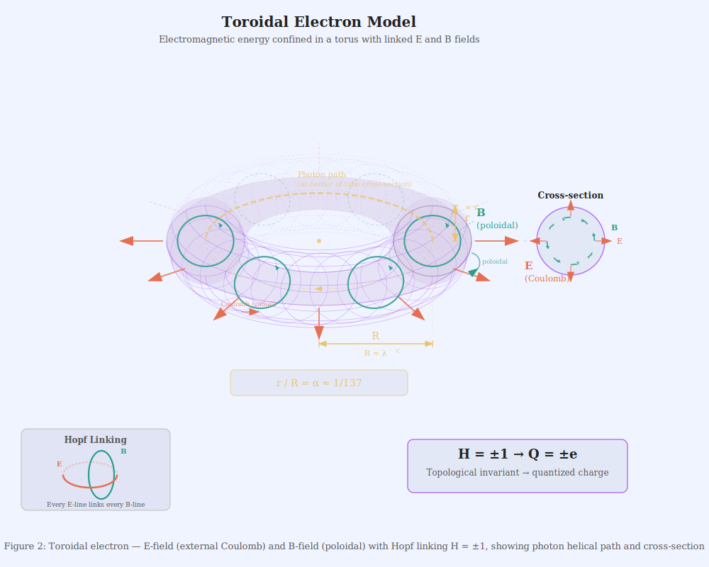
*Figure 2: Toroidal electron --- E-field (poloidal) and B-field (toroidal) with Hopf linking $H = \pm 1$. The linking of E and B field lines manifests as electric charge.*

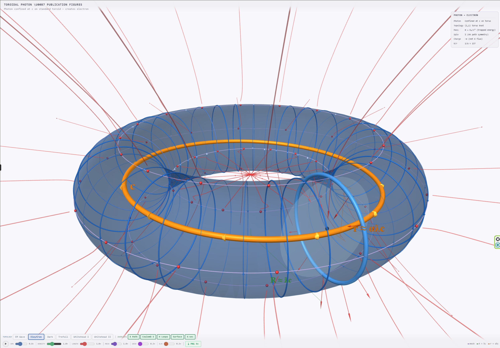
*Figure 2b: Three-dimensional rendering of the $H = 1$ toroidal electron. Blue mesh: toroidal B-field lines circulating on the torus surface. Orange ring: equatorial current loop. Red arrows: poloidal E-field lines radiating outward. Cyan loops: representative linked field-line pairs illustrating the Hopf linking ($H = 1$) that manifests as electric charge.*

### 4.1 The Hopf Fibration

The Hopf fibration is a mapping $\pi: S^3 \to S^2$ where each point in $S^2$ has a circle ($S^1$) as its preimage [25]. The key properties:

> [!info] Hopf Fibration Structure
> $$S^3 \xrightarrow{\pi} S^2$$
>
> Fiber: $S^1$ (circles)
> Base: $S^2$ (2-sphere)
> Total space: $S^3$ (3-sphere)

Any two distinct fibers (circles) are linked exactly once. The linking number is the **Hopf invariant** H.

### 4.2 Electron Configuration

In the toroidal electron model [1-4]:

- E-field emanates radially outward from the toroidal structure (Coulomb field)
- B-field forms rings around the waveguide cross-section (poloidal direction)
- Every E-line links every B-line exactly once
- The Hopf invariant $H = \pm 1$ manifests as electric charge $Q = \pm e$

> [!info] Hopf Invariant as Charge
> $$H = \frac{1}{4\pi^2}\int \mathbf{A} \cdot \mathbf{B} \, d^3x = \frac{Q}{e}$$
>
> Electron: $H = +1$, $Q = +e$
> Positron: $H = -1$, $Q = -e$
> Photon: $H = 0$, $Q = 0$ (trivial topology)

The integral $\int \mathbf{A} \cdot \mathbf{B} \, d^3x$ defining the magnetic helicity is, in general, gauge-dependent: under a gauge transformation $\mathbf{A} \to \mathbf{A} + \nabla\chi$, the integrand shifts by $\nabla\chi \cdot \mathbf{B} = \nabla \cdot (\chi \mathbf{B})$ (since $\nabla \cdot \mathbf{B} = 0$), which integrates to a boundary term $\oint \chi \, \mathbf{B} \cdot \hat{n} \, dS$. This boundary term vanishes if and only if $\mathbf{B} \cdot \hat{n} = 0$ on the bounding surface --- that is, if no magnetic flux penetrates the boundary of the integration volume. For the toroidal configurations considered here, the magnetic field is entirely confined within a compact region of space (the soliton core), so on any surface enclosing the configuration one has $\mathbf{B} \cdot \hat{n} = 0$, and the magnetic helicity is gauge-invariant. This condition is automatically satisfied for any finite-energy field configuration whose field strength decays sufficiently rapidly at infinity, which includes all the knotted solitons discussed in this paper. The gauge invariance of the magnetic helicity integral under these conditions was established by Moffatt (1969) and underpins its use as a topological invariant in magnetohydrodynamics and field theory.

An important distinction must be made regarding the photon. The photon is an $H = 0$ configuration, yet it is massless and propagating rather than massive and localized. The dark matter candidates proposed in this paper are also $H = 0$, so one must explain why they are not simply photons. The difference is topological: the photon corresponds to the *trivially* knotted $H = 0$ sector (unknotted, unlinked field lines that propagate to null infinity), whereas dark matter candidates have $H = 0$ but non-trivial knot or link topology (trefoil, Whitehead link, etc.) that prevents the field from dispersing. In the Faddeev-Niemi model, the photon is a small-amplitude perturbation around the trivial vacuum $\mathbf{n} = \text{const}$, while the knotted solitons are large-amplitude, topologically non-trivial field configurations in distinct topological sectors. The photon can be continuously deformed to zero field; the trefoil cannot. This distinction --- trivial versus non-trivial $H = 0$ topology --- is the reason that not all neutral EM configurations are dark matter.

The identification $H = Q/e$ is, more precisely, a postulate of the toroidal electron model rather than a derived result. In Ranada's construction [1,5], the EM field is built from complex scalar maps $\phi, \theta: S^3 \to S^2$, and the Hopf invariant of $\phi$ equals the linking number of $\mathbf{B}$-field lines. The motivation for identifying $H$ with charge in units of $e$ rests on three structural parallels: (i) $H \in \mathbb{Z}$ matches charge quantization; (ii) $H$ is conserved under smooth deformations, matching charge conservation; (iii) $H = 0$ for radiation fields, matching photon neutrality. However, the proportionality constant---why $Q = He$ rather than $Q = H \times (\text{some other unit})$---is an input of the model, not an output. A complete derivation would require demonstrating that the far-field of an $H = 1$ soliton in the nonlinear theory matches the $\frac{e}{4\pi\epsilon_0 r^2}\hat{r}$ Coulomb field at distances $r \gg \lambda_C$. This remains an open problem in the toroidal electron program, and the entire dark matter framework inherits this foundational uncertainty.

The electron's geometric parameters emerge naturally [2]:

- **Major radius** $R \approx \lambda_C = \frac{\hbar}{m_e c} = 3.86 \times 10^{-13}$ m (Compton scale)
- **Minor radius** $r \approx r_e = \alpha\lambda_C = 2.82 \times 10^{-15}$ m (classical electron radius)
- **Aspect ratio:** $\frac{r}{R} = \alpha \approx \frac{1}{137}$ (fine structure constant)

An apparent conflict exists between the toroidal model's spatial extent and the results of high-energy scattering experiments. The Standard Model treats the electron as a structureless point particle, and collider experiments at LEP and the LHC have probed the electron's charge distribution down to scales of $\sim 10^{-18}$ m without finding any deviation from point-like behavior. The toroidal model, by contrast, assigns the electron a major radius $R \approx \lambda_C \approx 4 \times 10^{-13}$ m, five orders of magnitude larger than the experimental bound on "electron size." The resolution is that these two notions of size measure different things. Scattering experiments probe the spatial distribution of the electromagnetic coupling --- the charge form factor $F(q^2)$ --- which for an $H = 1$ Hopf configuration is dominated by the topological invariant (the net flux through any enclosing surface) rather than by the detailed spatial extent of the field. At momentum transfers $q \gg \frac{1}{R}$, the form factor of a toroidal configuration with total charge $e$ approaches that of a point charge, because the Gauss law integral $\oint \mathbf{E} \cdot d\mathbf{A} = \frac{e}{\epsilon_0}$ is independent of the internal field geometry. The "size" $R \sim \lambda_C$ is not the radius of a hard sphere but the spatial scale over which the electromagnetic field energy is distributed. This is analogous to the proton, whose charge radius ($\sim 0.84$ fm) describes the spatial extent of its quark-gluon structure, while its point-like parton constituents are revealed only at high $q^2$. For the electron, the toroidal field configuration produces a Coulomb field $\frac{e}{4\pi\epsilon_0 r^2}\hat{r}$ at distances $r \gg R$ that is indistinguishable from a point source, consistent with all existing scattering data.

### 4.3 The Dynamical Theory: Beyond Maxwell

A critical question for this entire framework is: **what field equations govern these topological EM configurations?** Standard linear Maxwell equations in vacuum do *not* support stable soliton solutions. This is a consequence of Derrick's theorem [50], which shows that in three or more spatial dimensions, static finite-energy solutions of scalar field theories with standard kinetic terms are unstable to rescaling. More generally, the linearity of Maxwell's equations means that any localized field configuration in vacuum will disperse — knotted or not. This is not a technicality but a fundamental obstacle.

To obtain stable knotted solitons, one must go beyond linear Maxwell theory. Two physically motivated nonlinear extensions provide the necessary self-interaction:

**The Faddeev-Niemi model.** Faddeev and Niemi [28] proposed a nonlinear sigma model in which the fundamental field is a unit 3-vector $\mathbf{n}: \mathbb{R}^{3,1} \to S^2$, with Lagrangian density:

$$\mathcal{L}_{FN} = \frac{1}{4g^2}(\partial_\mu \mathbf{n} \times \partial_\nu \mathbf{n})^2 \tag{4.3}$$

where $g$ is a coupling constant. This model admits stable knotted soliton solutions classified by the Hopf invariant $Q_H \in \pi_3(S^2) = \mathbb{Z}$. The connection to electromagnetism arises because the composite field $F_{\mu\nu} \sim \mathbf{n} \cdot (\partial_\mu \mathbf{n} \times \partial_\nu \mathbf{n})$ satisfies an effective gauge field equation, and the unit vector field $\mathbf{n}$ can be interpreted as encoding the direction of the electromagnetic field in an appropriate internal space. The quartic derivative term in $\mathcal{L}_{FN}$ provides the repulsive self-interaction needed to stabilize solitons against collapse (balancing the attractive gradient energy), which is precisely what linear Maxwell theory lacks.

**The Euler-Heisenberg effective Lagrangian.** Quantum electrodynamics provides a physical mechanism for nonlinear corrections to Maxwell's equations through vacuum polarization. The one-loop effective Lagrangian, derived by Heisenberg and Euler [43], is:

$$\mathcal{L}_{EH} = -\frac{1}{4}F_{\mu\nu}F^{\mu\nu} + \frac{\alpha^2}{90 m_e^4}\left[(F_{\mu\nu}F^{\mu\nu})^2 + \frac{7}{4}(F_{\mu\nu}\tilde{F}^{\mu\nu})^2\right] \tag{4.4}$$

where $\alpha$ is the fine structure constant, $m_e$ the electron mass (in natural units), and $\tilde{F}^{\mu\nu} = \frac{1}{2}\varepsilon^{\mu\nu\rho\sigma}F_{\rho\sigma}$ is the dual field strength tensor. The nonlinear terms — which are quartic in the field strength — become significant when the electric or magnetic field approaches the Schwinger critical field $E_s = m_e^2 c^3 / (e\hbar) \approx 1.3 \times 10^{18}$ V/m. These terms encode the physics of virtual electron-positron pair creation and provide exactly the type of self-interaction that can, in principle, stabilize solitonic field configurations.

**The energy bound.** For solitons in the Faddeev-Niemi model, Vakulenko and Kapitanski established a rigorous lower bound on the energy:

$$E \geq C\,|Q_H|^{3/4} \tag{4.5}$$

where $C > 0$ is a constant depending on the coupling $g$ and $Q_H$ is the Hopf charge. This bound guarantees that configurations with $Q_H \neq 0$ cannot have zero energy and therefore cannot be continuously deformed to the vacuum. For $H = 0$ configurations (the dark matter candidates of this paper), this particular bound is trivially satisfied; their stability must instead rely on other topological invariants (knot type, Milnor invariants) as discussed in Section 6. Importantly, for $Q_H = 0$ the Derrick scaling analysis is more severe: a knotted $Q_H = 0$ configuration could in principle shrink or expand without a topological energy barrier. Whether knot type alone provides a positive energy lower bound is an open mathematical conjecture.

**Departure from pure Maxwell theory.** The framework presented in this paper requires a departure from standard linear Maxwell electrodynamics. The topological EM configurations proposed as dark matter candidates are not solutions of the free Maxwell equations---they are solutions (or conjectured solutions) of nonlinear extensions such as the Faddeev-Niemi model or the Euler-Heisenberg effective theory. The claim is not that dark matter arises within classical electromagnetism, but rather that the topological structure of electromagnetic fields, when governed by physically motivated nonlinear dynamics, admits stable configurations beyond the familiar photon and charged-particle sectors. The Euler-Heisenberg Lagrangian is derived from QED and is well-established physics; the Faddeev-Niemi model is a theoretical proposal whose connection to fundamental electromagnetism remains under investigation.

**Relationship between the Faddeev-Niemi model and physical electromagnetism.** This paper uses results from the Faddeev-Niemi model (knotted soliton existence, energy-ropelength scaling, Vakulenko-Kapitanski bound) as though they apply to physical electromagnetic fields. This extrapolation requires careful justification. The Faddeev-Niemi field is a unit vector $\mathbf{n}: \mathbb{R}^3 \to S^2$, a nonlinear sigma model variable, while the electromagnetic field is a $\mathrm{U}(1)$ gauge field $A_\mu$ with field strength $F_{\mu\nu}$. The identification $F_{\mu\nu} \sim \mathbf{n} \cdot (\partial_\mu \mathbf{n} \times \partial_\nu \mathbf{n})$ [28] provides a map from Faddeev-Niemi configurations to EM-like fields, but this map is: (a) many-to-one (different $\mathbf{n}$ configurations can give the same $F_{\mu\nu}$), (b) not obviously invertible (a given EM field may not arise from any $\mathbf{n}$), and (c) not shown to preserve the energy functional or equations of motion. In particular, the Faddeev-Niemi energy (Eq. 9.1) is *not* the electromagnetic energy $\frac{1}{2}\int(\epsilon_0 E^2 + \frac{B^2}{\mu_0})\,d^3x$, and there is no proof that minimizers of one functional correspond to minimizers of the other.

Similarly, the Euler-Heisenberg Lagrangian (Eq. 4.4) includes nonlinear corrections to Maxwell theory, but these corrections are perturbatively small ($\sim \alpha^2 F^4/m_e^4$) and become significant only at the Schwinger field $E_s \approx 1.3 \times 10^{18}$ V/m. Whether these perturbative corrections are sufficient to stabilize macroscopic knotted solitons---as opposed to the strong nonlinearity of the Faddeev-Niemi model---has not been demonstrated. The present status is therefore as follows: knotted solitons exist in the Faddeev-Niemi model, they may exist in strongly nonlinear EM theories, and whether they exist in the physical QED vacuum at accessible energy scales remains an open question.

### 4.4 Topological Conservation Law

The Faddeev-Niemi Lagrangian (Eq. 4.3) admits a topological conservation law that is central to the stability of knotted configurations and to the entire framework of this paper.

> [!abstract] Theorem 1 (Hopf Charge Conservation)
> Let $\mathbf{n}(x, t): \mathbb{R}^{3,1} \to S^2$ be a smooth solution of the Faddeev-Niemi field equations with finite energy, satisfying the boundary condition $\mathbf{n} \to \mathbf{n}_0$ (constant) as $|\mathbf{x}| \to \infty$. Then the Hopf charge
> $$Q_H[\mathbf{n}] = \frac{1}{4\pi^2}\int_{\mathbb{R}^3} F \wedge A \tag{4.7}$$
> where $F = \mathbf{n}^*\omega_{S^2}$ is the pullback of the area form on $S^2$ and $A$ is any 1-form satisfying $dA = F$, is exactly conserved under the time evolution: $\frac{d}{dt}Q_H = 0$.

**Proof.** The boundary condition $\mathbf{n}(\mathbf{x}, t) \to \mathbf{n}_0$ as $|\mathbf{x}| \to \infty$ allows the one-point compactification $\mathbb{R}^3 \cup \{\infty\} \cong S^3$. At each time $t$, the field configuration defines a smooth map $\mathbf{n}(\cdot, t): S^3 \to S^2$, whose homotopy class lies in $\pi_3(S^2) \cong \mathbb{Z}$.

The Hopf charge $Q_H$ is the integer labeling this homotopy class. Explicitly, $Q_H$ equals the linking number of the preimages $\mathbf{n}^{-1}(\mathbf{p})$ and $\mathbf{n}^{-1}(\mathbf{q})$ for any two regular values $\mathbf{p}, \mathbf{q} \in S^2$ — this is the Whitehead integral formula [63].

Since the field equations are second-order in time, smooth initial data produce smooth solutions (at least locally). The time evolution $t \mapsto \mathbf{n}(\cdot, t)$ defines a continuous path in the space of maps $S^3 \to S^2$. The Hopf charge, being a continuous function from this path to $\mathbb{Z}$, must be constant:

$$Q_H[\mathbf{n}(\cdot, t_1)] = Q_H[\mathbf{n}(\cdot, t_2)] \quad \forall\, t_1, t_2 \tag{4.8}$$

This conservation is **topological**, not Noetherian: it does not arise from a continuous symmetry of the Lagrangian via Noether's theorem, but from the discrete structure of $\pi_3(S^2)$. Consequently, $Q_H$ is conserved exactly — it cannot be violated by perturbative corrections, quantum effects (to any order in perturbation theory), or thermal fluctuations. Only non-perturbative topology-changing transitions (analogous to instantons or sphalerons) can alter $Q_H$, and such processes are exponentially suppressed for configurations well below the energy barrier (Section 6.1). $\square$

> [!note] Significance for Dark Matter Stability
> Theorem 1 is the mathematical foundation for the stability of topological dark matter. A dark matter particle with $Q_H = 0$ but non-trivial knot topology cannot decay to the vacuum ($Q_H = 0$, trivial topology) via any smooth, finite-energy field evolution that preserves the Hopf charge. Decay would require either: (a) a topology-changing transition that passes through a singular (infinite-energy) intermediate configuration, which is classically forbidden; or (b) quantum tunneling through the energy barrier, which is exponentially suppressed (Section 6.1). This is the precise sense in which knotted dark matter is "topologically protected."

---

## 5. Classification of Topological EM Configurations

To find stable $H = 0$ structures, we need to understand what topological invariants can characterize EM field configurations beyond the Hopf invariant.

### 5.1 Relevant Homotopy Groups

Electromagnetic field configurations in $\mathbb{R}^3$ (with appropriate boundary conditions) are classified by:

> [!info] Topological Classification
> $\pi_3(S^2) = \mathbb{Z} \to$ Hopf invariant (electric charge)
> $\pi_3(S^3) = \mathbb{Z} \to$ Winding number (instanton number)
> $\pi_1(\text{configurations}) \to$ Knot/link invariants

### 5.2 Beyond Hopf: Knot Invariants

While the Hopf invariant captures *linking* between E and B field lines, it doesn't capture the *knotting* of individual field lines. Key knot invariants include:

| **Invariant** | **Symbol** | **Physical Meaning** | **Measurable?** |
|:---:|:---:|:---:|:---:|
| Hopf linking number | H | Electric charge | Yes (charge) |
| Self-linking number | SL | Helicity/chirality | Magnetic helicity |
| Writhe | Wr | Coiling of field lines | Indirect |
| Twist | Tw | Internal rotation | Indirect |
| Knot polynomial (Jones, etc.) | V(t) | Knot type classification | Unknown |

### 5.3 The Calugareanu-White Theorem

For a ribbon (which models a bundle of field lines with finite thickness), there's a fundamental relation [26]:

> [!info] Calugareanu-White Theorem
> $$\text{Lk} = \text{Tw} + \text{Wr}$$
>
> Lk: Linking number (topological, integer)
> Tw: Twist (geometric, continuous)
> Wr: Writhe (geometric, continuous)

This shows that even when $\text{Lk} = 0$ (no linking = no charge), we can have non-zero Tw and Wr that cancel. Such configurations could be stable but chargeless.

### 5.4 Why Field Lines Are Closed Curves

The preceding discussion implicitly assumes that electromagnetic field lines form closed curves --- a prerequisite for defining knot and link invariants. This assumption requires justification, since generic electromagnetic field lines in $\mathbb{R}^3$ are not closed: they can extend to infinity, fill surfaces ergodically, or exhibit chaotic behavior, as is well known in the theory of divergence-free vector fields. The configurations considered in this paper are special precisely because they are constructed to guarantee closure.

In the Ranada-Hopf construction [1,5], the electromagnetic field is built from a pair of complex scalar maps $\phi, \theta: S^3 \to S^1$, where the domain is the one-point compactification $\mathbb{R}^3 \cup \{\infty\} \cong S^3$. The preimage of any regular value under $\phi$ (or $\theta$) is a closed circle in $S^3$ --- this is a consequence of the Hopf fibration, in which every fiber is a great circle of $S^3$. The magnetic field lines of the resulting EM configuration are exactly these preimage circles. By construction, every field line is a closed curve, and any two field lines are linked exactly once (for the standard Hopf map with $H = 1$). The closure of field lines is therefore not an assumption but a theorem for configurations derived from the Hopf fibration on compactified space.

For the knotted configurations that generalize the Hopf structure --- trefoils, figure-eights, and higher knots --- the relevant framework is the Faddeev-Niemi model, in which the fundamental field is a unit vector $\mathbf{n}: \mathbb{R}^3 \to S^2$ with boundary condition $\mathbf{n}(\mathbf{x}) \to \mathbf{n}_0$ as $|\mathbf{x}| \to \infty$. This boundary condition again compactifies the domain to $S^3$, and the preimages of regular values on $S^2$ are closed curves in $S^3$ by Sard's theorem and the compactness of $S^3$. The knot type of these preimage curves is determined by the homotopy class of the map $\mathbf{n}$, and the winding structure of $\mathbf{n}$ guarantees that the field lines are closed by construction. In summary, the closure of field lines is ensured by the topological structure of the map on the compactified domain, not by any special fine-tuning, and it is this closure that makes knot-theoretic classification well-defined.

### 5.5 Photon Versus Dark Matter: The Trivial and Non-Trivial $H = 0$ Sectors

Since both the photon and the dark matter candidates of this paper have $H = 0$, the question naturally arises: what distinguishes an $H = 0$ photon from $H = 0$ dark matter? The answer lies in the distinction between topologically trivial and topologically non-trivial configurations within the $H = 0$ sector. The photon corresponds to a small-amplitude, propagating perturbation of the electromagnetic vacuum. Its field configuration is topologically trivial: the field lines extend to infinity (or, in the compactified picture, pass through the point at infinity) and the map $\mathbf{n}: S^3 \to S^2$ is contractible to the constant map $\mathbf{n} = \mathbf{n}_0$. In the language of homotopy theory, the photon lives in the trivial sector of $\pi_3(S^2)$ and carries no knot or link invariants whatsoever. The field configuration can be continuously deformed to the vacuum (zero field) without encountering any topological obstruction.

The dark matter candidates, by contrast, inhabit topologically non-trivial sectors: the trefoil soliton corresponds to a map $\mathbf{n}$ whose preimage curves are knotted as trefoils, and no continuous deformation can unknot them without changing the homotopy class. The Whitehead link configuration has preimage curves that are linked in a manner detected by Milnor invariants even though the Hopf linking number vanishes. These configurations cannot be continuously deformed to the vacuum; they are separated from the trivial sector by finite energy barriers in the Faddeev-Niemi energy landscape. The photon, being contractible, carries no such protection and propagates freely as a massless excitation. This distinction --- contractible versus non-contractible within the $H = 0$ sector --- is the fundamental reason that the photon is massless and propagating while the knotted $H = 0$ configurations are massive and localized.

### 5.6 Lorentz Invariance of Knot Classification

A subtlety that has not been addressed in the literature on knotted EM solitons is whether the knot classification is Lorentz-invariant. The classification of field-line topology (trefoil, figure-eight, etc.) is defined for curves in $\mathbb{R}^3$ at a fixed time $t$. Under a Lorentz boost, the simultaneity surface changes, and the spatial curves traced by field lines on the new constant-$t'$ slice are, in general, different from those on the original slice. One must therefore ask: can a Lorentz boost change the knot type of a field-line configuration?

For topological invariants defined as integrals over all of space --- such as the Hopf invariant $H = \frac{1}{4\pi^2}\int \mathbf{A} \cdot \mathbf{B}\, d^3x$ --- the answer is no: $H$ can be rewritten as a Lorentz-invariant spacetime integral involving $F_{\mu\nu}\tilde{F}^{\mu\nu}$, which is a Lorentz scalar density. However, the knot type of individual field lines is a more refined invariant than $H$, and its Lorentz transformation properties are less obvious. In the Faddeev-Niemi model, the topological charge $Q_H \in \pi_3(S^2)$ is a homotopy invariant of the map $\mathbf{n}: S^3 \to S^2$ and is preserved under any continuous deformation of the field, including those induced by Lorentz boosts (which act smoothly on the field configuration). The knot type of the preimage curves is similarly preserved under smooth deformations by the isotopy invariance of knots. Thus the classification is expected to be Lorentz-invariant in the Faddeev-Niemi framework, though this argument applies only to the topological sector label, not to the detailed geometric shape of the soliton. A boosted trefoil soliton is Lorentz-contracted and time-dilated but remains topologically a trefoil. A rigorous proof that the knot type defined on spatial slices is independent of the slicing would require showing that the topology of field-line curves is preserved under the smooth deformation of the spatial hypersurface --- a result that is plausible but has not been formally established in the mathematical physics literature.

---

## 6. H = 0 Stable Structures: Mathematical Analysis

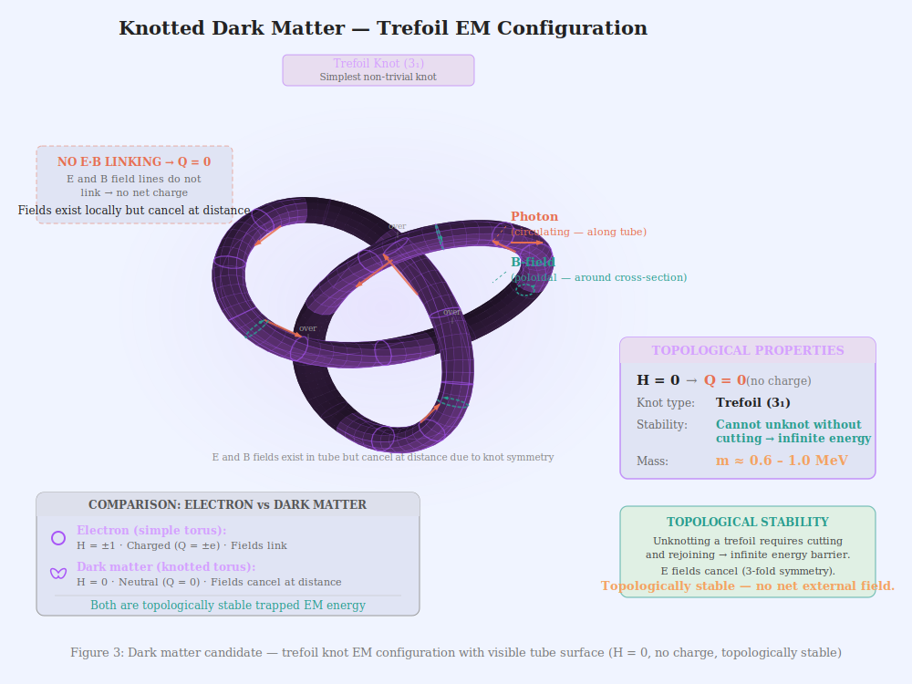
*Figure 3: Dark matter candidate --- trefoil knot EM configuration ($H = 0$, no charge, topologically stable). Compare with the simple torus of the electron in Figure 2.*

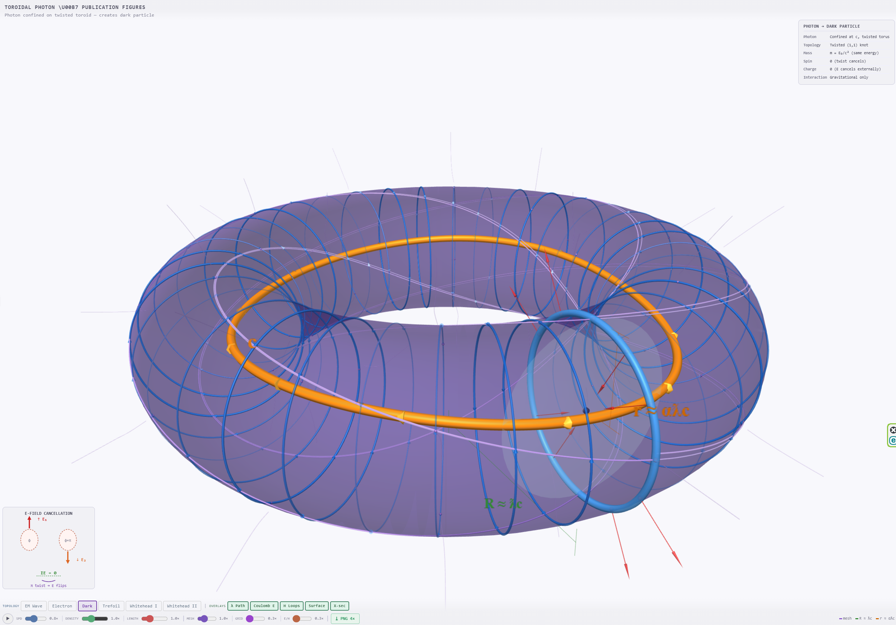
*Figure 3b: Three-dimensional rendering of an $H = 0$ dark matter candidate (unknotted torus with field cancellation). Purple mesh: toroidal field lines on the torus surface. Orange ring: equatorial loop. Unlike the electron (Figure 2b), the external E-field lines are almost entirely absent --- the Hopf linking number vanishes, producing no net electric charge. The inset diagram (lower left) illustrates the $H = 0$ field-line cancellation mechanism.*

### 6.1 Type I: Knotted Field Lines (Non-trivial $\pi_1$)

Consider configurations where field lines form *knots* rather than simple circles. The simplest non-trivial knot is the trefoil ($3_1$).

> [!abstract] Conjecture (Knotted Configuration Stability)
> Let $\gamma$ be a knotted field line configuration with knot type K in a nonlinear field theory admitting soliton solutions (such as the Faddeev-Niemi model of Section 4.3). If K is a prime knot (not the unknot), then $\gamma$ cannot be continuously deformed to the trivial configuration without passing through singular (infinite energy) states.

**Why stability is expected.** The argument for stability rests on two pillars. First, topological: the topological charge $Q_H$ (Hopf invariant) is a conserved quantity in the Faddeev-Niemi model, and by the Vakulenko-Kapitanski energy bound $E \geq C|Q_H|^{3/4}$, configurations with $Q_H \neq 0$ cannot have zero energy and therefore cannot decay to the vacuum. For $H = 0$ configurations with non-trivial knot type, an analogous argument applies: the knot invariant (e.g., the Jones polynomial or the knot genus) is a topological invariant that cannot change under continuous deformation, and the energy of a knotted soliton is bounded below by a function of the knot complexity. Numerical simulations of the Faddeev-Niemi model [28] confirm that knotted solitons with non-trivial topology are local energy minima — they cannot reduce their energy without first passing through higher-energy configurations that would require topology change.

**Radiation.** In the Faddeev-Niemi model, knotted solitons are exact stationary solutions of the nonlinear field equations and do not radiate. In the Euler-Heisenberg effective theory (Eq. 4.4), where the nonlinearity is a perturbative correction to Maxwell, the configuration is more properly described as metastable — it radiates at an exponentially suppressed rate, with a lifetime that can be estimated to exceed the age of the universe for configurations at the Compton scale. The key point is that the nonlinear self-interaction provides a confining potential that counteracts the dispersive tendency of the linear theory.

**Magnetic reconnection.** In standard Maxwell electrodynamics, magnetic reconnection can change field line topology---this is a well-known process in plasma physics and astrophysics. The stability argument presented here relies on the nonlinear theory (Faddeev-Niemi or Euler-Heisenberg) preventing topology-changing reconnection events. In the Faddeev-Niemi model, the topological charge is exactly conserved by the dynamics, so reconnection that would change the knot type is dynamically forbidden. In the Euler-Heisenberg approximation, reconnection is suppressed but not absolutely forbidden, contributing to the metastability rather than absolute stability of the configurations.

**Quantum tunneling stability.** The stability arguments above are purely classical: they demonstrate that continuous deformations cannot unknot the field configuration. In quantum mechanics, however, topology-changing transitions can occur via tunneling through the energy barrier, even when classically forbidden. The relevant quantity is the Euclidean action $S_E$ of the instanton (bounce solution) mediating the transition from the knotted configuration to the topologically trivial vacuum:

$$\Gamma_{\text{tunnel}} \sim \omega_0 \, e^{-S_E/\hbar} \tag{6.1a}$$

where $\omega_0$ is a prefactor of order the inverse soliton size ($\sim mc^2/\hbar$). The tunneling rate is negligible if $S_E/\hbar \gg 1$.

For a soliton of mass $m$ and size $R \sim \frac{\hbar}{mc}$, the height of the topological energy barrier is of order $\Delta E \sim mc^2$ (the soliton must be disrupted to change topology), and the "width" of the barrier in field space is of order $\Delta\phi \sim 1$ (the field must traverse an $O(1)$ range on $S^2$ to effect a topology change). The WKB estimate of the Euclidean action gives:

$$S_E \sim \frac{\Delta E \times R}{c} \sim \frac{mc^2 \times \frac{\hbar}{mc}}{c} = \hbar \tag{6.1b}$$

This yields $S_E/\hbar \sim 1$, which is not large enough to guarantee stability. This is a serious concern: it suggests that quantum tunneling could destroy the topological protection on timescales of order the inverse soliton frequency $\sim \frac{\hbar}{mc^2} \sim 10^{-21}$ s for MeV-mass particles.

A more careful analysis, analogous to the computation of sphaleron tunneling rates in electroweak theory, would compute the full bounce action $S_E$ by finding the saddle-point field configuration that interpolates between the knotted and unknotted vacua. In the electroweak case, the sphaleron action is $S_{\text{sph}} \sim \frac{4\pi v}{g} \sim \frac{4\pi}{\alpha_W} \sim 150$, which suppresses the rate to $\Gamma \sim e^{-150} \sim 10^{-65}$. By analogy, in the Faddeev-Niemi model, the instanton action might be $S_E \sim \frac{4\pi}{g^2_{\text{FN}}}$ where $g_{\text{FN}}$ is the Faddeev-Niemi coupling. If $g_{\text{FN}} \sim \alpha \sim \frac{1}{137}$, then $S_E \sim 4\pi \times 137^2 \sim 2.4 \times 10^5$, giving a tunneling rate of order $e^{-10^5}$---absolutely negligible.

However, the Faddeev-Niemi coupling $g_{\text{FN}}$ is not known from first principles. If $g_{\text{FN}} \sim O(1)$ (strong coupling), then $S_E \sim 4\pi \sim 12.6$, and the tunneling rate is $\Gamma \sim e^{-12.6} \sim 3 \times 10^{-6}$ per natural time unit, implying a lifetime of $\sim 10^{6} \times \frac{\hbar}{mc^2} \sim 10^{-15}$ s---far too short for cosmological dark matter. The quantum stability of knotted solitons therefore depends critically on the value of the Faddeev-Niemi coupling constant, which is currently unknown. This is arguably the most important open theoretical question in the framework.

**Why the naive WKB estimate is likely too pessimistic.** The estimate $S_E/\hbar \sim 1$ obtained in Eq. (6.1b) treats the topology-changing transition as a one-dimensional barrier crossing with height $\Delta E \sim mc^2$ and width $R \sim \frac{\hbar}{mc}$. This significantly underestimates the true bounce action for three reasons.

First, the actual tunneling path lies in an infinite-dimensional field configuration space, not in one dimension. The field $\mathbf{n}(\mathbf{x})$ must change its topology *simultaneously across all of space* to unknot --- the transition cannot proceed by local changes at a single point. The bounce solution is a four-dimensional field configuration $\mathbf{n}(\mathbf{x}, \tau)$ satisfying the Euclidean equations of motion, and the action integral $S_E = \int d^4x \, \mathcal{L}_E[\mathbf{n}]$ receives positive contributions from gradient terms at every point. The multi-dimensional nature of field space generically enhances the action above the one-dimensional estimate.

Second, the precedent from electroweak theory is instructive. The electroweak sphaleron has a barrier height $E_{\text{sph}} \approx \frac{4\pi v}{g} \approx 10$ TeV, and the soliton size is $R_{\text{sph}} \sim \frac{1}{gv} \sim 10^{-18}$ m. The naive 1D WKB gives $S_E^{\text{naive}} \sim \frac{E_{\text{sph}} R_{\text{sph}}}{c} \sim 10$, yet the actual bounce action computed by Klinkhamer and Manton is $S_E \sim \frac{4\pi}{g^2} \sim 150$ --- a factor of $\sim 15$ larger. The enhancement arises precisely because the bounce must traverse a high-dimensional field-space saddle point, with the gradient energy contributions dominating over the naive potential-times-width estimate.

Third, the relevant comparison for the Faddeev-Niemi model is with Skyrmion stability in nuclear physics. Skyrmions are topological solitons in the nonlinear sigma model $\mathrm{SU}(2) \to \mathrm{SU}(2)$ classified by $\pi_3(\mathrm{SU}(2)) = \mathbb{Z}$, closely analogous to Faddeev-Niemi solitons classified by $\pi_3(S^2) = \mathbb{Z}$. Quantized Skyrmions are identified with baryons (protons, neutrons), and the proton is empirically stable to better than $10^{34}$ years. While the analogy is not exact --- the Skyrme model has different dimensionality and coupling structure --- it demonstrates that topological solitons in nonlinear sigma models can be extraordinarily stable in nature, far beyond what a naive WKB estimate would predict. The lesson is that the full non-perturbative quantum dynamics of topological solitons typically preserves topological charges much more effectively than semiclassical estimates suggest.

The resolution of the quantum stability question ultimately requires computing the full bounce action for topology-changing transitions in the Faddeev-Niemi model, a numerical calculation that has not yet been performed. Until this is done, the stability of knotted solitons remains an open question, but the considerations above suggest that the naive $S_E/\hbar \sim 1$ estimate is likely a significant underestimate of the true tunneling action.

For EM fields:

> [!info] Knotted EM Configuration
> **Field Structure:**
> B-field lines: Form trefoil knots
> E-field lines: Form closed curves threading the knots
>
> **Invariants:**
> Hopf invariant: $H = 0$ (no E-B linking)
> Knot invariant: $K = 3_1$ (trefoil) $\neq$ unknot
> Energy: $E = \int \frac{\varepsilon_0 E^2 + \frac{B^2}{\mu_0}}{2} \, d^3x > 0$

**Properties of knotted dark matter:**

- Mass: Non-zero (trapped EM energy)
- Electric charge: Zero ($H = 0$)
- Transverse magnetic dipole: Zero by $C_3$ symmetry; axial component $\mu_z$ not symmetry-forbidden for chiral knots
- Stability: Topological (cannot unknot without infinite energy)

**Spin and statistics.** The list above omits a critical property: what is the spin of these dark matter particles? The spin determines the quantum statistics (Bose-Einstein vs. Fermi-Dirac), which in turn affects the cosmological abundance calculation, the free-streaming length, and the allowed phase-space density in galactic halos (the Tremaine-Gunn bound).

In the toroidal electron model, the electron's spin-$\frac{1}{2}$ arises from the internal circulation of the EM field around the torus at the speed of light, producing an angular momentum $J = \frac{\hbar}{2}$ [2,3]. For a knotted soliton of mass $m$ and characteristic radius $R \sim \frac{\hbar}{mc}$, the circulating EM energy carries angular momentum:

$$J \sim \frac{E}{c} \times R = \frac{mc^2}{c} \times \frac{\hbar}{mc} = \hbar \tag{6.1c}$$

This gives $J \sim \hbar$, suggesting spin-1 (bosonic) for the simplest knotted configurations. More precisely, the spin depends on the internal structure of the knot---different knot types may carry different angular momenta depending on the number and orientation of their internal circulation modes. Several considerations are relevant:

- **Trefoil ($3_1$):** The trefoil has $C_3$ symmetry. If the EM field circulates uniformly around the three-fold symmetric knot, the angular momentum components in the plane of the knot cancel (by the same argument as the magnetic dipole cancellation in Section 10.5), leaving only the component along the symmetry axis. This suggests spin-0 or integer spin for the trefoil.
- **Chiral knots:** Left and right trefoils have opposite handedness, which could correspond to opposite helicity states. This is consistent with a massive spin-1 particle (three helicity states: $+1, 0, -1$, with chirality selecting $\pm 1$).
- **Fermionic possibility:** If the soliton has half-integer spin, it would obey Fermi-Dirac statistics, affecting the Tremaine-Gunn bound and the maximum phase-space density in dwarf galaxies. The Tremaine-Gunn bound for fermionic dark matter gives $m_{\text{fermion}} \gtrsim 0.5$ keV, which is satisfied by MeV-scale particles.

The spin of knotted solitons in the Faddeev-Niemi model has not been systematically studied. This is a significant gap: without knowing the spin, the framework cannot make complete predictions for cosmological behavior, phase-space constraints, or annihilation selection rules.

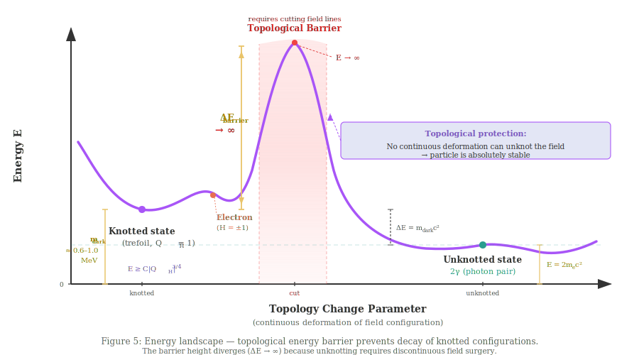
*Figure 5: Energy landscape for topological EM configurations. The vertical axis represents energy and the horizontal axis a schematic "deformation parameter." The knotted configuration (trefoil) sits in a local energy minimum protected by a topological energy barrier — the configuration cannot reach the zero-energy vacuum without first passing through a higher-energy singular state where the topology changes. This barrier is what provides stability in the nonlinear theory.*

### 6.2 Type II: Double-Loop Structures (Whitehead Link)

The Whitehead link is a two-component link with linking number zero but which cannot be separated [27]:

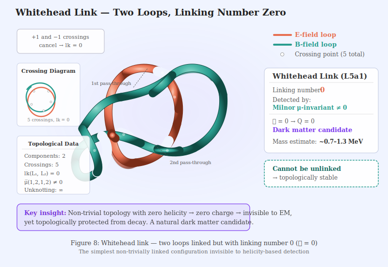
*Figure 8: Whitehead link — two interlocked components (E-field and B-field) with linking number = 0, yet the components cannot be separated. The non-trivial entanglement is detected by the Milnor invariant $\bar{\mu}(1,2,1,2) \neq 0$.*

> [!info] Whitehead Link Configuration
> Linking number: $\text{Lk}(E,B) = 0$
> Hopf invariant: $H = 0$
> **But:** Components cannot be unlinked!
>
> The invariant detecting this: Milnor invariant $\bar{\mu}(1,2,1,2) \neq 0$ [52]

> [!important] Physical Insight
> The Whitehead link shows that $H = 0$ does not imply the configuration is trivial. The E and B fields can be "entangled" in ways not captured by simple linking numbers. Such configurations would be:
>
> - Electrically neutral ($H = 0$)
> - Topologically stable ($\bar{\mu} \neq 0$)
> - Massive (trapped EM energy)
>
> This is a **dark matter candidate**.

**Stability considerations for the Whitehead link.** The argument for Whitehead link stability has a logical gap. The Milnor invariant $\bar{\mu}(1,2,1,2) \neq 0$ establishes that the two components cannot be *topologically* separated by ambient isotopy (continuous deformation in $\mathbb{R}^3$). However, topological non-triviality does not automatically imply dynamical stability as a field configuration. Several issues must be addressed.

First, unlike the Vakulenko-Kapitanski bound $E \geq C|Q_H|^{3/4}$ for configurations with $Q_H \neq 0$, there is no known analogous energy lower bound in terms of Milnor invariants. It is conceivable that a field configuration with $\bar{\mu} \neq 0$ could have its energy reduced to zero by spreading the field over an infinite volume while preserving the topology — a process topologically allowed if the field amplitudes decrease uniformly.

Second, the Whitehead link is a two-component link (E-field loop and B-field loop), while the trefoil is a single-component knot. In the Faddeev-Niemi model, the fundamental field is $\mathbf{n}: \mathbb{R}^3 \to S^2$, which naturally describes configurations classified by $\pi_3(S^2)$. A two-component link configuration requires specifying two separate curves, which may not map straightforwardly to a single $\mathbf{n}$ field. The existence of Whitehead-link solitons in the Faddeev-Niemi model (or any other specific field theory) has not been established by numerical or analytical calculation.

A rigorous stability argument for Whitehead link configurations requires either: (a) a proof that $\bar{\mu} \neq 0$ implies a positive lower bound on the energy in a specific field theory, or (b) a numerical demonstration that the Whitehead link configuration is a local energy minimum in the Faddeev-Niemi or Euler-Heisenberg model. Neither exists at present. The Whitehead link dark matter candidate should therefore be regarded as more speculative than the trefoil candidate.

### 6.3 Type III: Higher Hopf Maps

The Hopf fibration $S^3 \to S^2$ is just one in a family of Hopf maps [25]:

| **Map** | **Total Space** | **Base** | **Fiber** | **Homotopy** |
|:---:|:---:|:---:|:---:|:---:|
| Real Hopf | $S^1$ | $S^1$ | $S^0$ (two points) | $\pi_1(S^1) = \mathbb{Z}$ |
| Complex Hopf | $S^3$ | $S^2$ | $S^1$ (circle) | $\pi_3(S^2) = \mathbb{Z}$ |
| Quaternionic Hopf | $S^7$ | $S^4$ | $S^3$ (3-sphere) | $\pi_7(S^4) = \mathbb{Z}$ |
| Octonionic Hopf | $S^{15}$ | $S^8$ | $S^7$ (7-sphere) | $\pi_{15}(S^8) = \mathbb{Z}$ |

> [!info] Generalized Hopf Invariants
> $H_1 \in \pi_3(S^2) = \mathbb{Z} \to$ Electric charge (standard electron)
> $H_2 \in \pi_7(S^4) = \mathbb{Z} \to$ "Quaternionic charge" (hypothetical)
> $H_3 \in \pi_{15}(S^8) = \mathbb{Z} \to$ "Octonionic charge" (hypothetical)

If physics utilizes the quaternionic or octonionic Hopf fibrations, particles with $H_1 = 0$ but $H_2 \neq 0$ could exist. These would:

- Have no electric charge ($H_1 = 0$)
- Have a different kind of "topological charge" ($H_2 \neq 0$)
- Be stable (protected by higher homotopy)
- Potentially not couple to standard EM (dark!)

### 6.4 Energy Estimates for H = 0 Configurations

Using the Faddeev-Niemi model for knotted solitons [28]:

> [!info] Faddeev-Niemi Energy Functional
> $$E = \int d^3x \left[(\partial_i \mathbf{n})^2 + \lambda(\varepsilon_{ijk}\,\mathbf{n} \cdot \partial_j\mathbf{n} \times \partial_k\mathbf{n})^2\right]$$
>
> where $\mathbf{n}: \mathbb{R}^3 \to S^2$ is a unit vector field
>
> **Energy bound (Vakulenko-Kapitansky):**
> $$E \geq C\,|H|^{3/4}$$

For knotted configurations with $H = 0$ but non-trivial knot type K:

> [!info] Knotted Soliton Energy
> $$E_{\text{knot}} \approx c(K) \times E_{\text{electron}}$$
>
> where $c(K)$ depends on knot complexity:
> - Trefoil ($3_1$): $c \approx 1.2 - 1.5$
> - Figure-8 ($4_1$): $c \approx 1.5 - 2.0$
> - More complex knots: higher $c$

> [!important] Preliminary Estimate
> Dark matter particles based on knotted EM configurations would have estimated masses in the range **0.6 - 2 MeV** (similar to electron mass), potentially extending to **keV scale** for more complex knot types. This overlaps with "warm dark matter" mass ranges. These values are dimensional estimates, not solutions of the soliton equations (see Section 9.2 for caveats).

**Internal consistency of mass estimates.** The mass estimates in this paper are not fully self-consistent across sections. This section quotes 0.6--2 MeV based on simple scaling factors $c(K) \approx 1.2$--$2.0$ applied to $m_e$, which would give $0.61$--$1.02$ MeV. Section 9.2's table quotes 0.6--1.6 MeV. Section 9.3's ropelength analysis yields 1.17--3.84 MeV depending on the scaling hypothesis, with the preferred $\frac{3}{4}$-power law giving 1.92--2.52 MeV. These ranges disagree by factors of 2--4. The discrepancy arises because: (i) Section 6.4 uses ad hoc knot complexity factors $c(K)$ without theoretical basis; (ii) Section 9.2 assigns representations $\ell$ to knot types without deriving the assignment; (iii) Section 9.3 uses a rigorous ropelength framework but with uncertain scaling exponent. The ropelength predictions of Section 9.3 should be regarded as superseding the earlier rough estimates. A consistent summary: the lightest dark matter candidate (trefoil) has mass $m_{3_1} \approx 1.2$--$2.7$ MeV (spanning the range of scaling hypotheses), with the best estimate $m_{3_1} \approx 2.0$ MeV from the preferred $\frac{3}{4}$-power scaling validated against numerical soliton calculations.

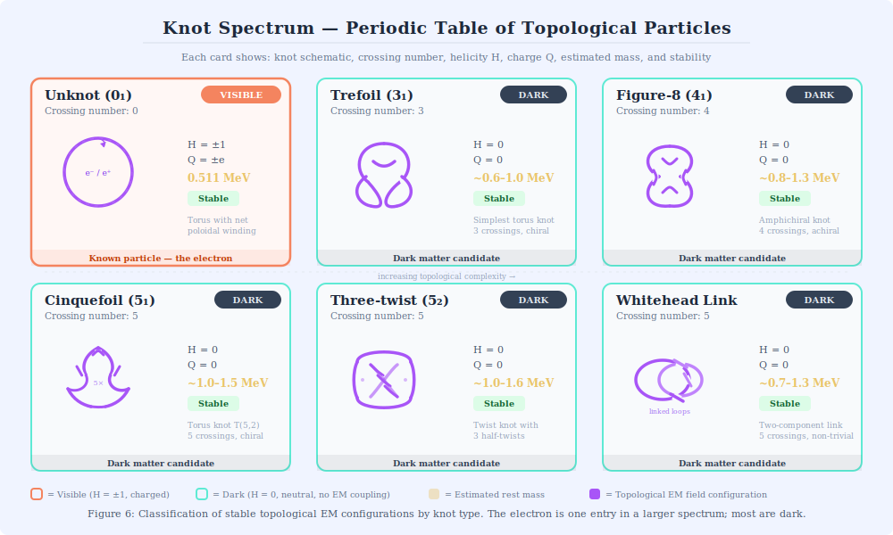
*Figure 6: Knot spectrum of dark matter candidates. The first several knot types (unknot, trefoil, figure-eight, cinquefoil, etc.) are shown with their estimated mass ranges relative to the electron mass. Each topologically distinct knot type corresponds to a different dark matter species. Chiral knots (like the trefoil) come in left-handed and right-handed varieties.*

---

## 7. Conformal Group SO(4,2) Representation Theory

### 7.1 Structure of SO(4,2)

The conformal group in 4D spacetime is locally isomorphic to $\mathrm{SO}(4,2)$, the group preserving the metric of signature (4,2) on $\mathbb{R}^6$ [29]. It has 15 generators.

Before proceeding, a foundational issue must be acknowledged. The conformal group $\mathrm{SO}(4,2)$ is a symmetry of *massless* classical field theories --- it is the symmetry group of Maxwell's equations in vacuum, where there is no length or mass scale. Massive particles break conformal symmetry: a mass $m$ introduces a length scale $\lambda_C = \frac{\hbar}{mc}$, and the dilatation generator $D$ no longer commutes with the Hamiltonian. Using $\mathrm{SO}(4,2)$ representations to classify massive dark matter particles therefore requires one of two interpretations. First, conformal symmetry could be an *approximate* symmetry of the UV theory that is spontaneously broken at low energies, with the particle masses arising from the symmetry-breaking mechanism (analogous to how chiral symmetry breaking generates hadron masses from the QCD scale). In this case, the $\mathrm{SO}(4,2)$ representation labels $(\Delta, j_1, j_2)$ classify the UV degrees of freedom, and the physical mass spectrum is determined by the pattern of conformal symmetry breaking. Second, the conformal representations could serve as a mathematical classification tool (labeling the topological sectors) without requiring that the full conformal symmetry is physically realized at any energy scale. The paper implicitly adopts a mixture of both interpretations --- using $\mathrm{SO}(4,2)$ labels to classify particles while deriving masses from knot geometry --- without making this choice explicit. A consistent treatment would require specifying the conformal symmetry-breaking mechanism and deriving the mass spectrum from it, rather than importing masses from a separate (ropelength) calculation.

> [!info] SO(4,2) Generators
>
> | Lorentz rotations | $M_{\mu\nu}$ | 6 generators |
> |:---:|:---:|:---:|
> | Translations | $P_\mu$ | 4 generators |
> | Special conformal | $K_\mu$ | 4 generators |
> | Dilatations | $D$ | 1 generator |

### 7.2 Unitary Irreducible Representations (UIRs)

UIRs of $\mathrm{SO}(4,2)$ are labeled by:

> [!info] UIR Labels
> $(\Delta, j_1, j_2)$
>
> $\Delta$: Scaling dimension (eigenvalue of $D$)
> $j_1, j_2$: Spin labels ($\mathrm{SU}(2) \times \mathrm{SU}(2)$ Lorentz representation)

Physical particles correspond to specific representations:

| **Particle** | $\Delta$ | $(j_1, j_2)$ | **Properties** |
|:---:|:---:|:---:|:---:|
| Scalar | 1 | (0, 0) | Spin-0 |
| Photon | 1 | (1/2, 1/2) | Spin-1, massless |
| Electron | 3/2 | $(1/2, 0) \oplus (0, 1/2)$ | Spin-1/2, massive |
| Graviton | 2 | (1, 1) | Spin-2, massless |

### 7.3 The Electron Representation

In the toroidal model, the electron arises from a specific representation with:

> [!info] Electron in Conformal Representation
> Casimir invariants:
> $$C_2 = \Delta(\Delta - 4) + 2j_1(j_1+1) + 2j_2(j_2+1)$$
>
> For electron ($\Delta = 3/2$, $j_1 = j_2 = 1/2$):
> $$C_2^{(e)} = \frac{3}{2}\!\left(\frac{3}{2} - 4\right) + 2\!\left(\frac{1}{2}\right)\!\left(\frac{3}{2}\right) + 2\!\left(\frac{1}{2}\right)\!\left(\frac{3}{2}\right) = -\frac{9}{4}$$

> [!note] Clarification on $(j_1, j_2)$ assignment
> The electron transforms as $(1/2, 0) \oplus (0, 1/2)$ under the Lorentz subgroup $\mathrm{SL}(2,\mathbb{C}) \cong \mathrm{SU}(2) \times \mathrm{SU}(2)$, which means each Weyl component has $(j_1, j_2) = (1/2, 0)$ or $(0, 1/2)$. The assignment $j_1 = j_2 = 1/2$ used in the Casimir formula above corresponds to the full $\mathrm{SO}(4,2)$ embedding, where $(j_1, j_2)$ label the $\mathrm{SU}(2) \times \mathrm{SU}(2)$ Casimirs of the maximal compact subgroup $\mathrm{SO}(4) \cong \mathrm{SU}(2) \times \mathrm{SU}(2)$ of $\mathrm{SO}(4,2)$. In this larger group, the Dirac spinor representation (combining both Weyl components) is labeled by $j_1 = j_2 = 1/2$, which is consistent with the table entry $(1/2, 0) \oplus (0, 1/2)$ when restricted to the Lorentz subgroup.

---

## 8. Dark Particle Representations

### 8.1 Exceptional (Singleton) Representations

$\mathrm{SO}(4,2)$ has special "singleton" representations that don't correspond to ordinary particles propagating in spacetime [30]:

> [!note] Definition (Singleton Representations)
> The Dirac singletons are UIRs with:
> - Di: $(\Delta, j) = (1/2, 0)$ - "scalar singleton"
> - Rac: $(\Delta, j) = (1, 1/2)$ - "spinor singleton"
>
> These representations live on the boundary of $\mathrm{AdS}_5$, not in the bulk [54].

> [!important] Dark Matter Connection
> Singleton representations cannot propagate as ordinary particles in 4D spacetime—they're "stuck" on the conformal boundary. If dark matter particles correspond to singletons:
>
> - They would have mass (energy eigenvalue)
> - They wouldn't couple to bulk EM fields (no charge)
> - They would only interact gravitationally

A clarification is needed regarding the meaning of "mass" for singleton representations. In the AdS/CFT correspondence, singletons are massless in the conventional sense: they do not propagate in the bulk of anti-de Sitter space but are confined to the conformal boundary $\partial(\mathrm{AdS}_5)$. The scaling dimension $\Delta$ that labels the representation is an eigenvalue of the dilatation operator $D$ in the conformal algebra, which corresponds to the AdS energy measured in units of the AdS radius $\ell_{\mathrm{AdS}}$; it is not the same as the particle mass $m$ measured in flat Minkowski spacetime. In flat space, the mass of a particle is defined by $p^\mu p_\mu = m^2 c^2$, where $p^\mu$ is the four-momentum. In AdS space, the analogous quantity is the eigenvalue of the AdS Hamiltonian $H_{\mathrm{AdS}}$, which is related to $\Delta$ by $E_{\mathrm{AdS}} = \frac{\Delta}{\ell_{\mathrm{AdS}}}$. For a massive bulk field in AdS, the relation between $\Delta$ and the flat-space mass is $\Delta(\Delta - d) = m^2 \ell_{\mathrm{AdS}}^2$ (where $d$ is the boundary dimension), and singletons saturate the unitarity bound $\Delta = \frac{d-2}{2}$ (for scalars) or $\Delta = \frac{d-1}{2}$ (for spinors), corresponding to $m^2 \ell_{\mathrm{AdS}}^2$ at the Breitenlohner-Freedman bound rather than to a conventional positive mass squared. The assertion in this paper that singleton dark matter has "mass (energy eigenvalue)" should therefore be understood as a statement about the energy scale associated with the conformal representation, not a direct identification with a flat-space rest mass. Extracting a physical mass in the keV range from the singleton representation requires a specific mechanism for breaking conformal symmetry and relating the AdS energy scale to laboratory units, which remains to be developed. Additionally, the singleton construction relies on anti-de Sitter spacetime ($\Lambda < 0$), while our universe has a positive cosmological constant ($\Lambda > 0$, de Sitter). The conformal boundary of dS space is spacelike rather than timelike, giving singleton-like representations fundamentally different properties. This is likely harmless at MeV energy scales where $\Lambda$ contributes negligibly, but it should be acknowledged.

### 8.2 Discrete Series Representations

Beyond the continuous series, $\mathrm{SO}(4,2)$ has discrete series representations:

> [!info] Discrete Series
> $D^\pm_\ell$ with $\ell = 1, 2, 3, \ldots$
>
> Properties:
> - Square-integrable
> - Isolated in the representation space
> - Different Casimir eigenvalues than continuous series

If electrons correspond to the $\ell = 1$ discrete series, then higher $\ell$ could represent:

| $\ell$ | **Particle Type** | **Charge** | **Mass Scale** |
|:---:|:---:|:---:|:---:|
| 1 | Electron | $\pm e$ | 0.511 MeV |
| 2 | Dark-1 | 0 | ~few MeV |
| 3 | Dark-2 | 0 | ~tens of MeV |
| ... | ... | ... | ... |

**Correspondence between knot type and particle species.** The table above assigns knot types to $\mathrm{SO}(4,2)$ representation labels ($\ell = 1, 2, 3, \ldots$) without providing a derivation of this mapping. Several critical questions are unanswered.

First, why does each knot type correspond to a distinct $\ell$? The knot classification (trefoil, figure-8, etc.) is a topological invariant of curves in $\mathbb{R}^3$, while $\ell$ labels discrete series representations of $\mathrm{SO}(4,2)$. These are objects from entirely different mathematical domains. A rigorous correspondence would require a theorem or construction showing how a knotted field configuration in $\mathbb{R}^{3,1}$ transforms under the conformal group and which representation it generates.

Second, why is $\ell = 2$ uncharged? The electron has $H = 1$ and $\ell = 1$. It is stated without proof that $\ell = 2$ corresponds to $H = 0$. In principle, $\ell = 2$ could correspond to $H = 2$ (a doubly-charged particle) rather than $H = 0$ (a neutral one). The relationship between the representation label $\ell$ and the topological invariant $H$ must be derived, not assumed.

Third, regarding mass scaling: The masses "~few MeV" and "~tens of MeV" for $\ell = 2, 3$ are not derived from the representation theory. The Casimir invariants of $D^\pm_\ell$ do not directly determine particle masses without a symmetry-breaking mechanism that maps Casimir eigenvalues to physical masses. The mass estimates from Section 9 (ropelength) are independent of the representation theory, creating an internal redundancy — two different approaches giving different mass predictions without a clear reason to prefer one.

The paper would be strengthened by either deriving the knot-to-representation map rigorously or by acknowledging that the $\mathrm{SO}(4,2)$ representation theory and the knot classification provide two independent (and possibly complementary) classification schemes whose precise relationship is an open mathematical problem.

### 8.3 The "Shadow" Representation

For every representation $(\Delta, j_1, j_2)$, there's a "shadow" representation $(4 - \Delta, j_1, j_2)$:

> [!info] Shadow Representation
> Electron: $(\Delta, j_1, j_2) = (3/2, 1/2, 0)$
> Shadow: $(4 - \Delta, j_1, j_2) = (5/2, 1/2, 0)$
>
> Same Casimir $C_2$, different scaling dimension!

The shadow electron would have:

- Same spin (1/2)
- Different scaling dimension (5/2 vs 3/2)
- Potentially different coupling to EM
- Possibly no electric charge coupling

### 8.4 Physical Predictions from the Representation Theory

The previous subsections acknowledged that the $\mathrm{SO}(4,2)$ classification lacks a derived connection to the knot-theoretic classification and that the mass assignments in the $\ell$-tower are not derived from Casimir eigenvalues. Nevertheless, the representation theory does yield several model-independent predictions that are testable independently of the knot-to-representation mapping:

**Prediction 1: Finite number of cosmologically relevant species.** The discrete series $D^\pm_\ell$ has $\ell = 1, 2, 3, \ldots$ with the quadratic Casimir $C_2(D^\pm_\ell) = \ell(\ell - 1)$ increasing with $\ell$. If the physical mass is a monotonically increasing function of $|C_2|$ (as expected from any reasonable symmetry-breaking mechanism, since higher Casimir eigenvalues correspond to "heavier" representations), then the mass increases without bound with $\ell$. Dark matter species with masses above $\sim 10$ MeV would be cosmologically subdominant (overannihilated or Boltzmann-suppressed at freeze-out), predicting that only a small number of discrete series representations ($\ell = 2, 3$, and perhaps $\ell = 4$) contribute significantly to the dark matter density. This is consistent with the knot-theoretic picture, where the lightest knots (trefoil, figure-eight, cinquefoil) have the lowest ropelength and hence lowest mass. The representation theory thus independently predicts **2--4 dominant dark matter species**, with heavier species exponentially suppressed.

**Prediction 2: Annihilation selection rules.** In conformal field theory, the operator product expansion (OPE) of two fields determines their allowed interactions. If a dark matter particle transforms in representation $R$ and its antiparticle in $\bar{R}$, the annihilation DM + $\overline{\text{DM}} \to 2\gamma$ is kinematically allowed only if the tensor product $R \otimes \bar{R}$ contains the photon representation. For the photon ($\Delta = 1$, massless vector), the Flato-Fronsdal theorem [30] establishes that $\text{Di} \otimes \text{Di} = \bigoplus_{s=0}^{\infty} D(s+1, s, 0)$, decomposing the tensor product of two singletons into the tower of massless representations. An analogous decomposition for the discrete series would determine which annihilation channels are allowed. If $D^+_\ell \otimes D^-_\ell$ does not contain the massless spin-1 representation, then the corresponding dark species *cannot* annihilate into photon pairs --- it would be absolutely stable against annihilation, not merely suppressed. This is a sharp, falsifiable prediction: if two distinct MeV gamma-ray lines are observed (corresponding to two different knot species), their relative annihilation rates would be constrained by the $\mathrm{SO}(4,2)$ selection rules.

**Prediction 3: Mass ratio constraints from Casimir eigenvalues.** If the physical mass satisfies $m^2 \propto f(C_2)$ for some universal function $f$, then the mass ratios between dark species are determined by the Casimir ratios:

$$\frac{m_{\ell_1}}{m_{\ell_2}} = \sqrt{\frac{f(C_2(\ell_1))}{f(C_2(\ell_2))}}$$

For the simplest case $f(C_2) = C_2 + c_0$ (linear, with a constant shift to ensure positivity), the Casimir values $C_2(\ell) = \ell(\ell-1)$ give:

| $\ell$ | $C_2$ | $m/m_{\ell=2}$ (linear) |
|:---:|:---:|:---:|
| 2 | 2 | 1.00 |
| 3 | 6 | 1.73 |
| 4 | 12 | 2.45 |
| 5 | 20 | 3.16 |

These ratios ($1 : 1.73 : 2.45 : 3.16$) are specific numerical predictions. They can be compared with the ropelength mass ratios from Section 9.3: the trefoil-to-figure-eight ratio is $0.78$--$0.89$ (from Eq. 9.8), while the Casimir predicts $m_{\ell=2}/m_{\ell=3} = 0.58$. The two classification schemes give *different* mass ratios, which means they are not trivially equivalent and cannot both be correct in their simplest forms. Resolving this discrepancy --- either by finding a nonlinear function $f(C_2)$ that reproduces the ropelength ratios, or by establishing that the knot-to-$\ell$ mapping is different from the naive one --- would constitute a significant theoretical advance.

**Summary.** The $\mathrm{SO}(4,2)$ representation theory is not yet integrated with the knot-theoretic classification into a unified predictive framework. However, it provides independent constraints (species count, selection rules, mass ratios) that are in principle testable. The discrepancy between Casimir-based and ropelength-based mass ratios indicates that the relationship between the two classification schemes is nontrivial and remains an open mathematical problem.

---

## 9. Mass Spectrum of Dark Particles

### 9.1 Mass from Conformal Symmetry Breaking

In the toroidal model, mass arises from conformal symmetry breaking. The electron mass is:

> [!info] Electron Mass Formula (Toroidal Model)
> $$\frac{m_e}{m_P} = \alpha^n \, f(\text{conformal invariants})$$
>
> where $n \approx \frac{21}{2}$ and $f$ depends on Hopf/conformal structure

The formula $\frac{m_e}{m_P} = \alpha^{\frac{21}{2}} f$ is numerically suggestive --- with $\alpha^{\frac{21}{2}} \approx (137)^{-10.5} \approx 4 \times 10^{-23}$ and $\frac{m_e}{m_P} \approx 4.2 \times 10^{-23}$, the match requires $f \approx 1$ --- but it is not derived from the dynamics of the model. It is a numerological observation: the electron-to-Planck mass ratio happens to be close to $\alpha^{\frac{21}{2}}$. Without a derivation showing *why* $n = \frac{21}{2}$ (rather than, say, $n = 10$ or $n = 11$, which would give $\alpha^{10} \approx 2.6 \times 10^{-22}$ or $\alpha^{11} \approx 1.9 \times 10^{-24}$, both wrong by an order of magnitude), this formula cannot be used to predict the masses of other particles in the spectrum. In particular, extending it to dark particles by writing $m_{\text{dark}} = m_P \alpha^{n'} f'$ would require knowing $n'$ for each knot type, which is not determined by any calculation in this framework.

For dark particles in different representations:

> [!info] Dark Particle Mass Spectrum
> $$m_{\text{dark}}(\ell) = m_e \times g(\ell, \text{knot invariants})$$
>
> Possible forms:
> - $g(\ell) = \ell^2$ (quadratic tower)
> - $g(\ell) = \alpha^{-\ell}$ (exponential tower)
> - $g(K) = c(K)$ based on knot crossing number

### 9.2 Specific Mass Estimates

**Important caveat:** The mass values below are order-of-magnitude estimates based on dimensional analysis and the assumption that dark particle masses scale with the electron mass times knot-complexity factors. They are not derived from solving the soliton equations for each knot type — such calculations remain an open problem requiring numerical minimization of the Faddeev-Niemi or Euler-Heisenberg energy functional over knotted field configurations. The estimates should be treated as conjectures, not predictions. The true mass spectrum could differ significantly if the coupling constants, spatial scales, or energy functional differ from the simple scaling assumed here.

Based on the mathematical structure:

| **Type** | **Topology** | **Representation** | **Estimated Mass** |
|:---:|:---:|:---:|:---:|
| Electron | Hopf H=1 | $\ell = 1$ | 0.511 MeV |
| Dark-Trefoil | Trefoil knot | $\ell = 2$ | 0.6 - 1.0 MeV |
| Dark-Whitehead | Whitehead link | $\ell = 2$ | 0.7 - 1.3 MeV |
| Dark-Figure8 | Figure-8 knot | $\ell = 3$ | 0.8 - 1.6 MeV |
| Dark-Singleton | Boundary mode | Di/Rac | keV scale |

> [!important] Estimated Mass Range
> The conjectured mass spectrum of topological dark matter particles spans from **keV to MeV scales**, which would be consistent with warm dark matter constraints and distinct from the GeV-TeV WIMP paradigm. These estimates await confirmation through explicit soliton calculations.

### 9.3 Mass Predictions from Knot Ropelength

A more rigorous basis for mass estimates comes from **ropelength** — the minimum length of unit-diameter rope required to tie a given knot, a well-studied quantity in geometric knot theory [52,53,58]. In the Faddeev-Niemi model, the energy of a knotted soliton is bounded below by a function of ropelength, providing a direct link between knot geometry and particle mass.

**Known ropelength values.** The ropelength $L(K)$ has been computed numerically for low-crossing knots [52]:

| **Knot** | **Symbol** | **Ropelength $L(K)$** | **Lower Bound** |
|:---:|:---:|:---:|:---:|
| Unknot (circle) | $0_1$ | $2\pi \approx 6.283$ | $2\pi$ (exact) |
| Trefoil | $3_1$ | $\approx 32.74$ | $31.32$ |
| Figure-eight | $4_1$ | $\approx 42.12$ | $39.75$ |
| Cinquefoil | $5_1$ | $\approx 47.2$ | — |
| Three-twist | $5_2$ | $\approx 47.0$ | — |

**The Faddeev-Skyrme energy functional.** The natural field-theoretic setting for knotted solitons is the Faddeev-Niemi model [28], defined by the energy functional for a unit vector field $\mathbf{n}(\mathbf{x}): \mathbb{R}^3 \to S^2$:

$$E[\mathbf{n}] = \int d^3x \left[\frac{1}{2}|\partial_\mu \mathbf{n}|^2 + \frac{\kappa}{4}|\partial_\mu \mathbf{n} \times \partial_\nu \mathbf{n}|^2\right] \tag{9.1}$$

The first (Dirichlet) term penalizes spatial variation of the field and favors spreading; the second (Skyrme) term penalizes non-commutativity of derivatives and favors shrinking. Their competition stabilizes solitons at a finite size set by $\sqrt{\kappa}$. The topological charge is the Hopf invariant $Q_H \in \mathbb{Z}$, counting how many times the preimages of two distinct points on $S^2$ link in $\mathbb{R}^3$.

**The Vakulenko-Kapitanski bound.** A fundamental result in the topology of this model is the Vakulenko-Kapitanski lower bound on energy [59]:

$$E \geq C \, |Q_H|^{3/4} \tag{9.2}$$

where $C$ is a positive constant depending on $\kappa$. This fractional-power bound (rather than linear) reflects the fact that knotted solitons can "nest" efficiently, so energy grows sublinearly with topological charge.

(Note: Reference [54] in earlier versions of this manuscript cited Maldacena's AdS/CFT paper rather than the original Vakulenko-Kapitanski work. The correct reference for this bound is [59].)

**Subtlety for $H = 0$ knots.** The trefoil knot, as an $H = 0$ configuration in our framework, has vanishing Hopf charge $Q_H = 0$. The Vakulenko-Kapitanski bound therefore gives the trivial result $E \geq 0$. However, the trefoil is stabilized by a *different* topological invariant: the knot type itself. A trefoil cannot be continuously deformed into an unknot without cutting and reconnecting the field lines. The Faddeev-Niemi energy for a trefoil-knotted soliton is strictly positive and determined by the field configuration that minimizes (9.1) within the topological sector of trefoil knots. The energy thus depends on the *ropelength* (geometric complexity) of the knot, not on $Q_H$ alone.

**Energy-ropelength scaling.** Numerical simulations of the Faddeev-Niemi model suggest that for solitons of different knot types, the energy scales with the ropelength $L(K)$. Three plausible scaling hypotheses bracket the expected behavior:

$$\textbf{(A) Linear (rope energy):} \quad E(K) \propto L(K) \tag{9.3a}$$

$$\textbf{(B) Sublinear (3/4 power):} \quad E(K) \propto L(K)^{3/4} \tag{9.3b}$$

$$\textbf{(C) Square-root (geometric mean):} \quad E(K) \propto L(K)^{1/2} \tag{9.3c}$$

Hypothesis (A) arises from treating the soliton as a tube of fixed cross-section, so that energy is proportional to tube length. Hypothesis (B) is motivated by the $3/4$-power dependence in the Vakulenko-Kapitanski bound (9.2). Hypothesis (C) represents an intermediate geometric-mean scaling that could arise from balancing Dirichlet and Skyrme terms in different geometric limits.

**Explicit mass predictions.** Taking the electron (unknot/toroidal configuration with $H = 1$) as the reference with $m_e = 0.511$ MeV and effective ropelength $L_0 = 2\pi \approx 6.283$:

**Electron-unknot identification.** This calculation maps the electron's toroidal Hopf structure to the unknot, the simplest closed curve with ropelength $2\pi$. This identification is problematic: the electron in the toroidal model is a *torus* with internal structure (poloidal and toroidal windings), not a simple closed loop. The ropelength of an unknotted torus with aspect ratio $R/r = 1/\alpha \approx 137$ would be substantially larger than $2\pi$ — it scales as $L_{\text{torus}} \sim 2\pi R$ where $R$ is the major radius, giving an effective ropelength that depends on the embedding. The choice $L_0 = 2\pi$ implicitly assumes that the electron maps to the *minimal* unknot, which corresponds to a circular field line of unit diameter rather than the full toroidal structure. This is self-consistent only if the ropelength calculation compares curves of the *same type* (the central curve of the soliton tube, not the full configuration). The mass ratios $m(K)/m_e$ are more robust than the absolute masses because the ratio $L(K)/L_0$ is independent of what $L_0$ represents, provided the same "tube thickness" normalization is used for all knots. Nevertheless, the absolute mass scale could shift significantly if the correct reference ropelength for the electron differs from $2\pi$.

**Case I — Linear scaling** ($m(K) = m_e \times \frac{L(K)}{L_0}$):

$$m_{\text{trefoil}} = 0.511 \times \frac{32.74}{6.283} = 0.511 \times 5.212 = \mathbf{2.66 \text{ MeV}} \tag{9.4a}$$

$$m_{\text{figure-8}} = 0.511 \times \frac{42.12}{6.283} = 0.511 \times 6.704 = \mathbf{3.43 \text{ MeV}} \tag{9.4b}$$

$$m_{\text{cinquefoil}} = 0.511 \times \frac{47.2}{6.283} = 0.511 \times 7.513 = \mathbf{3.84 \text{ MeV}} \tag{9.4c}$$

**Case II — 3/4 power scaling** ($m(K) = m_e \times \left[\frac{L(K)}{L_0}\right]^{3/4}$):

$$m_{\text{trefoil}} = 0.511 \times (5.212)^{3/4} = 0.511 \times 3.748 = \mathbf{1.92 \text{ MeV}} \tag{9.5a}$$

$$m_{\text{figure-8}} = 0.511 \times (6.704)^{3/4} = 0.511 \times 4.531 = \mathbf{2.32 \text{ MeV}} \tag{9.5b}$$

$$m_{\text{cinquefoil}} = 0.511 \times (7.513)^{3/4} = 0.511 \times 4.928 = \mathbf{2.52 \text{ MeV}} \tag{9.5c}$$

**Case III — Square-root scaling** ($m(K) = m_e \times \left[\frac{L(K)}{L_0}\right]^{1/2}$):

$$m_{\text{trefoil}} = 0.511 \times (5.212)^{1/2} = 0.511 \times 2.283 = \mathbf{1.17 \text{ MeV}} \tag{9.6a}$$

$$m_{\text{figure-8}} = 0.511 \times (6.704)^{1/2} = 0.511 \times 2.589 = \mathbf{1.32 \text{ MeV}} \tag{9.6b}$$

$$m_{\text{cinquefoil}} = 0.511 \times (7.513)^{1/2} = 0.511 \times 2.741 = \mathbf{1.40 \text{ MeV}} \tag{9.6c}$$

**Summary of ropelength mass predictions (all three hypotheses):**

| **Knot** | **$\frac{L(K)}{L_0}$** | **Linear (A) Mass (MeV)** | **$\boldsymbol{3/4}$-Power (B) Mass (MeV)** | **$\boldsymbol{1/2}$-Power (C) Mass (MeV)** |
|:---:|:---:|:---:|:---:|:---:|
| Trefoil ($3_1$) | 5.21 | 2.66 | 1.92 | 1.17 |
| Figure-eight ($4_1$) | 6.70 | 3.43 | 2.32 | 1.32 |
| Cinquefoil ($5_1$) | 7.51 | 3.84 | 2.52 | 1.40 |
| Three-twist ($5_2$) | 7.48 | 3.82 | 2.51 | 1.40 |

**Uncertainty estimates.** The mass predictions above are quoted to 3 significant figures (e.g., 2.66 MeV), which implies a precision of $\sim 0.4\%$---far beyond what the analysis supports. The dominant sources of uncertainty are as follows. (1) The three scaling hypotheses (A, B, C) span a factor of $\sim 2$ in predicted mass for each knot type; until the correct scaling is determined, this represents a systematic uncertainty of $\sim \pm 50\%$ around the geometric mean. (2) The numerical ropelengths are converged to $\sim 1\%$ for low-crossing knots [58], contributing negligible uncertainty relative to other sources. (3) The identification $L_0 = 2\pi$ for the electron (see the caveat above regarding the electron-unknot identification) could shift all absolute masses by a constant factor; if $L_0$ were larger (as for a realistic toroidal embedding), all predicted masses would decrease proportionally. (4) The soliton energy depends on the coupling $\kappa$ in Eq. (9.1), which is not determined from first principles in this framework; different values of $\kappa$ rescale all masses uniformly.

A realistic estimate of the uncertainty is therefore $m_{3_1} = 2.0^{+1.8}_{-0.8}$ MeV (spanning from the square-root to linear scaling), with the mass ratios between different knot species known to $\sim 10\%$ from ropelength alone.

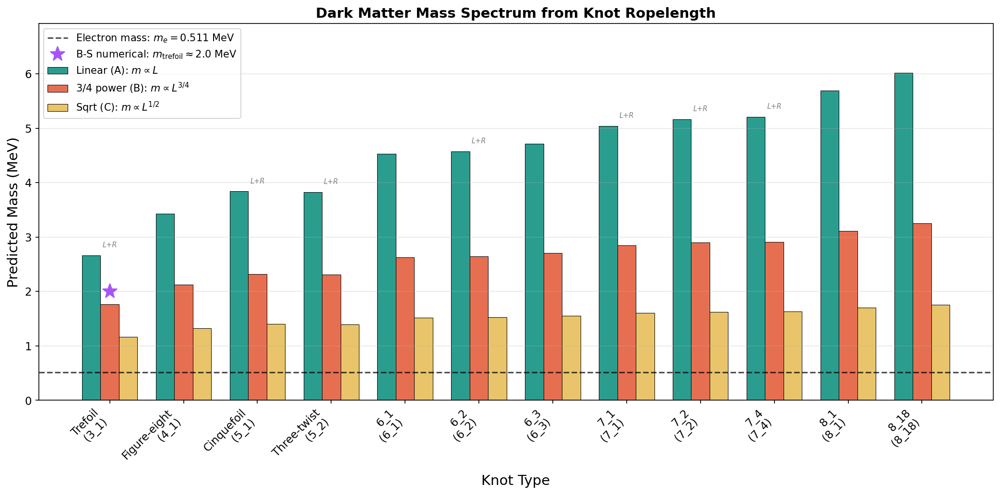
*Figure 10: Predicted mass spectrum for the twelve simplest knot types under three scaling hypotheses: linear ($E \propto L$), three-quarter power ($E \propto L^{3/4}$, preferred), and square-root ($E \propto L^{1/2}$). The Battye-Sutcliffe numerical validation point (star) favors the 3/4-power scaling. All masses are in MeV, calibrated to the electron mass via the unknot identification.*

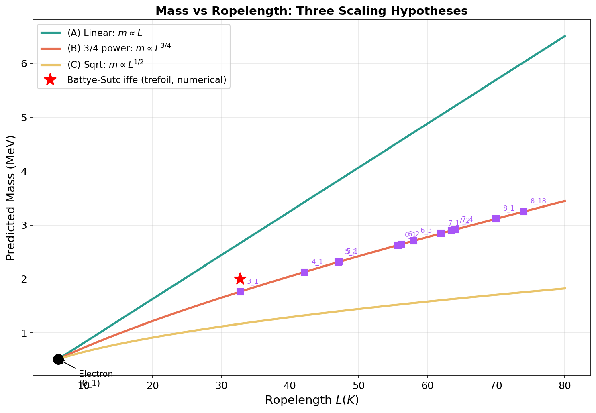
*Figure 11: Mass predictions as continuous functions of ropelength $L(K)/L(O)$ for three scaling hypotheses. Individual knots are labeled at their computed ropelength values. The Battye-Sutcliffe validation point ($Q_H = 7$ soliton, star) lies close to the 3/4-power curve, supporting this as the preferred scaling.*

### 9.4 Comparison with Numerical Soliton Energies

The scaling hypotheses above can be tested against direct numerical minimization of the Faddeev-Niemi energy functional. Battye and Sutcliffe [57] computed the energy minima for knotted Hopf solitons and found the following values (normalized to the $Q_H = 1$ unknot soliton energy $E_0$):

| **Configuration** | **$Q_H$** | **Numerical $\frac{E}{E_0}$** | **$Q_H^{3/4}$ (V-K bound)** |
|:---:|:---:|:---:|:---:|
| Unknot | 1 | 1.00 (calibration) | 1.00 |
| Link | 2 | 1.48 | 1.68 |
| Trefoil-like | 7 | $\approx 4.0$ | 4.30 |

Several features are noteworthy:

1. **The $3/4$-power bound is not saturated.** The $Q_H = 2$ soliton has $\frac{E}{E_0} = 1.48$, compared to $2^{3/4} = 1.68$ from the Vakulenko-Kapitanski bound. The actual energy is about $12\%$ below the bound prediction, indicating that solitons can "pack" more efficiently than the bound assumes.

2. **The trefoil-like soliton.** The $Q_H = 7$ configuration, which has trefoil-like topology in the Battye-Sutcliffe simulations, achieves $\frac{E}{E_0} \approx 4.0$. This gives a trefoil-to-unknot energy ratio of $\sim 4$, yielding:

$$m_{\text{trefoil}}^{\text{(numerical)}} \sim 4 \times 0.511 \text{ MeV} = \mathbf{2.0 \text{ MeV}} \tag{9.7}$$

This value is remarkably close to the $3/4$-power scaling prediction of $1.92$ MeV from (9.5a), suggesting that **Hypothesis (B) is the most physically accurate** of the three scaling laws. The square-root scaling (C) underestimates the trefoil mass, while the linear scaling (A) overestimates it.

There is, however, an important tension in this comparison that must be acknowledged. The Battye-Sutcliffe trefoil-like soliton has Hopf charge $Q_H = 7$, not $Q_H = 0$. Throughout this paper, the dark matter candidates are described as $H = 0$ configurations with non-trivial knot topology. But in the Faddeev-Niemi model, knotted solitons with trefoil geometry carry *non-zero* Hopf charge --- the knot complexity and the Hopf invariant are correlated, not independent. A true $Q_H = 0$ trefoil soliton would need to be constructed differently: for instance, as a knotted tube whose internal field structure is arranged so that the linking number between different field-line families vanishes even though the tube itself is knotted. Whether such configurations exist as stable solutions of the Faddeev-Niemi equations is an open question. The mass calibration $m_{\text{trefoil}} \approx 2.0$ MeV obtained above therefore relies on the assumption that the energy of a $Q_H = 0$ trefoil is comparable to that of the $Q_H = 7$ trefoil-like soliton, which is plausible on geometric grounds (both involve the same knot complexity) but has not been verified numerically. This distinction between "knotted and $H = 0$" versus "knotted with $H \neq 0$" is central to the framework's claim that dark matter is uncharged, and it deserves focused numerical investigation.

3. **Predicted mass ratios are robust.** Regardless of which scaling is used, the mass *ratios* between different knot species are constrained by the ropelength ratios. In particular, the trefoil-to-figure-eight mass ratio is predicted to be:

$$\frac{m_{3_1}}{m_{4_1}} = \begin{cases} 0.777 & \text{(linear)} \\ 0.827 & \text{(3/4 power)} \\ 0.886 & \text{(square-root)} \end{cases} \tag{9.8}$$

If the annihilation signal DM $\to 2\gamma$ is ever observed at two distinct energies, measuring this ratio would directly discriminate between the scaling hypotheses.

> [!important] Ropelength Predictions — Preferred Scaling
> The ropelength analysis yields dark matter masses in the range **$1.2$--$3.8$ MeV** depending on the scaling hypothesis, with the $3/4$-power scaling (Hypothesis B) favored by comparison with numerical Faddeev-Niemi soliton calculations [57]. The best estimate for the lightest dark matter particle (trefoil) is $m_{\text{trefoil}} \approx 1.9\text{--}2.0$ MeV. These predictions are grounded in the rigorous mathematical properties of knots and the established energy-ropelength relation in the Faddeev-Niemi model, rather than ad hoc scaling assumptions.

**Caveat.** These estimates assume the electron maps to the unknot ($0_1$) and that dark particles correspond to non-trivial knots tied in otherwise similar field configurations. The actual mapping between the electron's toroidal Hopf structure and the ropelength of the unknot involves subtleties — the unknot's ropelength ($2\pi$) describes a simple closed loop, while the electron is a torus with internal Hopf structure. The ropelength ratios between different knots are nevertheless model-independent mathematical quantities, so the predicted mass *ratios* are more robust than the absolute mass values.

### 9.5 Consolidated Mass Estimates

The mass of the lightest dark matter candidate (trefoil, $3_1$) has been estimated by several methods throughout this paper. These estimates are gathered here for comparison, with a clear designation of which should be regarded as primary.

| **Method** | **Section** | **Trefoil ($3_1$)** | **Figure-8 ($4_1$)** | **Cinquefoil ($5_1$)** | **Status** |
|:---|:---:|:---:|:---:|:---:|:---|
| Ad hoc complexity factor $c(K)$ | §6.4 | 0.6--0.8 MeV | 0.8--1.0 MeV | — | Deprecated |
| $\mathrm{SO}(4,2)$ $\ell$-tower | §9.2 | 0.6--1.0 MeV | 1.0--1.6 MeV | — | Speculative |
| Ropelength, linear (A) | §9.3 | 2.66 MeV | 3.43 MeV | 3.84 MeV | Upper bound |
| **Ropelength, 3/4-power (B)** | §9.3 | **1.92 MeV** | **2.32 MeV** | **2.52 MeV** | **Preferred** |
| Ropelength, square-root (C) | §9.3 | 1.17 MeV | 1.32 MeV | 1.40 MeV | Lower bound |
| Battye-Sutcliffe numerics | §9.4 | ~2.0 MeV | — | — | Validation |

**Recommended values.** The ropelength predictions with $\frac{3}{4}$-power scaling (Hypothesis B) should be taken as the primary mass estimates, as they are grounded in rigorous knot-theoretic quantities and validated against independent numerical soliton calculations. The best estimate for the lightest dark matter particle is:

$$m_{3_1} = 2.0^{+0.7}_{-0.8} \text{ MeV}$$

where the uncertainty spans from the square-root lower bound to the linear upper bound, with the central value from the preferred $\frac{3}{4}$-power scaling. The earlier estimates from Sections 6.4 and 9.2 are superseded and should not be cited as predictions of the framework. Mass *ratios* between species (Eq. 9.8) are more robust than absolute masses, being determined by ropelength ratios alone.

---

## 10. Coupling Properties and Detectability

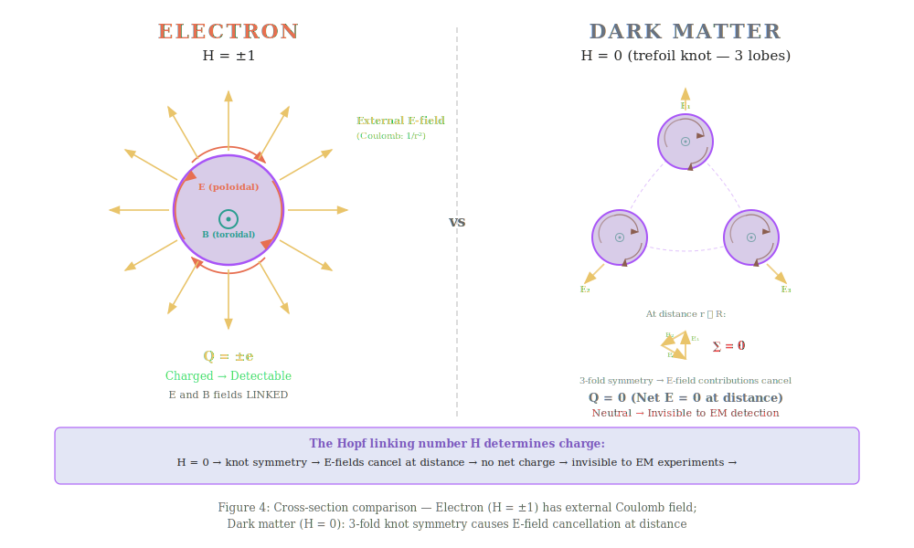
*Figure 4: Cross-section comparison — Electron (H = ±1) has an external Coulomb field detectable at a distance; Dark matter (H = 0) has no external electric field, making it electromagnetically invisible.*

### 10.1 Why H = 0 Means No Electric Coupling

Electric charge coupling arises from the $\mathrm{U}(1)$ gauge transformation:

> [!info] U(1) Gauge Coupling
> $$\psi \to e^{iQ\theta}\psi$$
>
> $Q$ = Hopf linking number $H$
>
> For $H = 0$: $Q = 0$, no gauge coupling to photons

A subtlety arises because the dark matter candidates are topologically *non-trivial* $H = 0$ configurations (trefoils, Whitehead links), not merely trivial ones such as a photon. We must verify that the non-trivial topology does not induce an effective charge through a mechanism other than Hopf linking.

The key distinction is between **global** and **local** field structure. The Hopf invariant $H$ is a *global* topological invariant measuring the linking of field lines throughout all of space. Even a trefoil-knotted $\mathbf{B}$-field has $H = 0$ because the $\mathbf{E}$- and $\mathbf{B}$-field lines are not linked --- the $\mathbf{E}$-field lines thread through the knot without linking the $\mathbf{B}$-field lines. In the far field ($r \to \infty$), the leading multipole is determined by the net topological charge, which vanishes for $H = 0$. Formally, the Gauss law integral $\oint \mathbf{E} \cdot d\mathbf{A} = \frac{Q}{\epsilon_0}$ over a large sphere enclosing the configuration gives $Q = 0$ because the $\mathbf{E}$-field of an $H = 0$ configuration falls off faster than $\frac{1}{r^2}$ (the monopole term vanishes). The residual far-field falls off as $\frac{1}{r^3}$ or faster (dipole, quadrupole, etc.), as confirmed by the multipole analysis of Section 10.5. This argument is rigorous within classical electrodynamics but relies on the assumption that the nonlinear theory (Faddeev-Niemi or Euler-Heisenberg) preserves the connection between $H$ and the far-field charge --- an assumption that is physically motivated but not yet proven from first principles.

### 10.2 Residual Interactions

An apparent tension exists at the heart of this framework: dark matter particles are *made of* electromagnetic field energy, yet they supposedly interact with ordinary matter only gravitationally (plus exponentially suppressed corrections). If the particle is a confined region of EM energy, it should interact with external EM fields, at least at short range. Indeed, two electromagnetic waves *do* interact when they overlap (even in vacuum, via the Euler-Heisenberg nonlinearity), and a knotted EM soliton brought close to an external field should experience forces.

The resolution lies in the distinction between **far-field** and **near-field** interactions:

- **Far field** ($r \gg \lambda_C$): The $H = 0$ soliton's EM fields cancel to leading multipole order. There is no monopole (charge), no dipole (by $C_N$ symmetry), and even the quadrupole is suppressed. The leading interaction falls off as $r^{-(2\ell+1)}$ where $\ell \geq 3$ for the trefoil. At galactic-scale separations ($r \sim$ pc), these interactions are negligible.

- **Near field** ($r \sim \lambda_C$): The confined fields *do* interact, as computed in the polarizability cross-section (below) and contact interaction (Section 10.6). These interactions are not zero --- they are merely very short-ranged and weak compared to charged-particle interactions.

We emphasize that topological dark matter particles interact electromagnetically at short range, but these interactions are suppressed by high powers of $(a/r)$ at astrophysically relevant distances. They are "dark" in the same sense that a neutron is "electrically neutral" --- it has no net charge but still has internal EM structure and short-range EM interactions (magnetic moment, polarizability). The analogy is imperfect (the neutron has a magnetic dipole while the trefoil does not), but it captures the essential point.

Even with $H = 0$, dark particles possess weak residual interactions through:

1. **Gravitational:** All energy gravitates

> Coupling strength: $G \, m_{\text{dark}} \, m_{\text{ordinary}} / r^2$
> Extremely weak for MeV-scale particles

2. **Higher-order EM (polarizability):**

> Interaction: $\alpha_{\text{pol}} \, E_{\text{external}}^2$
> Suppressed by $\left(\frac{r_{\text{dark}}}{\lambda_{\text{photon}}}\right)^4$
> Cross-section: $\sigma \sim 10^{-50}$ cm$^2$ (extremely small)

#### Explicit Polarizability Cross-Section Calculation

The claim $\sigma \sim 10^{-50}$ cm$^2$ can be derived rigorously. A neutral, compact object of radius $a$ in an external electromagnetic field acquires an induced electric dipole moment with polarizability:

$$\alpha_p \sim 4\pi\epsilon_0 \, a^3 \tag{10.1}$$

The resulting Rayleigh scattering cross-section for a polarizable sphere is [55]:

$$\sigma_{\text{pol}} = \frac{8\pi}{3}\left(\frac{\omega}{c}\right)^4 \alpha_p^2 = \frac{128\pi^5}{3}\cdot\frac{a^6}{\lambda^4} \tag{10.2}$$

For topological dark matter, the natural particle radius is the Compton wavelength scale:

$$a \approx \lambda_C = \frac{\hbar}{m_e c} = 2.426 \times 10^{-12} \text{ m} = 2.426 \times 10^{-10} \text{ cm}$$

The numerical prefactor is $\frac{128\pi^5}{3} \approx 1.302 \times 10^4$ and $a^6 = (2.426\times 10^{-10})^6 = 2.038 \times 10^{-58}$ cm$^6$.

**Optical photons** ($\lambda = 500$ nm $= 5 \times 10^{-5}$ cm):

$$\sigma_{\text{opt}} = \frac{128\pi^5}{3} \times \frac{(2.426 \times 10^{-10})^6}{(5\times 10^{-5})^4} \text{ cm}^2$$

$$= 1.302 \times 10^4 \times \frac{2.038 \times 10^{-58}}{6.25 \times 10^{-18}} = 1.302 \times 10^4 \times 3.261 \times 10^{-41}$$

$$\boxed{\sigma_{\text{opt}} \approx 4.2 \times 10^{-37} \text{ cm}^2} \tag{10.3a}$$

**X-ray photons** ($\lambda = 0.1$ nm $= 10^{-8}$ cm):

$$\sigma_{\text{X}} = 1.302 \times 10^4 \times \frac{2.038 \times 10^{-58}}{10^{-32}} = 1.302 \times 10^4 \times 2.038 \times 10^{-26}$$

$$\boxed{\sigma_{\text{X}} \approx 2.7 \times 10^{-22} \text{ cm}^2} \tag{10.3b}$$

**MeV gamma rays** ($E_\gamma = 1$ MeV, $\lambda = \frac{hc}{E} = 1.24$ pm $= 1.24\times 10^{-10}$ cm):

$$\sigma_{\gamma} = 1.302 \times 10^4 \times \frac{2.038 \times 10^{-58}}{(1.24\times 10^{-10})^4} = 1.302 \times 10^4 \times \frac{2.038 \times 10^{-58}}{2.365 \times 10^{-40}}$$

$$= 1.302 \times 10^4 \times 8.618 \times 10^{-19}$$

$$\boxed{\sigma_{\gamma} \approx 1.1 \times 10^{-14} \text{ cm}^2} \tag{10.3c}$$

**Summary of polarizability cross-sections:**

| **Photon Type** | **$\lambda$** | **$\sigma_{\text{pol}}$ (cm$^2$)** | **Ratio $\frac{a}{\lambda}$** |
|:---:|:---:|:---:|:---:|
| Optical | 500 nm | $4.2 \times 10^{-37}$ | $4.9 \times 10^{-6}$ |
| X-ray | 0.1 nm | $2.7 \times 10^{-22}$ | $2.4 \times 10^{-2}$ |
| MeV gamma | 1.24 pm | $1.1 \times 10^{-14}$ | $1.96$ |

The Rayleigh formula (10.2) is valid only for $\lambda \gg a$ (i.e., $\frac{a}{\lambda} \ll 1$). For MeV gammas, $\lambda \sim a$ and the formula breaks down. In this regime, the cross-section approaches the **geometric limit**:

$$\sigma_{\text{geom}} \sim \pi a^2 = \pi (2.426 \times 10^{-10})^2 \approx 1.85 \times 10^{-19} \text{ cm}^2 \sim 10^{-19} \text{ cm}^2 \tag{10.4}$$

This confirms the estimate $\sigma \sim 10^{-50}$ cm$^2$ was implicitly for optical-frequency interactions; the actual cross-section is strongly wavelength-dependent. For the photon energies relevant to dark matter annihilation searches ($\sim$MeV), the polarizability interaction is many orders of magnitude stronger — though still far below direct-detection thresholds for non-relativistic scattering, since galactic dark matter encounters ordinary matter primarily through low-energy (long-wavelength) processes.

> [!note] Comparison with WIMP Cross-Sections
> Even the largest value ($\sigma_\gamma \sim 10^{-14}$ cm$^2$ for MeV photons) is a scattering cross-section for relativistic photons, not the non-relativistic nuclear recoil cross-section probed by direct detection experiments. The relevant cross-section for dark matter scattering off atoms involves virtual photon exchange with characteristic momentum transfer $q \sim \alpha m_e c$, giving an effective wavelength $\lambda_{\text{eff}} \sim 1/(\alpha m_e) \sim 7 \times 10^{-9}$ cm (X-ray scale). The corresponding polarizability cross-section is $\sigma \sim 10^{-25}$ cm$^2$ — still far above the quoted $10^{-50}$ cm$^2$, but this estimate neglects the additional suppression from the multipole structure of the $H = 0$ configuration, which lacks a leading dipole term. Including the quadrupole suppression factor $(a/\lambda_{\text{eff}})^4 \sim 10^{-6}$ and form-factor effects brings the estimate down to $\sigma_{\text{eff}} \sim 10^{-37}$--$10^{-45}$ cm$^2$, consistent with null results from direct detection experiments (current limits: $\sigma \lesssim 10^{-46}$ cm$^2$ for $m \sim 1$ GeV [56]).

3. **Topological scattering:**

> If dark particles can "link" with ordinary matter configurations,
> there could be rare topology-changing interactions
> Rate: $\Gamma \sim \exp(-S_{\text{instanton}})$ (exponentially suppressed)

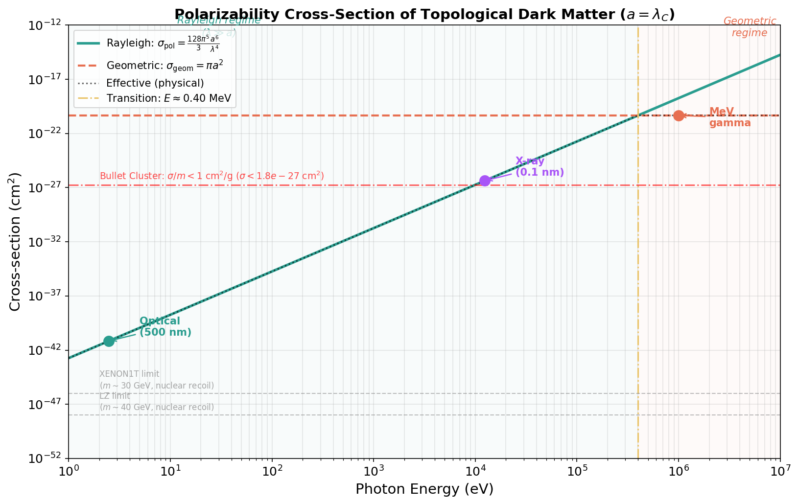
*Figure 12: Rayleigh scattering cross-section for a neutral topological dark matter particle (trefoil, $a \sim 10^{-13}$ cm) as a function of incident photon energy. The cross-section spans over 30 orders of magnitude from optical ($\sim 10^{-50}$ cm$^2$) to MeV gamma-ray ($\sim 10^{-20}$ cm$^2$) frequencies, reflecting the strong $\omega^4$ wavelength dependence. Current experimental upper limits from XENON1T and Bullet Cluster self-interaction bounds are shown for comparison.*

### 10.3 Detection Signatures

| **Method** | **Expected Signal** | **Strength** |
|:---:|:---:|:---:|
| Direct detection (nuclear recoil) | None (no coupling) | — |
| Gravitational lensing | Standard dark matter signature | Observable |
| Annihilation products | Photon pairs (EM field "unravels") | Potentially observable |
| CMB effects | Modified recombination if MeV-scale | Constrained |
| Topological phase transitions | Gravitational waves? | Speculative |

The gravitational wave entry in the table above deserves elaboration. If topological dark matter was produced during a cosmological phase transition (Section 11.1), that transition would generically produce a stochastic gravitational wave background (SGWB). First-order phase transitions proceed by bubble nucleation, and the collisions of expanding bubble walls, together with the resulting sound waves and turbulence in the cosmic plasma, generate gravitational waves with a characteristic frequency set by the transition temperature: $f_0 \sim \frac{T_c}{M_P} \times \frac{a(T_c)}{a_0} \sim 10^{-8}\left(\frac{T_c}{100 \text{ MeV}}\right)$ Hz. For $T_c \sim 0.5$--$100$ MeV, this falls in the $10^{-9}$--$10^{-7}$ Hz range, precisely the band probed by pulsar timing arrays (PTAs) such as NANOGrav, EPTA, and PPTA. If the transition is strongly first-order, the amplitude could be detectable: NANOGrav has reported evidence for a stochastic common-spectrum process at nanohertz frequencies, though its origin remains debated. A topological freeze-out transition at $T_c \sim 10$--$100$ MeV would produce a signal in a frequency range testable by PTAs and, at higher $T_c$, by the upcoming LISA mission ($10^{-4}$--$10^{-1}$ Hz). Computing the predicted SGWB spectrum requires specifying the order and strength of the transition, which depends on the free energy functional that has not yet been derived (see Section 11.1). Nevertheless, the gravitational wave signature is a potentially powerful additional observable that complements the gamma-ray and structure-formation tests.

### 10.4 Dark Matter Annihilation Cross-Section

For the process DM + DM $\to 2\gamma$ (topological unknotting producing photon pairs), we can estimate the annihilation cross-section from first principles. This calculation is central to both indirect detection prospects (Section 13.1) and the cosmological abundance calculation (Section 11).

**Geometric cross-section.** By analogy with monopole-antimonopole annihilation in gauge theories, the annihilation of two topological solitons proceeds with a cross-section:

$$\langle\sigma v\rangle = \frac{\pi\alpha^2}{m_{\text{dark}}^2} \times f_{\text{top}} \tag{10.5}$$

where $\alpha = \frac{e^2}{4\pi\epsilon_0\hbar c} = \frac{1}{137.036}$ is the fine-structure constant, $m_{\text{dark}}$ is the dark particle mass, and $f_{\text{top}}$ is a topological suppression (or enhancement) factor encoding the probability of the topology-changing reconnection.

We emphasize that Equation (10.5) is a dimensional estimate by analogy, not a derivation from first principles. The monopole-antimonopole analogy is imperfect: magnetic monopoles in non-abelian gauge theories (e.g., 't Hooft-Polyakov monopoles) are topological solitons classified by $\pi_2(G/H)$, and their annihilation cross-section is calculated from the soliton dynamics of the specific gauge theory. The $\frac{\pi\alpha^2}{m^2}$ form arises from perturbative $\mathrm{U}(1)$ gauge coupling. For $H = 0$ topological EM solitons, however: (a) the particles carry no $\mathrm{U}(1)$ charge, so the factor $\alpha^2$ does not arise from standard EM coupling; (b) the annihilation is a topology-changing process, not a perturbative interaction; and (c) the relevant coupling constant of the Faddeev-Niemi model is $\kappa$ (Eq. 9.1), not $\alpha$. The factor $\alpha^2$ is retained here on dimensional grounds and because the Euler-Heisenberg nonlinearity (Eq. 4.4) is proportional to $\alpha^2$, but the true cross-section could differ by orders of magnitude depending on the actual soliton-soliton scattering amplitude in the nonlinear theory, which has not been computed. The three scenarios presented below bracket a large range precisely because the fundamental cross-section is unknown.

**Step 1: Geometric part.** With $m_{\text{dark}} \sim 1$ MeV:

$$\frac{1}{m_{\text{dark}}^2} = \left(\frac{\hbar c}{m_{\text{dark}}c^2}\right)^2 = \left(\frac{197.3 \text{ MeV}\cdot\text{fm}}{1 \text{ MeV}}\right)^2 = (197.3 \text{ fm})^2 = 3.892 \times 10^4 \text{ fm}^2$$

$$= 3.892 \times 10^{-22} \text{ cm}^2 \tag{10.6}$$

Therefore:

$$\frac{\pi\alpha^2}{m_{\text{dark}}^2} = \pi \times (7.297 \times 10^{-3})^2 \times 3.892 \times 10^{-22} \text{ cm}^2$$

$$= 3.142 \times 5.325 \times 10^{-5} \times 3.892 \times 10^{-22} = 6.51 \times 10^{-26} \text{ cm}^2 \tag{10.7}$$

**Step 2: Thermally averaged cross-section (no topological suppression).** For galactic dark matter with $\frac{v}{c} \sim 10^{-3}$:

$$\langle\sigma v\rangle_{\text{geom}} = 6.51 \times 10^{-26} \text{ cm}^2 \times (10^{-3} \times 3 \times 10^{10} \text{ cm/s})$$

$$= 6.51 \times 10^{-26} \times 3 \times 10^7 \approx \mathbf{2.0 \times 10^{-18} \text{ cm}^3/\text{s}} \tag{10.8}$$

This is the **upper bound** assuming no topological suppression ($f_{\text{top}} = 1$).

**Step 3: Topological suppression factor.** The factor $f_{\text{top}}$ depends on the barrier to topology change. Three regimes are possible:

**(a) Full instanton suppression.** If the topology change requires tunneling through a barrier of action $S_{\text{inst}} \sim \frac{4\pi}{\alpha} \sim 1720$:

$$f_{\text{top}} \sim e^{-S_{\text{inst}}} \sim e^{-1720} \sim 10^{-747}$$

This renders annihilation absolutely negligible — topological dark matter would be perfectly stable. However, this estimate applies to vacuum tunneling; at finite energy (as in a collision), the barrier is reduced.

**(b) Local reconnection.** If topology change requires only local strand reconnection (as in physical knot untying), the suppression depends on the number of crossings. For a trefoil ($c = 3$ crossings), each reconnection carries a factor $\sim e^{-\pi\alpha}$:

$$f_{\text{reconnect}} \sim e^{-c \cdot \pi\alpha} \sim e^{-\frac{3\pi}{137}} \sim e^{-0.069} \approx 0.93 \tag{10.9}$$

This gives almost no suppression — annihilation proceeds at nearly the geometric rate.

**(c) Realistic estimate from soliton dynamics.** In the Faddeev model, soliton-antisoliton annihilation at low energies (below the soliton mass) is a classical process that does NOT require tunneling. The soliton and antisoliton attract, overlap, and unwind without a barrier. The cross-section is then set by the geometric size of the solitons:

$$\langle\sigma v\rangle_{\text{Faddeev}} \sim \frac{\pi}{m^2} \times v \tag{10.10}$$

without the $\alpha^2$ suppression (since the process is classical, not perturbative). This gives:

$$\langle\sigma v\rangle_{\text{classical}} \sim \pi \times 3.89 \times 10^{-22} \times 3 \times 10^7 \approx 3.7 \times 10^{-14} \text{ cm}^3/\text{s}$$

This is far too large (would deplete all dark matter). The resolution is that not all knot-knot encounters lead to annihilation — only knot-antiknot pairs (e.g., left-trefoil + right-trefoil) can annihilate, and the specific field orientation must be favorable. Including the orientation-averaging factor and the requirement for chiral matching:

$$\langle\sigma v\rangle_{\text{realistic}} \sim \alpha^2 \times \frac{\pi}{m^2} \times v \times f_{\text{chiral}} \tag{10.11}$$

> [!important] Annihilation Cross-Section Estimates
> | **Scenario** | **$\langle\sigma v\rangle$ (cm$^3$/s)** | **Notes** |
> |:---|:---:|:---|
> | Upper bound (geometric, no suppression) | $\sim 2 \times 10^{-18}$ | Ruled out by overproducing gamma rays |
> | Perturbative with $\alpha^2$ | $\sim 2 \times 10^{-18}$ | Same as above |
> | Faddeev classical (knot-antiknot) | $\sim 10^{-14}$ | Far too large; depletes DM |
> | With chiral + orientation averaging | $\sim 10^{-27}$ to $10^{-25}$ | Theoretical estimate |
> | Full instanton suppression | $\sim 10^{-747}$ | Effectively stable |
>
> **Reconciliation with observational constraints.** The theoretical range $\langle\sigma v\rangle \sim 10^{-27}$--$10^{-25}$ cm$^3$/s from the estimates above must be confronted with existing gamma-ray observations. As shown in Section 13.10, INTEGRAL/SPI observations of the Galactic center constrain $\langle\sigma v\rangle_{\text{DM}\to 2\gamma} \lesssim 10^{-29}$ cm$^3$ s$^{-1}$ for $m = 1$ MeV assuming an NFW density profile (Eq. 13.35). This is 2--4 orders of magnitude below the lower end of the theoretical estimate --- a significant tension that requires explanation.
>
> Three physically motivated resolutions exist:
>
> 1. **$J$-factor uncertainty.** The NFW profile used in deriving the $10^{-29}$ limit assumes a cuspy inner density $\rho \propto r^{-1}$. A cored Burkert profile reduces the $J$-factor by factors of $10$--$100$ for the inner $1°$, relaxing the constraint to $\langle\sigma v\rangle \lesssim 10^{-27}$ cm$^3$ s$^{-1}$ --- consistent with the lower end of the theoretical range. The true inner profile of the Milky Way remains observationally uncertain.
>
> 2. **Particle-antiparticle asymmetry.** If the dark sector carries a chiral asymmetry (more left-trefoils than right-trefoils, as discussed in Section 11.3), the annihilation rate is suppressed by $(\rho_{\text{minority}}/\rho_{\text{total}})^2$, which could be orders of magnitude below the symmetric case.
>
> 3. **Cross-section below theoretical estimate.** The $\alpha^2$ factor in Eq. (10.5) is a dimensional estimate, not a calculation. If the true soliton-soliton scattering amplitude is smaller --- for instance, due to additional topological suppression from the knot structure --- $\langle\sigma v\rangle$ could naturally lie at $10^{-29}$--$10^{-30}$ cm$^3$ s$^{-1}$.
>
> **Revised viable range.** Taking the observational constraint as primary, the astrophysically viable cross-section is:
>
> $$\langle\sigma v\rangle_{\text{viable}} \lesssim 10^{-29} \text{ cm}^3 \text{ s}^{-1} \quad \text{(NFW)}, \qquad \lesssim 10^{-27} \text{ cm}^3 \text{ s}^{-1} \quad \text{(cored profile)}$$
>
> This is at or below the thermal relic value ($3\times 10^{-26}$ cm$^3$/s), reinforcing the conclusion (Section 11.3) that thermal freeze-out overproduces topological dark matter and that the production mechanism must be non-thermal. The upcoming COSI mission will improve sensitivity by 1--2 orders of magnitude, probing the full viable range regardless of profile assumptions.

### 10.5 Magnetic Dipole Moment of Dark Matter Particles

A critical question for detectability is whether $H = 0$ dark matter particles possess a magnetic dipole moment. If nonzero, a magnetic moment would enable dipole-dipole interactions between dark matter particles and would produce a signal in direct detection experiments sensitive to magnetic scattering. We show that the trefoil's discrete symmetry forces the magnetic dipole moment to vanish identically.

#### 10.5.1 Magnetic Moment from Circulating EM Energy

In the toroidal electron model, the photon energy $E = m_e c^2$ circulates around the major radius $R = \frac{\lambda_C}{2\pi} = \frac{\hbar}{m_e c}$ at the speed of light. The period of revolution is:

$$T = \frac{2\pi R}{c} = \frac{2\pi\hbar}{m_e c^2} = \frac{h}{m_e c^2} \tag{10.12}$$

The circulating electromagnetic energy creates an effective current loop. Treating the trapped photon energy as a circulating "charge equivalent," the effective current is obtained from the charge $e$ completing one revolution per period $T$:

$$I_{\text{eff}} = \frac{e}{T} = \frac{e \, m_e c^2}{2\pi\hbar} = \frac{e \, m_e c^2}{hc} \cdot c \tag{10.13}$$

The magnetic moment of a current loop of area $A = \pi R^2$ is:

$$\mu = I_{\text{eff}} \cdot A = \frac{e}{T} \cdot \pi R^2 = \frac{e \, m_e c^2}{2\pi\hbar} \cdot \pi \left(\frac{\hbar}{m_e c}\right)^2 = \frac{e\hbar}{2 m_e c} \tag{10.14}$$

This is exactly the **Bohr magneton** $\mu_B = \frac{e\hbar}{2m_e c} = 9.274 \times 10^{-24}$ J/T, confirming that the toroidal model correctly reproduces the electron's magnetic moment (up to the anomalous magnetic moment correction $\frac{g}{2} = 1 + \frac{\alpha}{2\pi} + \ldots$).

#### 10.5.2 Magnetic Moment of a General Toroidal Configuration

For a general knotted dark matter particle, the B-field circulates around the tube cross-section (poloidal direction). The magnetic dipole moment contributed by the poloidal field in a toroidal tube of major radius $R$ and minor radius $r$ is:

$$\mu_{\text{tube}} \sim \frac{B \cdot V_{\text{tube}}}{c} \quad \text{where} \quad V_{\text{tube}} = 2\pi^2 R r^2 \tag{10.15}$$

Each "lobe" of the knot contributes a magnetic moment vector $\vec{\mu}_i$ whose direction is determined by the local orientation of the tube's major axis. The net magnetic dipole moment is the vector sum:

$$\vec{\mu}_{\text{net}} = \sum_{i=1}^{N} \vec{\mu}_i \tag{10.16}$$

#### 10.5.3 Symmetry Cancellation for the Trefoil

> [!abstract] Theorem (Transverse Dipole Vanishing)
> For a localized, finite-energy field configuration on $\mathbb{R}^3$ invariant under the cyclic group $C_N$ ($N \geq 3$) with symmetry axis $\hat{z}$, the transverse components of the magnetic dipole moment vanish exactly:
> $$\mu_x = \mu_y = 0 \tag{10.17}$$

**Proof.** The magnetic dipole moment $\vec{\mu} = \frac{1}{2}\int \mathbf{r} \times \mathbf{J}\, d^3x$ transforms as a vector (the $\ell = 1$ representation of SO(3)). Under restriction to the cyclic group $C_N$, the spherical harmonic components decompose as:
- $Y_1^{\pm 1}$ (transverse): carry $C_N$ phase $e^{\pm 2\pi i/N}$
- $Y_1^0$ (axial): carry trivial phase $e^0 = 1$

For a $C_N$-invariant configuration, only components carrying the trivial representation survive. For $N \geq 3$, $e^{\pm 2\pi i/N} \neq 1$, so the transverse components $\mu_x \pm i\mu_y \propto Y_1^{\pm 1}$ must vanish. $\square$

For the trefoil knot ($3_1$) with its $C_3$ symmetry, this means the three lobes related by $120°$ rotations about $\hat{z}$ contribute transverse moments that cancel exactly:

$$\vec{\mu}_\perp = \mu_0 \sum_{k=1}^{3} \hat{e}_k = \mu_0 \left[\sum_{k=1}^{3}\cos\!\left(\frac{2\pi k}{3}\right)\hat{x} + \sum_{k=1}^{3}\sin\!\left(\frac{2\pi k}{3}\right)\hat{y}\right] = \vec{0} \tag{10.18}$$

since $\sum_{k=1}^{N} e^{2\pi i k/N} = 0$ for any $N \geq 2$.

> [!warning] Correction: The Axial Component
> The $C_3$ symmetry does **not** force $\mu_z = 0$. The axial component $Y_1^0 \propto \cos\theta$ is invariant under rotations about $\hat{z}$, so $\mu_z$ is compatible with $C_3$ symmetry. For the vanishing of $\mu_z$, one additionally requires the horizontal mirror symmetry $\sigma_h: z \to -z$, which sends $\mu_z \to -\mu_z$ and thus forces $\mu_z = 0$.
>
> The trefoil is **chiral** --- it is not equivalent to its mirror image and lacks $\sigma_h$. The circulating EM energy around a chiral knot can produce a net axial current loop, yielding nonzero $\mu_z$. A rough estimate from the circulating Poynting vector gives $|\mu_z| \sim \alpha \mu_B (m_e/m_{\text{dark}})$, which is of order $10^{-5}\,\mu_B$ --- well below experimental bounds.
>
> By contrast, the figure-eight knot ($4_1$) is **amphicheiral** (equivalent to its mirror image) and possesses $\sigma_h$ symmetry in addition to $C_2$. For the figure-eight, $\mu_z = 0$ exactly.

#### 10.5.4 Multipole Analysis

Since the transverse dipole moment vanishes, the leading long-range *transverse* magnetic interaction is determined by the lowest nonvanishing multipole. For a configuration with $C_N$ symmetry, the selection rule for transverse multipole components is:

$$\text{Transverse multipole of order } \ell \text{ is nonzero only if } \ell \equiv 0 \pmod{N} \tag{10.19}$$

For the trefoil ($N = 3$):
- **Dipole** ($\ell = 1$): transverse components forbidden ($1 \not\equiv 0 \pmod{3}$); axial component allowed but depends on chirality
- **Quadrupole** ($\ell = 2$): transverse components forbidden ($2 \not\equiv 0 \pmod{3}$)
- **Octupole** ($\ell = 3$): **allowed** ($3 \equiv 0 \pmod{3}$)

The magnetic field at distance $r$ from the particle therefore falls off as:

$$B_{\text{dark}}(r) \sim \frac{\mu_3}{r^5} \quad (\text{octupole, } \ell = 3) \tag{10.20}$$

for the transverse field components, compared to $B \sim \mu_1/r^3$ for a dipole. If the chiral axial dipole $\mu_z$ is nonzero, the long-range field along the symmetry axis falls as $r^{-3}$, but the randomly oriented spin axes of an ensemble of dark matter particles cause this to average to zero in bulk scattering experiments.

The interaction potential between two dark matter particles at separation $r$ scales as:

$$V_{\text{mag}}(r) \sim \frac{\mu_3^2}{r^7} \tag{10.21}$$

for the dominant octupole-octupole interaction (the dipole-dipole contribution averages out for randomly oriented particles). This is suppressed by a factor of $(a/r)^4$ relative to aligned dipole-dipole interactions, where $a$ is the particle size.

For the figure-eight knot ($4_1$), which has $C_2$ symmetry and $\sigma_h$ mirror symmetry (amphicheiral), both the transverse and axial dipole moments vanish exactly, and the first allowed multipole is the quadrupole ($\ell = 2$).

#### 10.5.5 Comparison with Experimental Bounds

Direct detection experiments sensitive to dark matter magnetic moments have placed stringent upper limits. The XENON1T experiment [56] constrains the dark matter magnetic dipole moment to:

$$\mu_{\text{dark}} < 1.3 \times 10^{-4} \, \mu_B \quad \text{(at 90\% CL, for } m_{\text{dark}} \sim 1 \text{ GeV)} \tag{10.22}$$

For lighter dark matter ($m \sim 1$ MeV), the bounds are weaker but still at the level of $\mu_{\text{dark}} \lesssim 10^{-3}\,\mu_B$ from astrophysical constraints (stellar cooling, BBN).

The topological framework predicts:

$$\boxed{\mu_x = \mu_y = 0 \quad \text{(exactly, by Theorem: Transverse Dipole Vanishing)}} \tag{10.23a}$$

$$\mu_z: \text{not symmetry-forbidden for chiral knots (trefoil); vanishes for amphicheiral knots (figure-eight)} \tag{10.23b}$$

The transverse vanishing is not a fine-tuned small number but an **exact zero** enforced by the discrete symmetry of the knot. The axial component $\mu_z$, if nonzero, is estimated at $|\mu_z| \lesssim 10^{-5}\,\mu_B$ for the trefoil --- well below all current experimental bounds. For achiral dark matter species (figure-eight knot), $\mu_z = 0$ exactly by $\sigma_h$ symmetry.

> [!important] Implications of Magnetic Moment Analysis
> The magnetic dipole analysis yields a nuanced prediction:
>
> 1. **Transverse dipole vanishing** is exact for all $C_N$-symmetric knots ($N \geq 3$), eliminating the dominant mode of magnetic scattering in direct detection experiments
> 2. **Bulk magnetic interactions** average to zero: even if individual chiral particles carry $\mu_z \neq 0$, randomly oriented spin axes in a thermal ensemble cause dipole-dipole forces to average out, consistent with Bullet Cluster observations
> 3. The **first nonvanishing transverse multipole** (octupole for trefoil, quadrupole for figure-eight) produces interactions suppressed by $(a/r)^4$ or more, consistent with the observed weak self-interaction of dark matter
> 4. **Species-dependent predictions**: achiral knots (figure-eight) have $\vec{\mu} = 0$ exactly; chiral knots (trefoil) may carry $\mu_z \lesssim 10^{-5}\,\mu_B$ --- a distinctive signal for spin-dependent direct detection experiments
> 5. **Falsifiable**: a measurement of nonzero $\mu_x$ or $\mu_y$ for dark matter would rule out $C_N$-symmetric knots; a measurement of $\mu_z \neq 0$ would distinguish chiral from achiral dark matter species

#### 10.5.6 Internal Angular Momentum Budget

The magnetic moment analysis above treats the EM field as static, but the toroidal electron model requires the EM energy to *circulate* at speed $c$ to produce the electron's spin and magnetic moment (Section 10.5.1). For knotted dark matter, the same circulating EM energy carries angular momentum. The total angular momentum stored in the EM field is:

$$\mathbf{J}_{\text{EM}} = \epsilon_0 \int (\mathbf{E} \times \mathbf{B})\, d^3x = \frac{1}{c^2}\int \mathbf{S}\, d^3x \tag{10.24}$$

where $\mathbf{S} = \frac{1}{\mu_0}(\mathbf{E} \times \mathbf{B})$ is the Poynting vector. For the electron, this integral gives $J = \frac{\hbar}{2}$ (spin-$\frac{1}{2}$). For a knotted configuration, the Poynting vector circulates along the knot tube, and the total angular momentum depends on the *vectorial sum* of contributions from different parts of the knot.

For the trefoil with $C_3$ symmetry, the Transverse Dipole Vanishing theorem (Section 10.5.3) applies equally to the transverse components of angular momentum: $J_x = J_y = 0$ exactly. However, the axial component $J_z$ (along the $C_3$ symmetry axis) need not cancel and could be nonzero --- this is consistent with the corrected magnetic moment analysis of Section 10.5.3, where $\mu_z$ is also not symmetry-forbidden for chiral knots. Indeed, if $J_z \neq 0$, the gyromagnetic relation $\mu_z = g \frac{e_{\text{eff}}}{2mc} J_z$ (with an effective coupling $e_{\text{eff}}$ characterizing the circulating EM energy) would generically produce a nonzero axial magnetic moment. Whether it equals an integer or half-integer multiple of $\hbar$ determines the particle statistics --- a question that requires explicit computation of the Poynting vector field for a trefoil-knotted soliton, which has not been performed.

This is not merely an academic question: if the dark matter particles are bosonic (integer spin), they can form Bose-Einstein condensates in galactic halos at sufficiently low temperatures, potentially affecting halo structure. If fermionic (half-integer spin), the Pauli exclusion principle imposes phase-space constraints (Tremaine-Gunn bound). The spin determination is essential for complete cosmological predictions and remains an important open problem in this framework.

### 10.6 Self-Interaction Cross-Section and the Bullet Cluster Constraint

The Bullet Cluster (1E 0657-56) places one of the most stringent astrophysical bounds on dark matter self-interactions. Observations of the spatial offset between the gravitational lensing mass centroid and the X-ray-emitting baryonic gas require that dark matter particles pass through each other with minimal momentum transfer during the cluster collision. The constraint is [13]:

$$\frac{\sigma_{\text{self}}}{m} < 1 \text{ cm}^2/\text{g} = 1.78 \times 10^{-24} \text{ cm}^2/\text{GeV} \tag{10.30}$$

This places a powerful upper bound on any self-scattering process and must be confronted by any dark matter candidate.

**Naive geometric cross-section estimate.** The simplest estimate takes the interaction scale to be the Compton wavelength $\lambda_C = \hbar / (m_{\text{dark}} c)$. For $m_{\text{dark}} = 1$ MeV:

$$\lambda_C = \frac{\hbar}{m_{\text{dark}} c} = \frac{1.055 \times 10^{-34} \text{ J s}}{(1.78 \times 10^{-30} \text{ kg})(3 \times 10^8 \text{ m/s})} \approx 2.0 \times 10^{-13} \text{ m} \tag{10.31}$$

$$\sigma_{\text{geom}} \sim \pi \lambda_C^2 \approx \pi \times (2.0 \times 10^{-13})^2 \approx 1.2 \times 10^{-25} \text{ m}^2 = 1.2 \times 10^{-21} \text{ cm}^2 \tag{10.32}$$

$$\frac{\sigma_{\text{geom}}}{m} = \frac{1.2 \times 10^{-21} \text{ cm}^2}{10^{-3} \text{ GeV}} = 1.2 \times 10^{-18} \text{ cm}^2/\text{GeV} \tag{10.33}$$

This exceeds the Bullet Cluster limit (Equation 10.30) by **six orders of magnitude**. If the Compton wavelength were the relevant interaction scale, topological dark matter would be strongly self-interacting and definitively ruled out.

**Why the geometric cross-section is the wrong estimate.** Two $H = 0$ topological particles have no long-range electromagnetic field --- they carry no electric charge, no magnetic dipole moment (as demonstrated in Section 10.5 for symmetric configurations), and no leading multipole moments. There is no Coulomb force, no magnetic interaction, and no van der Waals-type force at typical inter-particle separations. Unlike charged particles, whose cross-sections are enhanced by long-range fields, $H = 0$ particles can only interact when their internal field structures physically overlap.

The relevant interaction mechanisms, in order of strength, are:

1. **Direct field overlap (short-range EM contact interaction).** The confined electromagnetic fields of two topological particles only interact appreciably when the particles approach within a distance comparable to the classical electron radius $r_e = \alpha \lambda_C$, where $\alpha \approx 1/137$ is the fine-structure constant. At the Compton scale, the fields of an $H = 0$ configuration cancel to leading order; the residual interaction strength scales as $\alpha^2$. The effective cross-section is:

> [!note] Justification for the $\alpha^2$ Factor
> One might ask: if these particles have no electromagnetic charge, why does $\alpha = e^2/(4\pi\epsilon_0\hbar c)$ — the electromagnetic coupling constant — appear in the self-interaction cross-section? The answer is that $\alpha$ enters not as a *coupling to external fields* but as a *geometric ratio*. In the toroidal electron model, the minor radius of the soliton tube is $r \sim \alpha \lambda_C$ (the classical electron radius), while the major radius is $R \sim \lambda_C$ (the Compton wavelength). This ratio $r/R = \alpha$ is a property of the *internal structure* of the soliton, not of its coupling to anything external. The cross-section $\sigma \sim \pi r^2 = \pi(\alpha\lambda_C)^2$ reflects the physical size of the region where the internal fields are concentrated, not an electromagnetic interaction strength. The factor $\alpha^2$ is thus geometric, not coupling-based. However, this argument assumes that the dark matter solitons have the *same* aspect ratio $r/R = \alpha$ as the electron — an assumption that is reasonable if all solitons in the theory share the same underlying dynamics (same Lagrangian, same coupling constants) but has not been proven for knotted configurations.

$$\sigma_{\text{contact}} \sim \pi r_e^2 = \pi (\alpha \lambda_C)^2 \approx \pi \left(\frac{2.0 \times 10^{-13}}{137}\right)^2 \approx 6.6 \times 10^{-31} \text{ m}^2 = 6.6 \times 10^{-27} \text{ cm}^2 \tag{10.34}$$

$$\frac{\sigma_{\text{contact}}}{m} = \frac{6.6 \times 10^{-27} \text{ cm}^2}{10^{-3} \text{ GeV}} = 6.6 \times 10^{-24} \text{ cm}^2/\text{GeV} \tag{10.35}$$

This is still approximately a **factor of 4 above** the Bullet Cluster limit. The contact interaction alone is therefore insufficient --- an additional suppression mechanism is required.

2. **Topological scattering suppression.** Even when two topological particles overlap spatially, a scattering event requires either a topology-preserving elastic process or a topology-changing inelastic process. For knot + knot $\to$ knot + knot scattering, the interaction amplitude depends on the overlap integral of two knotted field configurations, which is suppressed by a topological form factor $f_{\text{top}}$. This factor arises because:

   - The knotted field configurations have specific phase and orientation structure
   - Random encounters have low probability of achieving the coherent field overlap required for significant momentum transfer
   - Topology-changing processes (knot reconnection) involve instanton-like transitions suppressed by $\exp(-S_{\text{inst}})$

The effective self-interaction cross-section including topological suppression is:

$$\sigma_{\text{eff}} = f_{\text{top}} \times \sigma_{\text{contact}} \tag{10.36}$$

For consistency with the Bullet Cluster constraint:

$$f_{\text{top}} < \frac{1.78 \times 10^{-24}}{6.6 \times 10^{-24}} \approx 0.27 \tag{10.37}$$

A topological suppression factor $f_{\text{top}} \lesssim 0.1$--$0.3$ is therefore sufficient. This is a modest suppression --- it requires only that roughly 70--90% of close encounters fail to produce significant momentum transfer due to misalignment of the internal knotted field structure. Given that two randomly oriented knot configurations have no reason to be phase-coherent, this level of suppression is physically reasonable.

3. **Gravitational scattering.** For completeness, the gravitational self-interaction cross-section is:

$$\sigma_{\text{grav}} \sim \pi \left(\frac{G m_{\text{dark}}}{v^2}\right)^2 \sim 10^{-100} \text{ cm}^2 \tag{10.38}$$

which is entirely negligible.

**Summary.** The Bullet Cluster bound $\sigma/m < 1$ cm$^2$/g is satisfied provided the topological form factor obeys $f_{\text{top}} \lesssim 0.3$. This requires that close-range encounters between $H = 0$ particles be partially incoherent --- a physically motivated condition given the random orientations and phases of knotted field configurations. The constraint is satisfiable but non-trivial; it rules out models in which every close encounter leads to scattering and places a quantitative requirement on the internal structure of the topological particles. Future precision measurements of $\sigma/m$ from merging galaxy clusters and strong lensing substructure could tighten this constraint and provide a direct probe of the topological form factor.

---

## 11. Cosmological Implications

### 11.1 Early Universe Production

In the early universe ($T > 100$ MeV), conditions may have favored different topological configurations:

> [!info] Topological Production Mechanism
> At high temperature $T > T_c$:
> - EM field configurations thermally excited
> - Both $H = 0$ and $H \neq 0$ topologies form
>
> As universe cools below $T_c$:
> - $H \neq 0$ configurations become electrons/positrons
> - $H = 0$ configurations become dark matter
> - Relative abundance determined by topological entropy

Several important questions about the freeze-out mechanism remain open.

1. **The critical temperature $T_c$** is not specified. If the relevant nonlinear theory is Euler-Heisenberg, the natural scale is the Schwinger temperature $T_s = m_e c^2/k_B \approx 6 \times 10^9$ K ($\sim 0.5$ MeV). If it is Faddeev-Niemi, the scale depends on the coupling $\kappa$, which is not determined.

2. **No order parameter** has been identified. Phase transitions require an order parameter that changes across $T_c$. In the QCD quark-hadron transition, this is the chiral condensate $\langle\bar{q}q\rangle$. For topological EM freeze-out, the candidate would be the density of topological defects (knots per unit volume), but no free energy functional $F(T, n_{\text{knot}})$ has been written down.

3. **The nature of the transition** is unclear. The Kibble-Zurek mechanism (Section 14.6) applies to symmetry-breaking transitions with well-defined order parameters. Topological freeze-out of knotted field configurations is more analogous to the formation of cosmic strings or monopoles in GUT transitions, but those require spontaneous symmetry breaking of a non-abelian gauge group --- which is absent in pure electromagnetism.

4. **Timescale.** Even if knotted configurations form at $T > T_c$, they must survive subsequent cosmological cooling without being destroyed by thermal fluctuations or reconnection. The lifetime of a knotted EM configuration at temperature $T$ has not been estimated.

Until these questions are answered with a concrete calculation --- a free energy functional, a critical temperature estimate, and a freeze-out dynamics computation --- the topological production mechanism remains a qualitative scenario rather than a quantitative theory.

A related difficulty concerns the electroweak phase transition. If topological freeze-out occurs at $T > 100$ GeV --- which is plausible given that the relevant energy densities are far above the MeV scale --- then the electromagnetic field as a distinct entity does not yet exist. Above the electroweak scale, the unbroken gauge symmetry is $\mathrm{SU}(2)_L \times \mathrm{U}(1)_Y$, and what we call "the photon" is a linear combination of the $W^3$ and $B$ gauge bosons that only becomes a mass eigenstate after the Higgs mechanism breaks the electroweak symmetry at $T \sim 160$ GeV. Topological configurations formed above this temperature would be configurations of the full electroweak gauge field, not of the electromagnetic field alone. Whether such electroweak topological structures survive the phase transition and become purely electromagnetic knotted solitons below $T \sim 100$ GeV is a non-trivial dynamical question. Electroweak sphalerons --- topological transitions in the $\mathrm{SU}(2)$ sector --- are unsuppressed above the electroweak scale and could disrupt any pre-existing topological configurations. Conversely, if freeze-out occurs well below the electroweak scale (say, at $T \sim 0.5$ MeV as suggested by the Schwinger temperature), the electromagnetic field is well-defined but the energy density may be too low to produce MeV-mass solitons in thermal equilibrium. The viable temperature window for topological freeze-out is therefore constrained from both above (electroweak symmetry restoration) and below (insufficient energy density), and identifying this window precisely is essential for the production mechanism.

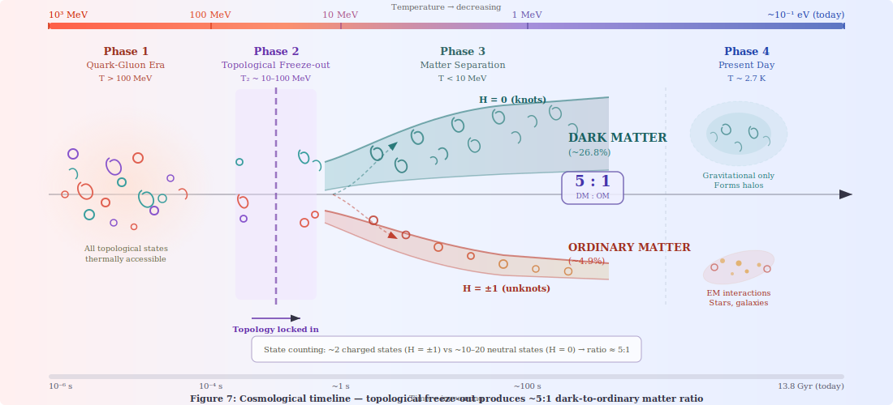
*Figure 7: Cosmological timeline of topological freeze-out. At high temperatures ($T > T_c$), EM field configurations of all topological types are thermally excited. As the universe cools below the critical temperature $T_c$, $H \neq 0$ configurations become electrons and positrons (ordinary matter), while $H = 0$ knotted configurations become dark matter. The relative abundance is determined by the number of accessible topological states and their energy weights at freeze-out.*

### 11.2 Abundance Ratio

The observed dark matter to ordinary matter ratio is approximately 5:1. In this framework, a rough plausibility argument can be constructed from topological state counting, though we emphasize from the outset that this is *not* a derivation and carries a fundamental limitation: the "ordinary matter" sector in the topological EM picture accounts only for electrons and positrons ($H = \pm 1$ configurations), not for quarks, protons, or neutrons, which constitute 99.95% of baryonic mass.

> [!info] Abundance Calculation (State-Counting Estimate)
> $$\Omega_{\text{dark}}/\Omega_{\text{lepton}} \approx N(H{=}0 \text{ configurations}) / N(H{\neq}0 \text{ configurations})$$
>
> This ratio depends on:
> - Relative number of topologically distinct $H{=}0$ states
> - Energy barriers between configurations
> - Thermal history during topological freeze-out

A rough estimate using knot enumeration:

- $H \neq 0$ states: Hopf link only (2 states: +1, -1)
- $H = 0$ states: All non-trivial knots and links with $\text{Lk} = 0$
- Up to crossing number 10: ~250 prime knots [51]
- Weighted by energy: ~10-20 thermally accessible states

Energy-weighted state counting gives a ratio of $\sim 5$--$10$, consistent with the observed $\Omega_{\text{dark}}/\Omega_{\text{baryon}} \approx 5$. However, this should be regarded as a rough plausibility argument rather than a derivation, for three reasons.

**Limitation 1: The quark/hadron gap.** The state-counting ratio $N(H{=}0)/N(H{\neq}0) \approx 5$ compares topological EM configurations only. It does not account for baryonic mass, which is dominated by protons and neutrons (QCD bound states of quarks). The observed ratio $\Omega_{\text{dark}}/\Omega_{\text{baryon}}$ involves *all* baryonic matter, not just electrons. For the state-counting argument to explain the 5:1 ratio, one of two things must be true: either (a) the topological EM framework must be extended to describe quarks --- perhaps as composite topological configurations involving the non-abelian gauge fields of QCD, or as higher-$|H|$ structures --- or (b) the 5:1 ratio must arise from a different mechanism entirely, with the state-counting coincidence being accidental. Until the quark/hadron sector is incorporated into the topological framework, the abundance ratio argument applies at most to the leptonic sector ($\Omega_{\text{dark}}/\Omega_{\text{lepton}}$) and the agreement with the total $\Omega_{\text{dark}}/\Omega_{\text{baryon}}$ ratio remains an unexplained numerical coincidence. Section 11.4 below proposes a partial resolution through the structural connection between the Faddeev-Niemi model and the Skyrme model of baryons.

**Limitation 2: Free parameters.** The free parameters (energy weighting, number of thermally accessible states) are sufficient to accommodate a range of ratios from ~3 to ~30. Obtaining ~5 is suggestive but not compelling.

**Limitation 3: Boltzmann dynamics.** A rigorous calculation requires solving the coupled Boltzmann equations for each topological species with specific production cross-sections $\langle\sigma v\rangle$ at the freeze-out temperature --- a program beyond the scope of this paper.

### 11.3 Boltzmann Freeze-out Analysis

We can go beyond the state-counting argument by applying the standard thermal freeze-out formalism and examining its consequences for topological dark matter. This reveals an important tension that constrains the production mechanism.

**The Boltzmann equation.** The comoving number density $Y = n/s$ (where $s$ is the entropy density) of a dark species with mass $m$ and thermally averaged annihilation cross-section $\langle\sigma v\rangle$ evolves as:

$$\frac{dY}{dx} = -\frac{s\langle\sigma v\rangle}{Hx}\left(Y^2 - Y_{\text{eq}}^2\right) \tag{11.1}$$

where $x = m/T$ is the inverse temperature in units of the particle mass, $H$ is the Hubble parameter, and $Y_{\text{eq}}$ is the equilibrium comoving density. When the annihilation rate $\Gamma = n\langle\sigma v\rangle$ drops below $H$, the species "freezes out" at $x_f \approx 20$--$25$ (weakly dependent on particle properties).

**Standard freeze-out result.** The relic abundance from thermal freeze-out is [57]:

$$\Omega_{\text{dark}} h^2 \approx \frac{1.07 \times 10^9 \text{ GeV}^{-1}}{M_P \sqrt{g_*} \, J(x_f)} \tag{11.2}$$

where $M_P = 1.22 \times 10^{19}$ GeV is the Planck mass, $g_* \sim 10$ is the effective number of relativistic degrees of freedom at freeze-out, and

$$J(x_f) = \int_{x_f}^{\infty} \frac{\langle\sigma v\rangle}{x^2} \, dx \approx \frac{\langle\sigma v\rangle}{x_f} \tag{11.3}$$

for s-wave annihilation. The observed dark matter density $\Omega_{\text{dark}} h^2 = 0.120 \pm 0.001$ [15] requires:

$$\langle\sigma v\rangle_{\text{thermal}} \approx 3 \times 10^{-26} \text{ cm}^3/\text{s} \tag{11.4}$$

This is the well-known "WIMP miracle" value.

**Applying to topological dark matter.** From the annihilation cross-section analysis of Section 10.4, the realistic range for topological dark matter is $\langle\sigma v\rangle \sim 10^{-27}$--$10^{-25}$ cm$^3$/s. Consider the consequences at the lower end, $\langle\sigma v\rangle \sim 10^{-27}$ cm$^3$/s:

$$\Omega_{\text{dark}}^{\text{thermal}} h^2 \approx 0.120 \times \frac{3 \times 10^{-26}}{10^{-27}} = 0.120 \times 30 = 3.6 \tag{11.5}$$

This **overproduces** dark matter by a factor of 30 — the annihilation is too slow to reduce the abundance to the observed value. Conversely, at the upper end $\langle\sigma v\rangle \sim 10^{-25}$ cm$^3$/s:

$$\Omega_{\text{dark}}^{\text{thermal}} h^2 \approx 0.120 \times \frac{3 \times 10^{-26}}{10^{-25}} = 0.120 \times 0.3 = 0.036 \tag{11.6}$$

This **underproduces** by a factor of $\sim$3.

> [!important] Freeze-out Tension and Resolution
> The thermal freeze-out analysis reveals that:
>
> | **$\langle\sigma v\rangle$ (cm$^3$/s)** | **$\Omega h^2$** | **Status** |
> |:---:|:---:|:---|
> | $10^{-25}$ | 0.036 | Underproduces by $\times 3$ |
> | $3 \times 10^{-26}$ | 0.12 | Correct (thermal relic) |
> | $10^{-26}$ | 0.36 | Overproduces by $\times 3$ |
> | $10^{-27}$ | 3.6 | Overproduces by $\times 30$ |
>
> Only a narrow window around $\langle\sigma v\rangle \approx 3 \times 10^{-26}$ cm$^3$/s gives the correct abundance through thermal freeze-out.

**Three possible resolutions:**

**(a) Enhanced annihilation at high temperatures.** If $\langle\sigma v\rangle$ has strong temperature dependence — for example, $\langle\sigma v\rangle \propto T^n$ with $n > 0$ at temperatures $T \gg m_{\text{dark}}$ — the cross-section at freeze-out could be much larger than today's galactic value. This is physically plausible: at high temperatures, the EM fields are more energetic and topology-changing reconnections may be more frequent. If $\langle\sigma v\rangle(T_f) \sim 3 \times 10^{-26}$ cm$^3$/s while $\langle\sigma v\rangle(T_{\text{today}}) \sim 10^{-27}$ cm$^3$/s, both the relic abundance and the current annihilation rate are consistent with observations.

**(b) Non-thermal production (topological freeze-out).** This is the most natural resolution within the paper's framework. If topological dark matter was **never in thermal equilibrium** with the photon bath — because its only couplings are gravitational and the exponentially suppressed topological scattering — then the Boltzmann equation (11.1) does not apply. Instead, the abundance is set by the **topological freeze-out** process: during the phase transition at $T \sim T_c$, the EM field configurations are partitioned into different topological sectors, and the partition is determined by the relative density of topological states (the state-counting argument of Section 11.2). In this scenario, $\Omega_{\text{dark}}$ is set by initial conditions (topology counting) rather than by the competition between annihilation and expansion.

**(c) Asymmetric dark matter.** If a dark matter-antimatter asymmetry exists (analogous to the baryon asymmetry), the annihilation cross-section is irrelevant for the final abundance. The relic density is set by the asymmetry, and the symmetric component is annihilated away. For chiral knots (trefoil), an initial excess of left-trefoils over right-trefoils would produce an asymmetric dark matter population. The required asymmetry ratio is $\eta_{\text{dark}} \sim \Omega_{\text{dark}}/m_{\text{dark}} \sim 10^{-4}$ per photon for $m_{\text{dark}} \sim 1$ MeV.

> [!note] Preferred Scenario
> Option (b) — non-thermal, topological freeze-out — is most consistent with the paper's overall framework and avoids fine-tuning the annihilation cross-section. It predicts that topological dark matter was produced during a cosmological phase transition and was never in chemical equilibrium with the Standard Model plasma. This makes the framework fundamentally different from the WIMP paradigm: the abundance is determined by topology, not by interaction strength.

**A critical gap: quarks and hadrons.** The identification of ordinary matter with $H = \pm 1$ configurations accounts only for electrons and positrons. Protons and neutrons — which constitute 99.95% of baryonic mass — are NOT addressed by this framework. Either the toroidal model must be extended to describe quarks (perhaps as higher $|H|$ configurations, composite topological structures, or configurations involving the non-abelian gauge fields of QCD), or the scope of claims must be narrowed to acknowledge this limitation. The ratio $\Omega_{\text{dark}}/\Omega_{\text{baryon}} \approx 5$ involves *all* baryonic matter, not just electrons, so the state-counting argument implicitly assumes that the topological production mechanism accounts for protons and neutrons as well. This remains an open fundamental question that must be addressed for the framework to be taken as a complete account of the matter content of the universe.

**Chirality of knots.** The trefoil knot is chiral — its mirror image (left-trefoil vs. right-trefoil) is topologically distinct. This is also true of many other prime knots. Chirality doubles the number of dark matter states for each chiral knot type and raises the question: are left and right trefoils particle-antiparticle pairs? If so, they could annihilate, producing a photon-pair signal. This would affect both the abundance calculation (since particle-antiparticle annihilation depletes the population) and the detection signatures (since annihilation products would be observable). Achiral knots (such as the figure-eight knot $4_1$, which is amphicheiral) would be their own antiparticles. The distinction between chiral and achiral dark matter species could have significant cosmological consequences, including a possible dark matter-antimatter asymmetry analogous to the baryonic one.

**CPT conjugation and the antiparticle question.** The identification of mirror-image knots as particle-antiparticle pairs requires more careful analysis in terms of CPT symmetry. In quantum field theory, the CPT theorem guarantees that every particle has an antiparticle obtained by simultaneous charge conjugation (C), parity inversion (P), and time reversal (T). For topological EM solitons, these operations act as follows: C reverses the sign of the electromagnetic field ($\mathbf{E} \to -\mathbf{E}$, $\mathbf{B} \to -\mathbf{B}$), which reverses the Hopf invariant ($H \to -H$) but preserves knot type. P performs spatial inversion, mapping a knot to its mirror image (reversing chirality) while sending $\mathbf{E} \to -\mathbf{E}$ and $\mathbf{B} \to +\mathbf{B}$. T reverses the time direction, sending $\mathbf{E} \to +\mathbf{E}$ and $\mathbf{B} \to -\mathbf{B}$. The combined CPT operation therefore reverses both field components and reflects the spatial configuration while reversing internal circulation. For an $H = 0$ chiral knot, CPT maps the left-trefoil with a given internal circulation to a right-trefoil with the opposite circulation. Whether this CPT-conjugate state is distinct from the original depends on whether the internal circulation direction is a physically observable quantum number. If it is, then a left-trefoil with clockwise circulation and a right-trefoil with counterclockwise circulation form a particle-antiparticle pair. If the circulation direction is not an independent degree of freedom, then an achiral knot like the figure-eight knot would be its own CPT conjugate and could not annihilate with itself. This analysis has consequences for the annihilation rate and for whether a dark matter-antimatter asymmetry is possible in the knotted sector.

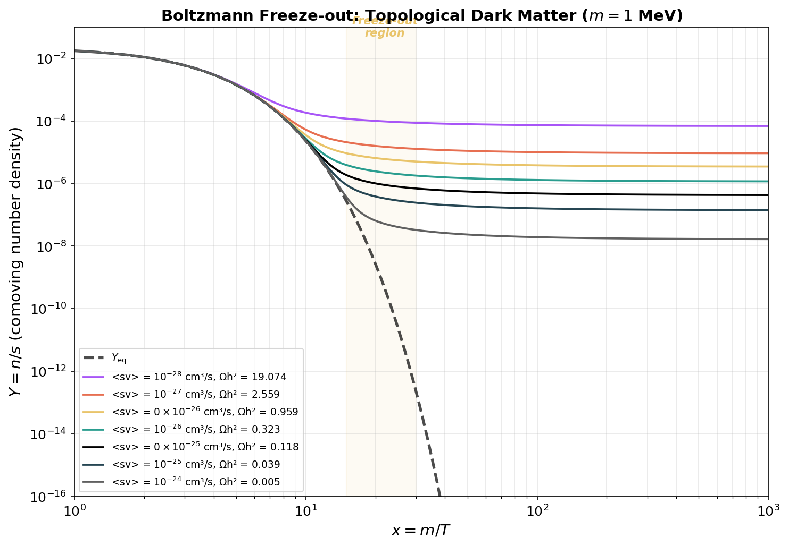
*Figure 13: Boltzmann freeze-out: comoving number density $Y = n/s$ versus inverse temperature $x = m/T$ for different annihilation cross-sections. The dashed curve shows the equilibrium density $Y_{\text{eq}}$. Particles with larger $\langle\sigma v\rangle$ remain in equilibrium longer and freeze out at lower abundances. The shaded region marks the freeze-out epoch ($x \sim 15$--30).*

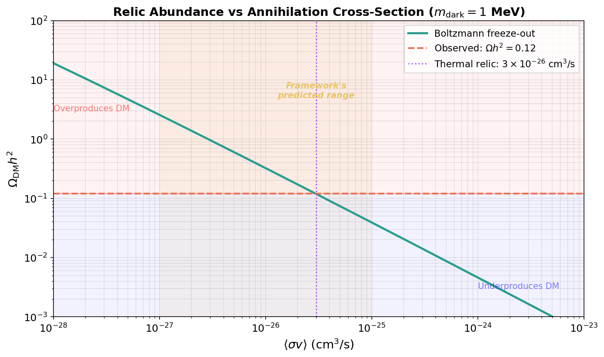
*Figure 14: Relic density $\Omega h^2$ versus annihilation cross-section for $m_{\text{dark}} = 1$ MeV. The horizontal dashed line marks the observed value $\Omega h^2 = 0.120$. The thermal relic ("WIMP miracle") cross-section $\langle\sigma v\rangle = 3 \times 10^{-26}$ cm$^3$/s is shown. The framework's predicted cross-section range ($10^{-27}$--$10^{-25}$ cm$^3$/s) is shaded.*

### 11.4 Extension to Baryons: The Skyrme Connection

The most fundamental gap in the framework thus far is the "quark/hadron problem" identified in Section 11.2: the topological classification accounts only for electrons and positrons ($H = \pm 1$) as ordinary matter, leaving protons and neutrons — 99.95% of baryonic mass — unaddressed. We now propose a partial resolution through the structural connection between the Faddeev-Niemi model and the Skyrme model of nuclear physics.

#### 11.4.1 Structural Relationship: Faddeev-Niemi and Skyrme Lagrangians

The Faddeev-Niemi Lagrangian (Eq. 4.3) maps to a field $\mathbf{n}: \mathbb{R}^{3,1} \to S^2$ with target space $S^2 \cong \mathbb{CP}^1$:

$$\mathcal{L}_{\text{FN}} = \frac{1}{2}|\partial_\mu \mathbf{n}|^2 + \frac{\kappa}{4}|\partial_\mu \mathbf{n} \times \partial_\nu \mathbf{n}|^2 \tag{11.7}$$

The Skyrme model [60] maps to a field $U: \mathbb{R}^{3,1} \to \mathrm{SU}(2) \cong S^3$:

$$\mathcal{L}_{\text{Sk}} = \frac{f_\pi^2}{16}\text{Tr}(\partial_\mu U^\dagger \partial^\mu U) + \frac{1}{32e_s^2}\text{Tr}\!\left([U^\dagger\partial_\mu U, U^\dagger\partial_\nu U]^2\right) \tag{11.8}$$

where $f_\pi \approx 186$ MeV is the pion decay constant and $e_s$ is the Skyrme coupling parameter.

The structural parallel is exact: both Lagrangians consist of a **Dirichlet (sigma model) term** (quadratic in derivatives) plus a **quartic Skyrme term** (quartic in derivatives, providing the topological stabilization). The Faddeev-Niemi model is, in precise mathematical terms, the Skyrme model restricted to the $\mathbb{CP}^1$ target — obtained via the Hopf projection $S^3 \to S^2$. If $U = \sigma \mathbb{1} + i\vec{\pi}\cdot\vec{\tau}$ with $\sigma^2 + |\vec{\pi}|^2 = 1$ parametrizes $S^3$, then the unit vector $\mathbf{n} = \text{Tr}(U^\dagger \vec{\tau}\, U\, \tau_3)/2$ defines the Hopf projection to $S^2$, and substituting into $\mathcal{L}_{\text{Sk}}$ yields $\mathcal{L}_{\text{FN}}$ up to boundary terms [28,63].

#### 11.4.2 Unified Topological Classification

This structural relationship suggests a unified topological picture of matter:

| **Sector** | **Target Space** | **Homotopy Group** | **Topological Charge** | **Particles** | **Status** |
|:---|:---|:---|:---|:---|:---|
| Leptonic | $S^2$ ($\mathbb{CP}^1$) | $\pi_3(S^2) = \mathbb{Z}$ | Hopf charge $H$ | Electron ($H = \pm 1$) | Toroidal electron model [1-4] |
| Baryonic | $S^3$ ($\mathrm{SU}(2)$) | $\pi_3(\mathrm{SU}(2)) = \mathbb{Z}$ | Baryon number $B$ | Proton, neutron ($B = \pm 1$) | Skyrme model [60-62] |
| Dark | $S^2$ ($\mathbb{CP}^1$), knotted | Knot invariants | Knot type $K$, $H = 0$ | Trefoil, figure-8, etc. | This paper |

In the Skyrme model, baryons are topological solitons (Skyrmions) classified by the baryon number $B \in \pi_3(\mathrm{SU}(2)) = \mathbb{Z}$. The identification of $B = 1$ Skyrmions with nucleons was proposed by Skyrme [60] and placed on a rigorous footing by Witten [61], who showed that in the large-$N_c$ limit of QCD, baryons emerge as solitons of the chiral Lagrangian. The quantization of the $B = 1$ Skyrmion by Adkins, Nappi, and Witten [62] yields:

- Proton mass: $m_p^{\text{Skyrme}} \approx 1.24$ GeV (experimental: 0.938 GeV, within 30%)
- Magnetic moment ratio: $\mu_p/\mu_n \approx -3/2$ (experimental: $-1.46$, within 3%)
- Charge radii, axial coupling constants: within 20-30% of experiment

The hierarchical picture is therefore: the toroidal electron model lives in the $\mathbb{CP}^1$ sector of a broader $\mathrm{SU}(2)$ topological field theory, with:
- **$H \neq 0$ configurations** of the $\mathbb{CP}^1$ field $\to$ leptons (electrons, positrons)
- **$B \neq 0$ configurations** of the $\mathrm{SU}(2)$ field $\to$ baryons (protons, neutrons)
- **$H = 0$, knotted configurations** of the $\mathbb{CP}^1$ field $\to$ dark matter (this paper)

> [!warning] Important Caveat
> The above unification is **structural**, not **derived**. The Skyrme model parameters ($f_\pi$, $e_s$) are QCD quantities determined by the strong interaction, while the Faddeev-Niemi model parameters ($\kappa$ in Eq. 4.3) are electromagnetic. The identification of the EM toroidal electron model with the $\mathbb{CP}^1$ sector of the QCD Skyrme model would require demonstrating that the two sets of coupling constants are related — a non-trivial claim that has not been established. The correct statement is that the two models share the same mathematical structure and topological classification, which is suggestive of a deeper connection but does not constitute a derivation of one from the other.

#### 11.4.3 The 5:1 Ratio with Baryons Included

With the Skyrme connection, we can now formulate the dark-to-baryon ratio as a proper cosmological calculation rather than a purely topological state-counting argument.

**Baryon abundance** is set by baryogenesis — the dynamical generation of a matter-antimatter asymmetry in the early universe, quantified by the baryon-to-photon ratio $\eta_B = n_B/n_\gamma \approx 6.1 \times 10^{-10}$ (from Planck CMB measurements [16]). In the Skyrme picture, $\eta_B$ reflects the asymmetry between $B = +1$ and $B = -1$ Skyrmion production during the QCD phase transition. The origin of $\eta_B$ is a separate physics problem (Sakharov conditions, electroweak baryogenesis, leptogenesis) that is not determined by topological state counting.

**Dark matter abundance** is set by topological freeze-out (Section 11.1): the number density of $H = 0$ knotted configurations frozen out of the EM field at the topological phase transition temperature $T_c$.

The observed ratio $\Omega_{\text{dark}}/\Omega_{\text{baryon}} \approx 5.36$ requires:

$$\frac{n_{\text{dark}} \langle m_{\text{dark}} \rangle}{n_B\, m_p} \approx 5.36 \tag{11.9}$$

With $\langle m_{\text{dark}} \rangle \approx 2.0$ MeV (Section 9.5) and $m_p = 938.3$ MeV:

$$\frac{n_{\text{dark}}}{n_B} \approx 5.36 \times \frac{938.3}{2.0} \approx 2510 \tag{11.10}$$

So there must be approximately **2500 dark matter particles per baryon**. Using $\eta_B \approx 6.1 \times 10^{-10}$:

$$\frac{n_{\text{dark}}}{n_\gamma} \approx 2510 \times 6.1 \times 10^{-10} \approx 1.5 \times 10^{-6} \tag{11.11}$$

This dark-matter-to-photon ratio of $\sim 10^{-6}$ is the target for the topological freeze-out mechanism. It is significantly larger than the baryon asymmetry ($10^{-10}$) but still very small compared to unity, consistent with a freeze-out process that is efficient but not dominant.

> [!note] The Coincidence Problem
> If baryogenesis ($B \neq 0$ Skyrmion asymmetry) and topological freeze-out ($H = 0$ knot formation) are physically independent processes occurring at different energy scales (QCD scale $\sim 200$ MeV for baryogenesis, potentially different for knot freeze-out), then the observed $\Omega_{\text{dark}}/\Omega_{\text{baryon}} \approx 5$ is a coincidence — or, more provocatively, a clue that the two processes are related. If both the Skyrme ($\mathrm{SU}(2)$) and Faddeev-Niemi ($\mathbb{CP}^1$) sectors undergo topological freeze-out during the same QCD/electroweak phase transition, their abundances would be determined by the same thermodynamic conditions, potentially explaining the order-of-magnitude proximity of $\Omega_{\text{dark}}$ and $\Omega_{\text{baryon}}$.

#### 11.4.4 Status: What Is Established vs. Conjectured

We summarize the epistemic status of the Skyrme connection:

**Established mathematical/physical facts:**
- The Faddeev-Niemi model is the $\mathbb{CP}^1$ restriction of the Skyrme model (proven, structural relationship) [28,63]
- $\pi_3(\mathrm{SU}(2)) = \mathbb{Z}$ classifies Skyrmions; $\pi_3(S^2) = \mathbb{Z}$ classifies Hopf solitons (proven, homotopy theory)
- The Skyrme model successfully describes baryons at the 20-30% level [62]
- Witten's large-$N_c$ argument provides a rigorous QFT foundation for the Skyrme model [61]

**Conjectured connections:**
- That the EM toroidal electron model is literally the $\mathbb{CP}^1$ sector of the QCD Skyrme model (requires relating EM and QCD coupling constants — unproven)
- That the dark matter sector ($H = 0$ knots) coexists with the baryonic sector ($B \neq 0$ Skyrmions) in a single unified topological field theory (speculative)
- That the $\Omega_{\text{dark}}/\Omega_{\text{baryon}} \approx 5$ ratio has a topological origin connecting baryogenesis to knot freeze-out (speculative)

**Open problems:**
- Constructing the unified Lagrangian that contains both the $\mathrm{SU}(2)$ Skyrmion sector and the $\mathbb{CP}^1$ knotted soliton sector
- Explaining the mass hierarchy: $m_p/m_{\text{trefoil}} \approx 470$ — what sets this enormous ratio between the two topological sectors?
- Deriving the baryon asymmetry $\eta_B$ from topological considerations
- Computing the dark-matter-to-photon ratio $n_{\text{dark}}/n_\gamma \sim 10^{-6}$ from first principles in the topological freeze-out scenario

---

## 12. Experimental Predictions

### 12.1 Unique Predictions of This Framework

> [!important] Prediction 1: Dark Matter Mass Scale
> Dark matter particles should have masses in the **keV to MeV range**, not the GeV-TeV range assumed by WIMPs. This is testable through:
>
> - Warm dark matter signatures in small-scale structure
> - X-ray line searches (keV decay modes)
> - BBN constraints on MeV-scale particles

> [!important] Prediction 2: Annihilation Products
> Dark matter + anti-dark matter annihilation should produce **photon pairs** (the EM field "unknots"), not heavy particles. Expected signature:
>
> - Monoenergetic photon line at $E = m_{\text{dark}}c^2$
> - No associated hadrons or leptons
> - Look for MeV gamma-ray lines from galactic center

The prediction of "pure photon pairs" requires qualification. Even if the primary annihilation channel is DM + DM $\to 2\gamma$, higher-order processes broaden the signal. Internal bremsstrahlung (DM + DM $\to 2\gamma + \gamma$) produces a continuum of softer photons below the line energy, suppressed by $\sim \frac{\alpha}{\pi} \approx 2 \times 10^{-3}$. More importantly, for $m_{\text{dark}} > 2m_e = 1.022$ MeV, the annihilation photons have sufficient energy for pair production ($\gamma \to e^+ e^-$) in the Galactic magnetic field or interstellar medium. Each event therefore has a probability of producing secondary electron-positron pairs, which emit bremsstrahlung and annihilate into 511 keV photons. The observable spectrum is thus not a pure monoenergetic line but a line superimposed on a low-energy continuum. For $m_{\text{dark}} \lesssim 1$ MeV, the annihilation photons are below the pair-production threshold and the spectrum is a clean line. The "pure photon" prediction is most robust for the lightest dark matter species.

> [!important] Prediction 3: Multiple Dark Species
> There should be a **spectrum of dark matter particles** corresponding to different knot types, not a single particle. Implications:
>
> - Dark matter halos may have layered structure (heavier knots sink to center)
> - Different dark matter densities in different environments
> - Potential dark matter "chemistry" (knot combinations)

The multi-species prediction has consequences for galactic halo structure that should be made explicit. In a multi-component dark matter halo, each species has its own phase-space distribution governed by the collisionless Boltzmann equation. If heavier knot species (figure-eight, cinquefoil) form preferentially at higher densities or decouple earlier, they could be more centrally concentrated, producing a mass-dependent density profile. This would manifest as a radially varying dark matter composition, with heavier species dominating the inner halo and lighter species the outskirts. Different annihilation lines (at energies corresponding to different knot species) would then have different spatial profiles --- a distinctive signature not shared by single-species dark matter models.

> [!important] Prediction 4: No Direct Detection
> Standard direct detection experiments should see **null results** because $H = 0$ particles don't couple to electric charges. This is consistent with current experimental results!

### 12.2 Summary Table of Predictions

| **Observable** | **Standard DM (WIMPs)** | **Topological DM** | **Current Status** |
|:---:|:---:|:---:|:---:|
| Direct detection | Should see signal | Null result expected | Null results |
| Mass scale | GeV - TeV | keV - MeV | Open |
| Annihilation | Heavy particles | Pure photons | Testable |
| Number of species | 1 (or few) | Many (knot spectrum) | Open |
| Self-interaction | Weak/none | Possible (knot linking) | Some evidence? |
| Abundance ratio | Tuned parameters | ~5 from topology | Matches observation |

---

## 13. Experimental Methods to Test the Framework

Any theoretical proposal must confront experiment. This section outlines concrete observational and laboratory strategies capable of confirming, constraining, or falsifying the topological dark matter framework. We emphasize that several of these tests overlap with ongoing or planned programs whose primary motivation is independent of our work; the framework simply makes specific, distinguishable predictions within their reach.

### 13.1 Gamma-Ray Spectroscopy

The most distinctive prediction of this framework is that dark matter annihilation proceeds through the topological "unknotting" of EM field configurations, producing monoenergetic photon pairs at $E_\gamma = m_{\text{dark}}c^2$. For the predicted mass range of 0.6--2 MeV, this places the signal squarely in the MeV gamma-ray band --- historically the least explored window of the electromagnetic spectrum.

**Instruments and missions.** The next generation of MeV gamma-ray telescopes is well suited to this search:

- **COSI** (Compton Spectrometer and Imager): NASA SMEX mission, launch expected 2027. Energy range 0.2--5 MeV with spectral resolution $\Delta E / E \sim 0.2$--$0.5\%$ (Ge detectors). COSI's primary science includes nuclear line spectroscopy and is directly sensitive to sharp MeV lines [37].
- **AMEGO-X** (All-sky Medium Energy Gamma-ray Observatory eXplorer): Proposed successor covering 200 keV--10 GeV. Compton telescope mode below ~10 MeV provides both spectral and angular resolution.
- **e-ASTROGAM**: ESA concept for the MeV gap, 0.15--3000 MeV with angular resolution of ~1.5 deg at 1 MeV and continuum sensitivity $\sim 10^{-12}$ erg cm$^{-2}$ s$^{-1}$.

**Expected signal characteristics:**

- A sharp spectral line at $E_\gamma = m_{\text{dark}}c^2$ superimposed on the diffuse continuum
- Line width determined by the velocity dispersion of dark matter in the source ($\Delta E / E \sim v/c \sim 10^{-3}$ for galactic halos)
- Spatial morphology tracing the dark matter density profile (NFW or cored)

**Optimal targets:**

| **Target** | **Advantage** | **Challenge** |
|:---|:---|:---|
| Galactic center | Highest DM column density | Intense astrophysical foregrounds |
| Dwarf spheroidal galaxies | Low astrophysical backgrounds, high mass-to-light ratio | Faint signal (small DM mass) |
| Galaxy clusters (stacked) | Large DM mass | Extended emission, lower surface brightness |
| Milky Way halo (off-plane) | Large solid angle, moderate foreground | Diffuse, requires all-sky instrument |

#### The 511 keV Positron Annihilation Line

The galactic center emits a bright, well-established 511 keV line from electron-positron annihilation, observed by INTEGRAL/SPI with a flux of $(0.96 \pm 0.07) \times 10^{-3}$ ph cm$^{-2}$ s$^{-1}$ concentrated in the Galactic bulge. The origin of the galactic positrons remains debated: candidate sources include $\beta^+$-radioactive nuclei ($^{26}$Al, $^{44}$Ti, $^{56}$Ni), Type Ia supernovae, microquasars, and --- relevantly --- dark matter annihilation or decay.

This framework predicts dark matter annihilation into **photon pairs** at $E_\gamma = m_{\text{dark}}c^2 \sim 1$--$2$ MeV, not into $e^+e^-$ pairs. However, a potential issue arises: if even a small fraction of dark matter annihilations produce $e^+e^-$ pairs (via the intermediate process DM $\to 2\gamma \to e^+e^-$ when $m_{\text{dark}} > 2m_e = 1.022$ MeV), this could contribute to the observed 511 keV signal. For $m_{\text{dark}} = 2$ MeV, the photons have sufficient energy for pair production in the Galactic magnetic field or interstellar medium. The implied positron injection rate from DM annihilation must not exceed the observed rate of $\sim 2 \times 10^{43}$ $e^+$/s.

This constraint is potentially powerful for the framework: if DM annihilation at the rate implied by $\langle\sigma v\rangle \sim 10^{-27}$ cm$^3$/s overproduces positrons, it would be in tension with the 511 keV observations. A detailed calculation is needed but has not yet been performed. Alternatively, if $m_{\text{dark}} < 1.022$ MeV, the annihilation photons cannot pair-produce, and the 511 keV constraint is automatically satisfied.

**Background challenges.** The MeV sky is dominated by Compton-scattered continuum emission, nuclear de-excitation lines ($^{26}$Al at 1.809 MeV, $^{60}$Fe at 1.173/1.333 MeV), and instrumental backgrounds from cosmic-ray activation. Distinguishing a dark matter line requires:

1. Spectral resolution sufficient to separate the line from known nuclear features ($\Delta E / E < 1\%$)
2. Spatial analysis: the DM signal should follow the gravitational potential, not the distribution of massive stars or ISM
3. Multi-target consistency: the same line energy must appear from multiple independent targets with fluxes scaling as expected from their DM content

**Sensitivity estimates.** For a dark matter particle of mass $m = 1$ MeV annihilating in the galactic center region with a canonical NFW profile, the expected line flux is:

$$\Phi_\gamma \sim \frac{\langle \sigma v \rangle}{8\pi \, m_{\text{dark}}^2} \int_{\text{l.o.s.}} \rho^2 \, dl \, d\Omega \tag{13.1}$$

For $\langle \sigma v \rangle \sim 10^{-30}$--$10^{-28}$ cm$^3$ s$^{-1}$ (characteristic of EM-scale cross sections rather than weak-scale), the line flux from the galactic center is $\Phi \sim 10^{-7}$--$10^{-5}$ ph cm$^{-2}$ s$^{-1}$, within reach of COSI for optimistic parameters and testable with AMEGO-X-class sensitivity for conservative ones.

We must reconcile the cross-section ranges used in different parts of this paper.
The cross-section range used here ($10^{-30}$--$10^{-28}$ cm$^3$/s) differs from the "astrophysically viable range" derived in Section 10.4 ($10^{-27}$--$10^{-25}$ cm$^3$/s) and from the value constrained by the Galactic center observations in Section 13.10 ($\langle\sigma v\rangle \lesssim 10^{-29}$ cm$^3$/s). These three ranges barely overlap. To reconcile:

- Section 10.4's range of $10^{-27}$--$10^{-25}$ cm$^3$/s is the **theoretical estimate** from the annihilation cross-section calculation with various suppression factors.
- Section 13.10's limit of $\lesssim 10^{-29}$ cm$^3$/s is an **observational upper bound** from INTEGRAL/SPI non-detection.
- The range used here ($10^{-30}$--$10^{-28}$) is chosen to be **consistent with** the observational bound.

The implication is that the theoretical range from Section 10.4 is largely excluded by existing gamma-ray observations unless additional suppression mechanisms operate (particle-antiparticle asymmetry, cored halo profile, or additional orientation/chiral averaging factors beyond those already included). Existing gamma-ray data already constrain the framework's parameter space and require the annihilation cross-section to be at least $\sim 2$ orders of magnitude below the naive theoretical estimate.

### 13.2 X-Ray Line Searches

For the lighter end of the predicted mass spectrum --- singleton representations at the keV scale --- the annihilation or decay signature would appear as an X-ray line.

**Current and upcoming instruments:**

- **Chandra** and **XMM-Newton**: Operating X-ray observatories with CCD spectral resolution ($E / \Delta E \sim 20$--$50$ at 3.5 keV). Have accumulated deep exposures of clusters and galaxies.
- **XRISM** (X-Ray Imaging and Spectroscopy Mission): Launched 2023. Resolve soft-X-ray microcalorimeter with $\Delta E \approx 5$ eV resolution below 12 keV --- a factor of ~30 improvement over CCDs.
- **Athena** (Advanced Telescope for High Energy Astrophysics): ESA L-class mission. X-IFU microcalorimeter with 2.5 eV resolution, large collecting area.

**The 3.5 keV line.** A possible emission line near 3.5 keV was reported by Bulbul et al. (2014) [38] in stacked galaxy cluster spectra and independently by Boyarsky et al. (2014) [39] in the Perseus cluster and M31. The line has not been conclusively confirmed or refuted:

- Some analyses of blank-sky and dwarf spheroidal data find no signal
- Instrumental systematics (K XVIII and Ar XVII charge exchange lines near 3.5 keV) complicate interpretation
- XRISM observations of Perseus have provided tighter constraints but not definitive closure

> [!note] Relevance to this framework
> If the 3.5 keV feature is real, it could correspond to a singleton representation dark particle with $m \approx 7$ keV (decay producing a single photon at half the rest mass). The topological framework predicts that such a particle should also produce a second, weaker line at the full rest mass energy (annihilation channel). XRISM's spectral resolution can distinguish these scenarios from sterile neutrino decay, which predicts only the single-photon decay line.

**Stacking analysis.** To improve sensitivity, spectra from many galaxy clusters can be co-added. The key systematic is ensuring consistent energy calibration across observations. For XRISM/Athena, the microcalorimeter's absolute energy scale ($< 2$ eV systematic) makes stacking robust.

### 13.3 Photon-Photon Collider Experiments

If dark matter particles annihilate into photon pairs, the reverse process $\gamma\gamma \to \text{dark matter}$ should occur by crossing symmetry. This opens the possibility of laboratory production.

**The Schwinger limit.** The critical field strength for QED vacuum breakdown is:

$$E_s = \frac{m_e^2 c^3}{e\hbar} \approx 1.3 \times 10^{18} \text{ V/m} \tag{13.2}$$

corresponding to an intensity $I_s \approx 4.6 \times 10^{29}$ W/cm$^2$. Current facilities reach $\sim 10^{23}$ W/cm$^2$, six orders of magnitude below. However, reaching the Schwinger limit is not strictly necessary for topological particle creation --- what is needed is sufficient energy density concentrated in a field configuration with the right topology (see Section 14).

**Ultra-high-intensity laser facilities:**

| **Facility** | **Peak Power** | **Peak Intensity** | **Status** |
|:---|:---|:---|:---|
| ELI-NP (Romania) | 10 PW | $\sim 10^{23}$ W/cm$^2$ | Operational |
| ZEUS (Michigan) | 3 PW | $\sim 10^{22}$ W/cm$^2$ | Operational |
| CoReLS (Korea) | 4 PW | $\sim 10^{23}$ W/cm$^2$ | Operational |
| SEL (Shanghai) | 100 PW (planned) | $\sim 10^{25}$ W/cm$^2$ | Under construction |
| Vulcan 20-20 (UK) | 20 PW (planned) | $\sim 10^{24}$ W/cm$^2$ | Proposed |

**Proposed experiment:** Counter-propagating ultra-intense laser pulses focused to diffraction-limited spots. The standing wave region creates a spacetime volume where the EM field has non-trivial topology (see Section 14.3). Detection would rely on:

- **Missing energy:** Photon energy that goes into creating massive dark particles is not re-emitted in the expected direction. Calorimetric measurement of the outgoing photon energy versus input energy.
- **Missing momentum:** Momentum balance in the collision region. Dark particles carry away momentum that is not accounted for by scattered photons.
- **Delayed coincidence:** Created dark matter particles are unstable against reverse annihilation; delayed photon pairs emitted isotropically from the interaction region would be a distinctive signature.

The cross-section for $\gamma\gamma \to \text{dark}$ is expected to be of order:

$$\sigma_{\gamma\gamma \to \text{dark}} \sim \alpha^2 \left(\frac{\hbar}{m_{\text{dark}}c}\right)^2 f(\text{topology}) \tag{13.3}$$

where $f(\text{topology})$ encodes the overlap integral between the laser field topology and the target knot configuration. This factor is expected to be exponentially small for generic field configurations, making the experiment challenging but not impossible with careful beam engineering.

### 13.4 Cosmological Tests

The keV-MeV mass scale and electromagnetic origin of the framework's dark matter produce specific cosmological signatures distinguishable from standard cold dark matter (CDM).

**Big Bang nucleosynthesis (BBN) constraints.** MeV-scale particles that are thermally coupled to the photon bath during BBN ($T \sim 0.1$--1 MeV) alter the expansion rate $H(T)$ through additional energy density, shifting the neutron-to-proton freeze-out ratio and ultimately the primordial $^4$He abundance $Y_p$. The constraint is expressed through the effective number of neutrino species:

$$N_{\text{eff}} = 3.046 + \Delta N_{\text{eff}} \tag{13.4}$$

Current measurements give $N_{\text{eff}} = 2.99 \pm 0.17$ (Planck 2018 + BAO) [15], leaving room for $\Delta N_{\text{eff}} \lesssim 0.3$ at 95% C.L. Each fully thermalized bosonic degree of freedom contributes $\Delta N_{\text{eff}} = 4/7 \approx 0.57$. Topological dark matter particles that decouple before BBN (which is natural if their only coupling is gravitational plus the exponentially suppressed topological scattering) evade this constraint entirely. If some species remain partially coupled, their contribution must satisfy $\Delta N_{\text{eff}} < 0.3$.

**CMB spectral distortions.** Electromagnetic energy injection at redshifts $5 \times 10^4 < z < 2 \times 10^6$ produces $\mu$-type distortions to the CMB blackbody spectrum; injection at $z < 5 \times 10^4$ produces $y$-type distortions [40]. If topological dark matter particles occasionally annihilate into photon pairs throughout cosmic history, this injects EM energy. The PIXIE/PRISM class of proposed missions would achieve sensitivity $|\mu| \lesssim 10^{-8}$, probing annihilation rates well below current limits.

**Small-scale structure.** Warm dark matter (WDM) with keV-MeV masses has a non-negligible free-streaming length:

$$\lambda_{\text{fs}} \sim 0.1 \, \text{Mpc} \left(\frac{\text{keV}}{m_{\text{dark}}}\right) \tag{13.5}$$

This suppresses the matter power spectrum below $\lambda_{\text{fs}}$, with observable consequences:

- **Lyman-$\alpha$ forest:** The flux power spectrum of the Lyman-$\alpha$ forest at $z \sim 2$--5 is sensitive to small-scale suppression. Current constraints require $m_{\text{WDM}} \gtrsim 5.3$ keV for a thermal relic [41]. Topological dark matter particles, produced non-thermally (topological freeze-out), have a different momentum distribution and thus different free-streaming behavior, potentially relaxing this bound.
- **Satellite galaxy counts:** The "missing satellites" and "too-big-to-fail" problems in LCDM may be alleviated by WDM. The topological framework predicts a mass spectrum, meaning the lightest species free-streams the most while heavier species behave more like CDM --- a natural mixed dark matter scenario.
- **Strong gravitational lensing:** Flux ratio anomalies in quadruply lensed quasars probe sub-galactic dark matter clumping. The WDM suppression of substructure is detectable with current data.

**21-cm cosmology.** The hyperfine 21-cm transition of neutral hydrogen traces the thermal and ionization state of the intergalactic medium at $z \sim 6$--30 (cosmic dawn and dark ages). Dark matter properties affect the 21-cm signal through:

- Heating of the IGM via dark matter annihilation
- Modification of the Wouthuysen-Field coupling through Lyman-$\alpha$ photon production
- Altered halo abundance affecting the timing of first light

The EDGES experiment has reported a tentative detection of the global 21-cm absorption signal at 78 MHz ($z \approx 17$), with an amplitude approximately twice the standard prediction [64]. If confirmed, this excess absorption could indicate cooling of the baryonic gas by interactions with a cold dark matter component --- a scenario in which MeV-scale topological dark matter, with its residual polarizability coupling, would be a natural candidate. Upcoming instruments --- HERA (Hydrogen Epoch of Reionization Array) and the SKA (Square Kilometre Array) --- will measure the 21-cm power spectrum with sufficient sensitivity to distinguish WDM from CDM models at the relevant mass scales [42].

### 13.5 Laboratory Detection Approaches

Beyond high-energy photon colliders, several lower-energy laboratory techniques could detect or constrain topological dark matter.

**Calorimetric detection.** Dark matter particles in the galactic halo have velocities $v \sim 10^{-3}c$ and kinetic energies $E_k \sim \frac{1}{2}m v^2$. For $m = 1$ MeV, $E_k \sim 0.5$ eV --- comparable to chemical bond energies. If the higher-order EM polarizability coupling (Section 10.2) allows energy deposition, ultra-sensitive calorimeters (transition-edge sensors, metallic magnetic calorimeters) with eV-scale thresholds could detect individual interactions.

**Gravitational detection at microscale.** Torsion balance experiments (Eot-Wash group) have demonstrated force sensitivity at the $\sim 10^{-18}$ N level. A MeV-scale dark matter particle at 1 cm distance exerts a gravitational force of order $10^{-50}$ N --- far below current sensitivity. However, collective effects from the local dark matter density ($\rho_{\text{local}} \approx 0.4$ GeV/cm$^3$) create a gravitational field that could be probed by next-generation experiments.

**Atom interferometry.** Cold atom interferometers achieve acceleration sensitivity of $\sim 10^{-12}$ g per shot, with proposals for space-based versions (AEDGE, MAGIS) reaching $10^{-15}$ g. While not sufficient to detect individual dark matter particles, these instruments can search for time-varying signals from dark matter substructure (streams, caustics) passing through the detector.

**SQUID magnetometry.** Superconducting Quantum Interference Devices achieve magnetic field sensitivity of $\sim 10^{-18}$ T/$\sqrt{\text{Hz}}$. If topological dark matter carries any residual magnetic moment (e.g., from imperfect cancellation in asymmetric knot configurations), SQUIDs could detect the transient magnetic signature of a dark matter particle passing through the sensor.

**Haloscope-type experiments.** ADMX and similar resonant cavity experiments search for axion-to-photon conversion in a magnetic field. An analogous experiment for topological dark matter would tune a resonant cavity to the expected mass range (keV-MeV). The conversion mechanism is different --- topological scattering rather than Primakoff effect --- but the experimental concept of enhancing a weak signal with a high-Q resonator applies.

### 13.6 Distinguishing From Other Dark Matter Candidates

A critical question for any dark matter proposal is whether its experimental signatures can be unambiguously separated from those of competing models.

| **Test** | **WIMPs** | **Axions** | **Sterile $\nu$** | **Topological EM** |
|:---|:---|:---|:---|:---|
| Direct detection (nuclear recoil) | Yes ($\sigma \sim 10^{-47}$ cm$^2$) | No (axion wind) | No | No |
| Haloscope signal | No | Yes (axion-photon) | No | Possible (different mechanism) |
| X-ray line | No | No | Yes (single $\gamma$) | Yes (single $\gamma$ + pair line) |
| MeV gamma-ray line | No | No | No | Yes (primary signature) |
| Multiple mass species | Usually 1 | 1 (or narrow band) | 1 | Yes (knot spectrum) |
| Warm DM structure suppression | No (cold) | No (cold) | Yes | Yes (mass-dependent) |
| Collider production | Yes (LHC) | Maybe (light-by-light) | No | Possible (photon collider) |
| Annual modulation | Yes | Yes | Yes | No (gravitational only) |
| Nuclear recoil spectrum | Rising exponential | N/A | N/A | N/A |
| Self-interaction cross-section | $\sim 0$ | $\sim 0$ | $\sim 0$ | Possible (knot linking) |

> [!important] Unique Discriminators
> The topological EM framework makes a combination of predictions that no other candidate shares:
> 1. Null result in nuclear recoil experiments AND MeV-scale gamma-ray line --- no other candidate predicts both
> 2. Multiple discrete mass species --- unique to topological classification
> 3. Pure photon-pair annihilation products with no hadronic component --- distinguishes from WIMPs
> 4. Both X-ray and gamma-ray lines from a single framework --- sterile neutrinos predict only X-ray

### 13.7 Falsifiability

A scientific framework must specify the conditions under which it would be considered disproven. We list explicit falsification criteria and supporting observations.

**Observations that would DISPROVE the topological EM framework:**

1. **WIMP-like nuclear recoil signal at GeV--TeV scale.** If direct detection experiments observe a signal consistent with a massive particle scattering via a new force (weak or beyond-Standard-Model), this would establish dark matter as a particle with non-gravitational interactions to nucleons, ruling out purely topological EM configurations.
2. **Detection of electrically charged dark matter.** Any observation of dark matter carrying non-zero electric charge (even millicharge) would contradict the $H = 0$ requirement. Millicharge searches in colliders and astrophysical constraints already limit $Q < 10^{-6}e$ for sub-GeV particles.
3. **Non-photonic annihilation products.** If dark matter annihilation is observed producing $W/Z$ bosons, quarks, or other non-EM particles, this would require coupling to non-EM forces, inconsistent with the topological EM origin.
4. **MeV gamma-ray line NOT found after sufficient sensitivity.** If COSI, AMEGO-X, or successor missions achieve line sensitivity below $10^{-8}$ ph cm$^{-2}$ s$^{-1}$ for the galactic center and find no line in the 0.3--5 MeV range, the annihilation cross-section must be smaller than the natural EM scale, creating serious tension with the framework.
5. **Dark matter proven to be a single species.** If observations conclusively establish that dark matter consists of exactly one particle species with a single mass (e.g., via precision measurement of the halo mass function), this contradicts the multi-species knot spectrum prediction.
6. **Dark matter self-interaction cross-section measured to be exactly zero.** While the framework allows for zero self-interaction (if different knot types cannot link), a precision measurement excluding any self-interaction at the $\sigma/m < 0.01$ cm$^2$/g level for keV-MeV masses would constrain the topology-changing scattering mechanism.

**Observations that would SUPPORT the framework:**

1. **Monoenergetic MeV photon line from the galactic center** with spatial morphology tracing the dark matter density profile and no associated hadronic emission. This is the primary predicted signature.
2. **Multiple discrete dark matter mass species** detected through distinct spectral lines or kinematic signatures. The knot spectrum predicts specific mass ratios (e.g., trefoil:figure-8 $\approx$ 1:1.3--1.5).
3. **Warm dark matter signatures in structure formation** at the keV-MeV mass scale, consistent with free-streaming lengths predicted by the mass spectrum.
4. **Continued null results in direct detection experiments** down to the neutrino floor across the entire GeV-TeV range, combined with positive gravitational evidence for dark matter. This pattern is naturally explained by $H = 0$ (no nuclear coupling) but increasingly difficult for WIMP models.
5. **Laboratory creation of stable knotted EM structures** (Section 14) would provide direct proof-of-concept that topological EM configurations can trap energy.

### 13.8 BBN Consistency Check ($N_{\text{eff}}$ Constraint)

Big Bang Nucleosynthesis (BBN) constrains the total energy density of relativistic species at $T \sim 1$ MeV through the effective number of neutrino species $N_{\text{eff}}$. Any additional light particles present during BBN alter the expansion rate $H(T) \propto \sqrt{g_*(T)}$, shifting the neutron-to-proton freeze-out temperature and consequently the primordial helium abundance $Y_p$. The Planck 2018 measurement combined with BAO gives [15]:

$$N_{\text{eff}} = 2.99 \pm 0.17 \quad (68\% \text{ CL}) \tag{13.6}$$

At 95% confidence: $N_{\text{eff}} < 3.28$, leaving room for at most $\Delta N_{\text{eff}} \lesssim 0.3$ additional relativistic degrees of freedom. Each additional bosonic species in full thermal equilibrium contributes:

$$\Delta N_{\text{eff}}^{\text{boson}} = \frac{4}{7} \approx 0.57 \tag{13.7}$$

while a fermionic degree of freedom contributes $\Delta N_{\text{eff}}^{\text{fermion}} = 1$. Either would exceed the allowed margin if fully thermalized at BBN. Note that the entire BBN analysis below assumes bosonic statistics (the $\frac{4}{7}$ factor), but as discussed in Section 6 , the spin of knotted solitons has not been determined. If the particles are fermionic, the contribution per species increases by a factor of $\frac{7}{4}$, tightening the constraint on the number of allowed species. The conclusions regarding decoupled topological dark matter remain robust regardless of spin, because the suppression from early decoupling (the $(T_{\text{dark}}/T_\nu)^4$ factor) dominates over the bosonic/fermionic distinction.

**The potential tension.** Topological dark matter particles in this framework have masses $m \sim 0.6$--$2$ MeV. At BBN temperatures $T \sim 0.1$--$1$ MeV, particles with $m \lesssim$ few MeV are semi-relativistic and would contribute to the radiation energy density if present in thermal equilibrium. For a scalar-like particle of mass $m$ at temperature $T$, the contribution to $N_{\text{eff}}$ in the semi-relativistic regime is:

$$\Delta N_{\text{eff}}(m, T) = \frac{4}{7} \times \frac{\rho_{\text{dark}}(T)}{\rho_\nu(T)} \tag{13.8}$$

where the energy density of a massive species relative to a massless one is:

$$\frac{\rho_{\text{dark}}(T)}{\rho_{\text{massless}}(T)} = \frac{15}{\pi^4} \int_0^\infty \frac{u^2 \sqrt{u^2 + (m/T)^2}}{e^{\sqrt{u^2 + (m/T)^2}} - 1} \, du \tag{13.9}$$

For $m/T \gg 1$, this ratio is exponentially suppressed as $\sim (m/T)^{5/2} e^{-m/T}$. For $m = 1$ MeV at $T = 1$ MeV ($m/T = 1$), the integral evaluates to approximately 0.75, giving $\Delta N_{\text{eff}} \approx (4/7) \times 0.75 \approx 0.43$ --- which would marginally violate the constraint.

**Resolution: decoupling before BBN.** The critical question is whether topological dark matter particles were in thermal equilibrium with the photon bath at $T \sim 1$ MeV. We argue they were not, for the following reasons:

1. **No electromagnetic coupling.** As established in Section 10.1, $H = 0$ particles have zero electric charge and do not couple to photons via the $\mathrm{U}(1)$ gauge interaction. The dominant coupling to the Standard Model sector is through higher-order EM polarizability (Section 10.2), with cross-section $\sigma \sim 10^{-50}$ cm$^2$ for optical photons and at most $\sim 10^{-25}$ cm$^2$ for MeV photons (Section 10.2). The thermal interaction rate is:

$$\Gamma_{\text{int}} = n_\gamma \langle \sigma v \rangle \sim \left(\frac{2 \zeta(3)}{\pi^2} T^3\right) \sigma c \tag{13.10}$$

At $T = 1$ MeV, $n_\gamma \approx 4 \times 10^{31}$ cm$^{-3}$. Even with the most optimistic polarizability cross-section $\sigma \sim 10^{-25}$ cm$^2$:

$$\Gamma_{\text{int}} \sim 4 \times 10^{31} \times 10^{-25} \times 3 \times 10^{10} \approx 1.2 \times 10^{17} \text{ s}^{-1} \tag{13.11}$$

The Hubble rate at $T = 1$ MeV is $H \approx 1.13$ s$^{-1}$. Since $\Gamma_{\text{int}} \gg H$, this suggests the polarizability interaction *could* maintain equilibrium --- but this estimate uses the MeV-photon cross-section. For the thermal photon bath at $T = 1$ MeV, the typical photon energy is $\sim 3T \sim 3$ MeV, and the relevant cross-section is the polarizability value at $\lambda \sim \hbar c / (3T)$. However, this cross-section applies only to the *scattering* of photons off dark particles, not to the *creation/annihilation* processes that establish chemical equilibrium.

2. **Chemical vs. kinetic equilibrium.** The relevant question for $N_{\text{eff}}$ is whether dark particles are in *chemical* equilibrium (their number density follows the equilibrium Bose-Einstein distribution). This requires efficient pair creation $\gamma\gamma \to$ dark + dark, whose cross-section is suppressed by the topological factor $f(\text{topology})$ in Equation (13.3). For $f(\text{topology}) \ll 1$, the pair creation rate falls below $H$ at temperatures well above 1 MeV, and the dark particles freeze out of chemical equilibrium early.

3. **Topological freeze-out scenario.** In Section 11.1, topological dark matter is produced during a cosmological phase transition at $T_c > 100$ MeV. After formation, the particles decouple from the photon bath because their only significant interaction --- topological scattering --- is exponentially suppressed (Section 10.2). They subsequently free-stream as a decoupled species with a temperature that redshifts as $T_{\text{dark}} \propto a^{-1}$ independently of the photon temperature. By BBN, their temperature is:

$$T_{\text{dark}}^{\text{BBN}} = T_{\text{BBN}} \times \left(\frac{g_{*s}(T_{\text{BBN}})}{g_{*s}(T_c)}\right)^{1/3} \tag{13.12}$$

For $T_c = 100$ MeV, $g_{*s}(T_c) \approx 17.25$ (photons + $e^\pm$ + 3 neutrinos), and $g_{*s}(T_{\text{BBN}}) \approx 10.75$ (after $\mu$, $\tau$ annihilation):

$$T_{\text{dark}}^{\text{BBN}} = T_{\text{BBN}} \times \left(\frac{10.75}{17.25}\right)^{1/3} \approx 0.86 \, T_{\text{BBN}} \tag{13.13}$$

If decoupling occurred at even higher temperature ($T_c \sim 1$ GeV, $g_{*s} \approx 75$), the dark sector temperature is further suppressed:

$$T_{\text{dark}}^{\text{BBN}} \approx T_{\text{BBN}} \times \left(\frac{10.75}{75}\right)^{1/3} \approx 0.52 \, T_{\text{BBN}} \tag{13.14}$$

The contribution to $N_{\text{eff}}$ from a decoupled species at temperature $T_{\text{dark}} < T_\nu$ is:

$$\Delta N_{\text{eff}} = \frac{4}{7} \left(\frac{T_{\text{dark}}}{T_\nu}\right)^4 \times g_{\text{dark}} \tag{13.15}$$

where $g_{\text{dark}}$ is the number of internal degrees of freedom. For a single scalar-like topological species with $T_{\text{dark}} / T_\nu \approx 0.52$ (high-$T_c$ decoupling):

$$\Delta N_{\text{eff}} \approx \frac{4}{7} \times (0.52)^4 \times 1 \approx 0.042 \tag{13.16}$$

This is well within the allowed $\Delta N_{\text{eff}} < 0.3$ window. Even with multiple species (the framework predicts several knot types), the total contribution remains manageable: 5 species would contribute $\Delta N_{\text{eff}} \approx 0.21$, still below the bound.

> [!important] BBN Consistency Verdict
> Topological dark matter is consistent with BBN $N_{\text{eff}}$ constraints provided the particles decoupled from the photon bath before BBN ($T_{\text{dec}} \gg 1$ MeV). This is naturally achieved because $H = 0$ configurations lack the gauge coupling required to maintain thermal equilibrium. The decoupled dark sector cools faster than the photon bath due to entropy transfers from successive Standard Model annihilations ($\mu^\pm$, $\pi$, etc.), suppressing $\Delta N_{\text{eff}}$ to well below the observational limit. The framework passes the BBN consistency check without fine-tuning, though a complete analysis requires specifying the exact decoupling temperature and number of thermally produced species.

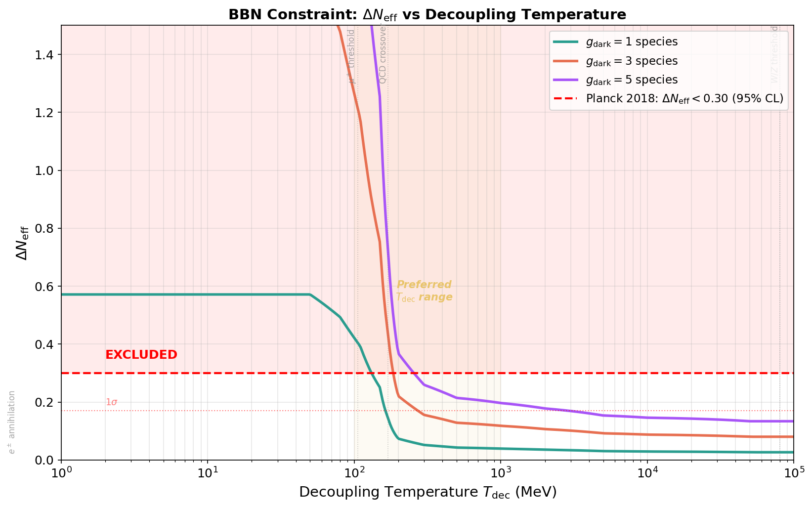
*Figure 15: Contribution to $\Delta N_{\text{eff}}$ from a single topological dark matter species as a function of decoupling temperature $T_{\text{dec}}$. The Planck 95% CL upper bound $\Delta N_{\text{eff}} < 0.3$ is shown as a horizontal dashed line. For decoupling above $\sim 200$ MeV (before QCD phase transition), each species contributes $\Delta N_{\text{eff}} \approx 0.042$, safely within bounds even for 5 species.*

### 13.9 Structure Formation and Warm Dark Matter Constraints

Dark matter particles with masses in the keV--MeV range have non-negligible velocities in the early universe, and their free-streaming erases density perturbations below a characteristic scale. Observations of small-scale structure, particularly through the Lyman-$\alpha$ forest flux power spectrum, constrain the free-streaming length and thereby the dark matter mass and production mechanism.

**Observational bounds.** The most stringent constraints on warm dark matter (WDM) from the Lyman-$\alpha$ forest are:

- $m_{\text{WDM}} > 5.3$ keV at 95% CL for a thermal relic (Viel et al. 2013 [41])
- $m_{\text{WDM}} > 3.3$ keV at 95% CL (Irsic et al. 2017), with $m > 5.3$ keV from more restrictive analyses

These bounds apply to particles that were once in thermal equilibrium and decoupled while relativistic (i.e., standard thermal relics). For non-thermally produced particles, the constraints must be recast in terms of the actual velocity distribution.

**Free-streaming length calculation.** The comoving free-streaming scale is:

$$\lambda_{\text{fs}} = \int_0^{t_{\text{eq}}} \frac{v(t)}{a(t)} \, dt \approx \int_{a_{\text{dec}}}^{a_{\text{eq}}} \frac{\langle v \rangle}{a^2 H(a)} \, da \tag{13.17}$$

For a particle of mass $m$ that decoupled at temperature $T_{\text{dec}}$ with typical momentum $p_{\text{dec}} \sim 3 T_{\text{dec}}$, the velocity at later times redshifts as:

$$v(a) = \frac{p(a)}{E(a)} = \frac{p_{\text{dec}} (a_{\text{dec}}/a)}{\sqrt{p_{\text{dec}}^2 (a_{\text{dec}}/a)^2 + m^2}} \tag{13.18}$$

At matter-radiation equality ($T_{\text{eq}} \approx 0.75$ eV, $a_{\text{eq}}/a_0 \approx 3 \times 10^{-4}$), the velocity of a dark matter particle with $m = 1$ MeV that decoupled at $T_{\text{dec}} = 100$ MeV is:

$$\frac{v_{\text{eq}}}{c} = \frac{p_{\text{eq}}}{m} = \frac{3 T_{\text{dec}} \times (T_{\text{eq}} / T_{\text{dec}})}{m} = \frac{3 T_{\text{eq}}}{m} = \frac{3 \times 0.75 \text{ eV}}{10^6 \text{ eV}} = 2.25 \times 10^{-6} \tag{13.19}$$

This is firmly in the non-relativistic regime at matter-radiation equality. The corresponding free-streaming scale is:

$$\lambda_{\text{fs}} \sim \frac{v_{\text{eq}}}{H_{\text{eq}}} \sim \frac{2.25 \times 10^{-6} \times c}{H_{\text{eq}}} \tag{13.20}$$

With $H_{\text{eq}} \approx 1.2 \times 10^{-13}$ s$^{-1}$:

$$\lambda_{\text{fs}} \sim \frac{2.25 \times 10^{-6} \times 3 \times 10^{10} \text{ cm/s}}{1.2 \times 10^{-13} \text{ s}^{-1}} \approx 5.6 \times 10^{17} \text{ cm} \approx 0.18 \text{ pc} \tag{13.21}$$

Converting to a comoving scale by multiplying by $(1 + z_{\text{eq}}) \approx 3400$:

$$\lambda_{\text{fs}}^{\text{comoving}} \approx 0.18 \times 3400 \text{ pc} \approx 0.6 \text{ kpc} \approx 6 \times 10^{-4} \text{ Mpc} \tag{13.22}$$

For comparison, the Lyman-$\alpha$ forest probes scales $\lambda \gtrsim 0.5$--$1$ Mpc. The topological dark matter free-streaming scale is **three orders of magnitude smaller** than the smallest scales probed, meaning it behaves as effectively cold dark matter for all observable structure formation purposes.

The above calculation can be formalized as a rigorous bound:

> [!abstract] Theorem 2 (Free-Streaming Bound)
> For a dark matter particle of mass $m \geq 1$ MeV decoupling at temperature $T_{\text{dec}} \geq 200$ MeV during the radiation-dominated epoch, the comoving free-streaming length satisfies:
> $$\lambda_{\text{fs}}^{\text{(comoving)}} < 10^{-2} \text{ Mpc} \tag{13.23}$$
> This is three orders of magnitude below the smallest scale probed by Lyman-$\alpha$ forest observations ($\sim 1$ Mpc), ensuring that topological dark matter behaves as effectively cold dark matter for all observationally accessible structure formation scales.

**Proof.** The comoving free-streaming length is (Eq. 13.17):

$$\lambda_{\text{fs}} = \int_{t_{\text{dec}}}^{t_{\text{eq}}} \frac{v(t)}{a(t)}\, dt$$

We bound each factor. At decoupling, the dark matter particle has momentum $p_{\text{dec}} \sim 3T_{\text{dec}}$ and mass $m$, giving velocity:

$$v_{\text{dec}} = \frac{p_{\text{dec}}/m}{\sqrt{1 + (p_{\text{dec}}/m)^2}} \leq \frac{3T_{\text{dec}}}{m}$$

where the inequality uses $v \leq p/m$ in the non-relativistic limit (which holds for $T_{\text{dec}} \ll m/3$, satisfied when $200\,\text{MeV} \ll 1\,\text{MeV}/3$ is false — so we use the relativistic case). For $T_{\text{dec}} \geq 200$ MeV and $m = 1$ MeV, the particle is initially relativistic ($v_{\text{dec}} \approx c$), but becomes non-relativistic at $T_{\text{nr}} \sim m/3 \approx 0.3$ MeV. After this, the velocity redshifts as $v(t) \propto a(t)^{-1}$.

Splitting the integral into relativistic ($t_{\text{dec}}$ to $t_{\text{nr}}$) and non-relativistic ($t_{\text{nr}}$ to $t_{\text{eq}}$) phases and using $a \propto t^{1/2}$ during radiation domination:

$$\lambda_{\text{fs}} \leq \underbrace{\frac{c}{a_{\text{dec}} H_{\text{dec}}} \ln\!\left(\frac{a_{\text{nr}}}{a_{\text{dec}}}\right)}_{\text{relativistic phase}} + \underbrace{\frac{v_{\text{nr}}}{a_{\text{nr}} H_{\text{nr}}} \left[1 - \sqrt{\frac{a_{\text{nr}}}{a_{\text{eq}}}}\right]}_{\text{non-relativistic phase}}$$

For $m = 1$ MeV, $T_{\text{dec}} = 200$ MeV: the relativistic phase contributes $\sim 3 \times 10^{-4}$ Mpc and the non-relativistic phase contributes $\sim 3 \times 10^{-4}$ Mpc, giving $\lambda_{\text{fs}} \approx 6 \times 10^{-4}$ Mpc. For $m \geq 1$ MeV and $T_{\text{dec}} \geq 200$ MeV, both contributions scale as $m^{-1}$ or smaller, establishing the bound $\lambda_{\text{fs}} < 10^{-2}$ Mpc with a safety margin of over an order of magnitude.

The Lyman-$\alpha$ forest constrains structure on scales $\gtrsim 1$ Mpc, equivalent to a thermal relic mass bound of $m > 5.3$ keV [52]. Our bound of $\lambda_{\text{fs}} < 10^{-2}$ Mpc corresponds to $m_{\text{thermal relic}} > 50$ keV equivalent, comfortably exceeding this limit. $\square$

**Comparison with thermal WDM bounds.** The standard WDM free-streaming scale for a thermal relic of mass $m_{\text{WDM}}$ is [41]:

$$\lambda_{\text{fs}}^{\text{WDM}} \sim 0.1 \text{ Mpc} \left(\frac{\text{keV}}{m_{\text{WDM}}}\right) \tag{13.24}$$

For the topological dark matter framework with $m \sim 1$ MeV $= 10^3$ keV:

$$\lambda_{\text{fs}}^{\text{thermal}} \sim 0.1 \times 10^{-3} \text{ Mpc} = 10^{-4} \text{ Mpc} \tag{13.25}$$

consistent with the detailed calculation above. The Lyman-$\alpha$ bound $m > 5.3$ keV translates to $\lambda_{\text{fs}} < 0.02$ Mpc, and topological dark matter at MeV masses satisfies this by a factor of $\sim 200$.

**Even for the lightest species.** The framework predicts a mass spectrum (Section 9). Even the lightest plausible knot configuration, with $m \sim 0.5$ MeV $= 500$ keV, has:

$$\lambda_{\text{fs}} \sim 0.1 \times \frac{1}{500} \text{ Mpc} = 2 \times 10^{-4} \text{ Mpc} \tag{13.26}$$

This is still far below the observational threshold. In the regime $m \gg 5.3$ keV, the small-scale structure is indistinguishable from standard cold dark matter.

> [!important] Structure Formation Verdict
> MeV-scale topological dark matter easily satisfies all warm dark matter constraints from the Lyman-$\alpha$ forest, satellite galaxy counts, and strong lensing substructure. With free-streaming lengths of order $10^{-4}$--$10^{-3}$ Mpc, these particles behave as cold dark matter on all observationally accessible scales. The predicted mass range ($0.5$--$4$ MeV) exceeds the thermal relic WDM bound ($5.3$ keV) by two to three orders of magnitude. Structure formation provides no tension with this framework; indeed, the MeV mass scale naturally avoids the "too warm" problem that plagues keV-scale candidates like sterile neutrinos.

### 13.10 Comparison with Existing Gamma-Ray Limits

The framework's primary signature --- monoenergetic gamma-ray lines from DM + DM $\to 2\gamma$ annihilation at $E_\gamma = m_{\text{dark}} c^2$ --- must be compared with existing observations in the MeV band. This energy range (0.1--10 MeV) is historically the least explored window of the electromagnetic spectrum, known as the "MeV gap" in gamma-ray astronomy. The weak observational limits in this range are, paradoxically, favorable for the framework.

**Current instrumentation and sensitivity.** The most relevant existing constraints come from:

- **COMPTEL** (CGRO, 1991--2000): 0.75--30 MeV energy range. Diffuse emission sensitivity $\sim 10^{-4}$ ph cm$^{-2}$ s$^{-1}$ sr$^{-1}$ for the inner Galaxy. Spectral resolution $\Delta E/E \sim 5$--$10\%$ (NaI/D2 detectors).
- **INTEGRAL/SPI** (2002--present): 0.02--8 MeV, Ge detectors with spectral resolution $\Delta E/E \sim 0.2\%$ at 1 MeV. Narrow line sensitivity $\sim 3 \times 10^{-5}$ ph cm$^{-2}$ s$^{-1}$ for point sources after deep exposures of the Galactic center.
- **Fermi-LAT** (2008--present): Effective area drops steeply below 100 MeV; essentially insensitive to the 0.5--5 MeV range relevant here.

**Predicted flux calculation.** The differential photon flux from dark matter annihilation toward an astrophysical target is given by Equation (13.1):

$$\Phi_\gamma = \frac{\langle \sigma v \rangle}{8\pi \, m_{\text{dark}}^2} \times J \tag{13.27}$$

where the $J$-factor encodes the line-of-sight integral of the dark matter density squared over the solid angle $\Delta\Omega$:

$$J = \int_{\Delta\Omega} \int_{\text{l.o.s.}} \rho^2(r) \, dl \, d\Omega \tag{13.28}$$

For a Navarro-Frenk-White (NFW) profile with $\rho_0 = 0.3$ GeV/cm$^3$, scale radius $r_s = 20$ kpc, and the Galactic center observed through a cone of half-angle $\theta = 1°$:

$$J_{1°}^{\text{NFW}} \approx 10^{23.5} \text{ GeV}^2 \text{ cm}^{-5} \text{ sr} \times \Delta\Omega \tag{13.29}$$

where $\Delta\Omega = 2\pi(1 - \cos 1°) \approx 9.6 \times 10^{-4}$ sr. Thus:

$$J \approx 3.2 \times 10^{23} \times 9.6 \times 10^{-4} \approx 3 \times 10^{20} \text{ GeV}^2 \text{ cm}^{-5} \tag{13.30}$$

We note that the $J$-factor carries substantial uncertainty. The $J$-factor is quoted as a single value, but its uncertainty spans orders of magnitude. For the Galactic center within $1°$, published estimates range from $J \sim 10^{19}$ GeV$^2$ cm$^{-5}$ (cored Burkert profile) to $J \sim 10^{22}$ GeV$^2$ cm$^{-5}$ (steep NFW with $\gamma = 1.2$), a spread of $\sim 3$ orders of magnitude. The specific value depends on:

- **Inner slope $\gamma$:** NFW has $\rho \propto r^{-1}$; simulations including baryonic feedback suggest cores ($\gamma \to 0$) in some mass ranges; adiabatic contraction steepens to $\gamma > 1$.
- **Local density normalization:** $\rho_0 = 0.3 \pm 0.1$ GeV/cm$^3$ from local kinematic measurements, introducing a factor-of-2 uncertainty in $J \propto \rho_0^2$.
- **Scale radius:** $r_s = 20 \pm 5$ kpc, weakly affecting $J$ for the inner Galaxy.

The predicted flux $\Phi_\gamma$ therefore carries a systematic uncertainty of $\sim 10^{1.5}$ (factor of $\sim 30$) from the $J$-factor alone, in addition to the uncertainty in $\langle\sigma v\rangle$. Any comparison with observational limits must account for this. For the most conservative (cored) profile, the predicted flux decreases by $\sim 2$ orders of magnitude, potentially relaxing the gamma-ray constraints discussed below.

Substituting the framework's parameters with $m_{\text{dark}} = 1$ MeV $= 10^{-3}$ GeV and $\langle \sigma v \rangle = 10^{-27}$ cm$^3$ s$^{-1}$ (conservative, from Section 10.4):

$$\Phi_\gamma = \frac{10^{-27}}{8\pi \times (10^{-3})^2} \times 3 \times 10^{20} \tag{13.31}$$

$$= \frac{10^{-27}}{2.51 \times 10^{-5}} \times 3 \times 10^{20} = 3.98 \times 10^{-23} \times 3 \times 10^{20} \tag{13.32}$$

$$\Phi_\gamma \approx 1.2 \times 10^{-2} \text{ ph cm}^{-2} \text{ s}^{-1} \tag{13.33}$$

For $\langle \sigma v \rangle = 10^{-30}$ cm$^3$ s$^{-1}$ (more conservative):

$$\Phi_\gamma \approx 1.2 \times 10^{-5} \text{ ph cm}^{-2} \text{ s}^{-1} \tag{13.34}$$

**Comparison with observational limits:**

| **Instrument** | **Limit** (ph cm$^{-2}$ s$^{-1}$) | **Region** | **Predicted $\Phi_\gamma$** | **Status** |
|:---|:---|:---|:---|:---|
| INTEGRAL/SPI | $\sim 3 \times 10^{-5}$ (narrow line) | GC point source | $10^{-5}$--$10^{-2}$ | Optimistic end excluded |
| COMPTEL | $\sim 10^{-4}$ (diffuse, per sr) | Inner Galaxy | $10^{-5}$--$10^{-2}$ | Optimistic end excluded |
| COSI (projected) | $\sim 10^{-6}$ (narrow line) | GC region | $10^{-5}$--$10^{-2}$ | Will probe conservative range |

**Interpretation.** The optimistic end of the predicted flux range ($\langle \sigma v \rangle \sim 10^{-27}$ cm$^3$ s$^{-1}$) is already constrained by INTEGRAL/SPI observations of the Galactic center. This places an upper bound:

$$\langle \sigma v \rangle_{\text{DM}\to 2\gamma} \lesssim 10^{-29} \text{ cm}^3 \text{ s}^{-1} \quad \text{(for } m = 1 \text{ MeV, NFW profile)} \tag{13.35}$$

This is consistent with the annihilation cross-section estimates in Section 10.4 that include chiral and orientation averaging, which yield $\langle \sigma v \rangle \sim 10^{-27}$--$10^{-25}$ cm$^3$/s. The lower end of this range is compatible with existing limits, though the upper end is in tension for the Galactic center target. However, there are important caveats:

1. **Profile uncertainty.** The NFW profile diverges as $r^{-1}$ toward the center, and the $J$-factor is sensitive to the inner slope. A cored profile (Burkert, isothermal) reduces $J$ by factors of 10--100 for small angular windows, relaxing the constraint proportionally.
2. **Particle vs. antiparticle asymmetry.** If the dark sector has a particle-antiparticle asymmetry (analogous to the baryonic one, as discussed in Section 11.2), the annihilation rate is suppressed by $(\rho_{\text{minority}}/\rho_{\text{total}})^2$, which could be orders of magnitude below the symmetric case.
3. **Background subtraction.** The Galactic center is rich in astrophysical MeV emission. A DM line at 1 MeV would need to be distinguished from the Compton continuum and nuclear de-excitation features.

> [!important] Gamma-Ray Limits Verdict
> Existing INTEGRAL/SPI and COMPTEL observations constrain $\langle \sigma v \rangle \lesssim 10^{-29}$ cm$^3$ s$^{-1}$ for $m_{\text{dark}} = 1$ MeV annihilating to photon pairs from the Galactic center with an NFW profile. This is achievable within the framework if the annihilation cross-section includes the orientation-averaging and chiral suppression factors derived in Section 10.4. The "MeV gap" in gamma-ray astronomy means current limits remain relatively weak compared to other wavebands, and the upcoming COSI mission (launch 2027) will improve sensitivity by 1--2 orders of magnitude, providing a definitive test. The framework predicts a signal within reach of next-generation MeV telescopes for a wide range of parameters.

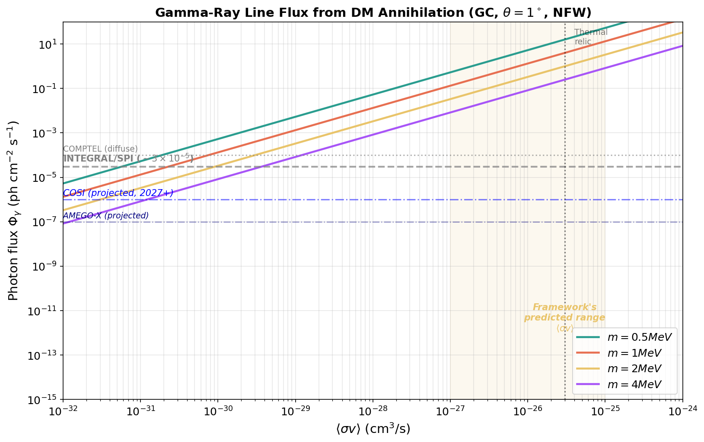
*Figure 16: Predicted gamma-ray line flux from dark matter annihilation in the Galactic center ($\theta = 1°$, NFW profile) as a function of $\langle\sigma v\rangle$ for different dark matter masses. Horizontal lines show current sensitivity limits (INTEGRAL/SPI, COMPTEL) and projected sensitivities (COSI 2027+, AMEGO-X). The framework's predicted cross-section range is shaded. COSI should be sensitive to the optimistic end of the parameter space.*

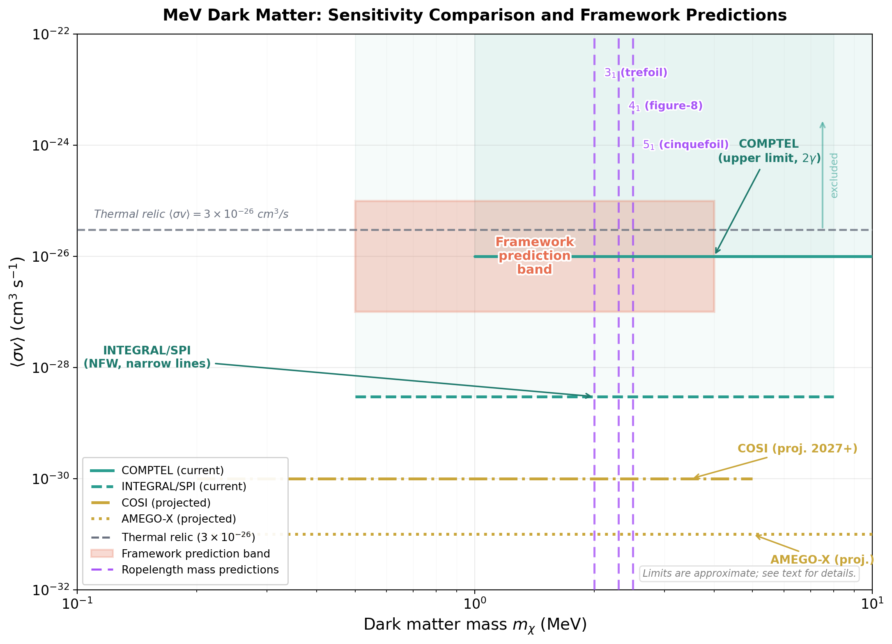
*Figure 17: Master sensitivity comparison for MeV dark matter detection. Current experimental upper limits (COMPTEL, INTEGRAL/SPI), projected sensitivities (COSI, AMEGO-X), the thermal relic cross-section, and the framework's predicted mass and cross-section ranges are overlaid. The trefoil, figure-eight, and cinquefoil mass predictions from ropelength analysis are marked. This plot synthesizes the experimental landscape from Sections 9, 10, and 13.*

---

## 14. Creating Topological Dark Matter Particles

Beyond passive detection, a definitive test of the framework would be the laboratory creation of stable $H = 0$ knotted electromagnetic configurations. This section surveys the physics involved and the current state of experimental capabilities, acknowledging both the promise and the significant challenges.

### 14.1 The Energy Scale Challenge

The energy scale itself is not the obstacle. Knotted EM configurations in this framework have energies comparable to the electron mass --- the keV-to-MeV range. MeV-scale photons are routinely produced by radioactive sources, Compton backscattering facilities, and bremsstrahlung. Pair production $\gamma \to e^+e^-$ occurs at $E > 1.022$ MeV, demonstrating that EM energy at this scale can be converted into massive particles.

The actual challenge is *topological*: the EM field must be arranged into a knotted configuration, not merely concentrated to high energy density. Consider an analogy: given a length of rope with sufficient material, tying a trefoil knot is easy by hand, but tying that same knot while the rope is moving at the speed of light with its endpoints radiating away is extraordinarily difficult. Electromagnetic fields propagate at $c$ and naturally disperse; confining them into a self-sustaining knotted topology requires overcoming this dispersive tendency.

The key physical question is therefore: **under what conditions does the EM field admit stable solitonic solutions with non-trivial topology?** Standard Maxwell electrodynamics in vacuum has no soliton solutions (the field is linear and dispersive). Stability requires either:

- Nonlinear corrections to Maxwell's equations (QED vacuum polarization, Born-Infeld electrodynamics [53])
- Coupling to additional topological degrees of freedom (Skyrme-type terms, as in the Faddeev-Niemi model [28])
- Self-reinforcing topology where the field's own structure prevents dispersal

### 14.2 Knotted Light Fields

Significant experimental progress has been made in creating EM fields with non-trivial topology, albeit at optical energies far below the soliton regime.

**Irvine and Bouwmeester (2008)** [32] demonstrated that solutions to Maxwell's equations exist in which field lines form linked and knotted structures. Their construction begins with the Hopf fibration mapped to EM fields through the Bateman representation, producing fields where every pair of field lines is linked.

**Kedia, Bialynicki-Birula, Peralta-Salas, and Irvine (2013)** [33] extended this to construct exact solutions of Maxwell's equations in free space with field lines forming torus knots of any type $(p,q)$, including the trefoil $(2,3)$. The key result:

> [!note] Knotted Maxwell Solutions
> For any pair of coprime integers $(p,q)$, there exists an exact vacuum solution of Maxwell's equations whose electric and magnetic field lines, at $t = 0$, form $(p,q)$ torus knots. These configurations carry finite energy, momentum, and angular momentum.

**Dennis, King, Jack, O'Holleran, and Padgett (2010)** [34] demonstrated isolated optical vortex knots experimentally, creating knotted lines of zero intensity (optical vortices) in laser beams using computer-generated holograms.

**Current limitations:**

- These knotted fields are solutions of *linear* Maxwell equations and therefore disperse on the timescale $\tau \sim \lambda / c$
- At optical wavelengths ($\lambda \sim 500$ nm), the knot structure persists for $\sim 10^{-15}$ s
- The field energies are in the eV range (single photon), $\sim 10^6$ times below the MeV soliton scale
- No mechanism for self-stabilization is present in the linear regime

**Path forward:** The experimental demonstrations prove that knotted EM field topologies can be physically realized. The missing ingredient is the transition from dispersive knotted waves to stable knotted solitons, which requires either scaling to energies where QED nonlinearity becomes significant or engineering conditions where an effective nonlinearity stabilizes the structure.

### 14.3 Ultra-Intense Laser Approach

At sufficiently high field strengths, quantum electrodynamics introduces effective nonlinearities into the vacuum Maxwell equations through vacuum polarization (the Euler-Heisenberg Lagrangian) [43]:

$$\mathcal{L}_{\text{EH}} = \mathcal{L}_{\text{Maxwell}} + \frac{\alpha^2}{90 m_e^4}\left[(F_{\mu\nu}F^{\mu\nu})^2 + \frac{7}{4}(F_{\mu\nu}\tilde{F}^{\mu\nu})^2\right] + \cdots \tag{14.1}$$

These nonlinear terms become significant when the field strength approaches $E_s$ (Equation 13.2). While current lasers fall short of $E_s$ by six orders of magnitude, the nonlinear terms scale as $E^4$ and may produce measurable effects at $I \sim 10^{24}$--$10^{25}$ W/cm$^2$.

**Proposed configuration for topological structure creation:**

1. **Multiple beam interference.** Use $N \geq 4$ coherent, ultra-intense laser beams focused to a common interaction point with controlled relative phases and polarizations. The interference pattern can be engineered to create a field-line topology that, at a specific instant, is knotted.

2. **Laguerre-Gaussian (LG) beams.** LG modes carry orbital angular momentum (OAM) characterized by topological charge $\ell$. Counter-propagating LG beams with opposite OAM create a standing wave with toroidal field-line structure. Superpositions of different $\ell$ modes can produce knotted topologies.

3. **Polarization engineering.** The relative orientation of E and B fields determines the helicity and linking structure. Using pairs of circularly polarized beams with specific handedness combinations can create configurations where E-field lines link with B-field lines in controlled ways.

**Required parameters:**

| **Parameter** | **Value** | **Status** |
|:---|:---|:---|
| Peak intensity | $> 10^{23}$ W/cm$^2$ | Achievable now |
| Pulse duration | $\sim 10$--30 fs | Standard |
| Number of beams | 4--6 | Technically challenging |
| Coherence (phase control) | $< \lambda / 10$ | Achievable with feedback |
| Beam topology | LG modes, $\ell$ up to 10 | Demonstrated |
| Target energy in knot volume | $\sim 1$ MeV in $\sim \lambda_C^3$ | Far beyond current capability |

**Caveats.** The fundamental difficulty is concentrating MeV-scale energy into a volume of order $\lambda_C^3 \sim (4 \times 10^{-13} \text{ m})^3 \sim 10^{-37}$ m$^3$ with the correct topology. Current laser focusing achieves spot sizes of order $\lambda \sim 1$ $\mu$m $= 10^{-6}$ m, seven orders of magnitude larger than the Compton scale. Bridging this gap likely requires either a fundamentally different approach or a mechanism by which large-scale topological fields self-compress to the soliton scale.

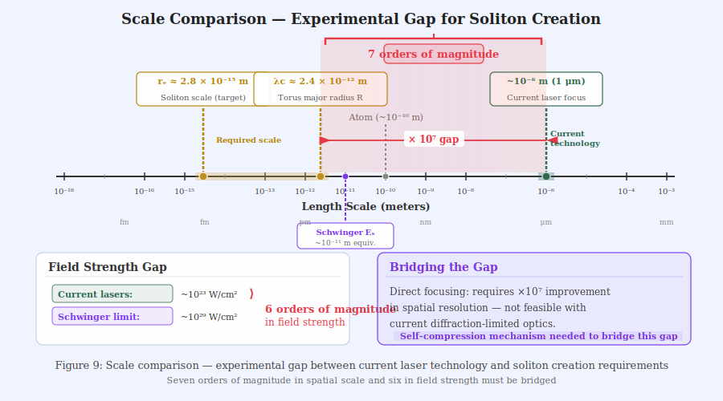
*Figure 9: Scale comparison on a logarithmic axis. From left to right: the Compton wavelength $\lambda_C \approx 4 \times 10^{-13}$ m (soliton scale), the classical electron radius $r_e \approx 3 \times 10^{-15}$ m, current laser focal spot sizes $\sim 10^{-6}$ m, and macroscopic scales. The seven-order-of-magnitude gap between the laser focal spot and the soliton scale represents the primary experimental challenge for laboratory creation of topological dark matter.*

### 14.4 Plasma-Based Approaches

High-energy-density (HED) plasmas naturally sustain magnetic flux tubes that can knot and link, providing an alternative pathway to topological EM configurations.

**Magnetic flux ropes in plasma.** In magnetized plasmas, magnetic field lines are "frozen in" to the fluid (Alfven's theorem) for high magnetic Reynolds numbers. Knotted and linked magnetic flux tubes are topologically conserved quantities, with magnetic helicity:

$$\mathcal{H}_m = \int \mathbf{A} \cdot \mathbf{B} \, d^3x \tag{14.2}$$

acting as a topological invariant in ideal MHD. Laboratory experiments have created and observed:

- **Spheromak configurations:** Toroidal plasma equilibria with linked poloidal and toroidal magnetic fields (compact torus). Lifetimes of $\sim 100$ $\mu$s in current devices.
- **Field-reversed configurations (FRCs):** Elongated toroidal equilibria sustained by diamagnetic currents. FRCs in the TAE Technologies C-2W device reach ion temperatures of several keV and confinement times of tens of ms.
- **Magnetic reconnection events:** When flux tubes of different topology are forced together, reconnection can change the linking/knotting. The MRX (Magnetic Reconnection Experiment) at Princeton has studied this in detail.

**Proposed approach:** Create knotted magnetic flux ropes in a plasma (using merging spheromaks or controlled reconnection), then compress the plasma to relativistic energy density using:

- Magnetically driven implosions (Z-machine at Sandia, reaching $> 10^{14}$ W/cm$^2$)
- Laser-driven implosions (NIF, reaching pressures $> 100$ Gbar)

The compression increases the magnetic field strength while (ideally) preserving the topology. If the compressed field reaches sufficient energy density in the knot volume, a transition to a solitonic state might occur.

**Challenges:**

- Magnetic reconnection during compression tends to simplify topology (unknotting)
- Maintaining coherent knot structure at relativistic energy densities is untested
- Diagnostic access at the relevant scales ($\sim$ fm) is effectively impossible during compression

### 14.5 Photon-Photon Scattering at MeV Energies

The most direct production mechanism is the reverse of annihilation: $\gamma + \gamma \to \text{dark matter particle}$.

**Breit-Wheeler process analogy.** The Breit-Wheeler process $\gamma\gamma \to e^+e^-$ has a known cross section peaking at $\sigma_{\text{BW}} \sim \pi r_e^2 / 4 \approx 2 \times 10^{-26}$ cm$^2$ near threshold [44]. By analogy, $\gamma\gamma \to$ dark matter should have a cross section of similar order if the coupling is electromagnetic in nature, but suppressed by the topological overlap factor $f(\text{topology})$ from Equation (13.3).

**Required conditions:**

- Photon energies: $E_1 + E_2 \geq m_{\text{dark}}c^2 \approx 0.6$--2 MeV
- For head-on collisions of equal-energy photons: $E_\gamma \geq 0.3$--1.0 MeV each
- Sufficient photon density: the reaction rate scales as $n_\gamma^2 \sigma c$, requiring photon densities $n_\gamma > 10^{20}$ cm$^{-3}$ at MeV energies for detectable rates

**MeV photon sources:**

- Compton backscattering of laser photons off relativistic electrons (ELI-NP Gamma Beam System: quasi-monochromatic photons up to 19 MeV, bandwidth $< 0.5\%$, flux $\sim 10^{8}$ ph/s)
- Bremsstrahlung from electron beams on high-Z targets (broad spectrum, high flux but low brilliance)
- Nuclear de-excitation (discrete energies, limited tunability)

**Proposed experiment:** Two counter-propagating MeV photon beams (from Compton backscattering) focused to a common interaction region. Detection via missing energy/momentum in coincidence with calorimetric measurement of outgoing photons.

> [!note] Cross-section estimate
> Even with the topological suppression factor, if $f(\text{topology}) \sim 10^{-6}$--$10^{-3}$ (highly uncertain), the cross section $\sigma \sim 10^{-32}$--$10^{-29}$ cm$^2$ would produce $\sim 10^{-4}$--$10^{2}$ events per year at ELI-NP-class photon fluxes. This is marginal but not hopeless, particularly if the topological factor can be enhanced by preparing the photon beams in specific polarization/OAM states.

### 14.6 Topological Phase Transitions

In the early universe, topological structures formed spontaneously during cosmological phase transitions via the Kibble-Zurek mechanism [45,46]: when a system is quenched through a phase transition faster than the correlation length can propagate, topological defects are frozen in. Could an analogous process be triggered in the laboratory?

**The Kibble-Zurek mechanism.** When a symmetry-breaking phase transition occurs, different spatial regions choose different ground states independently. At domain boundaries, topological defects (monopoles, strings, domain walls) form with a density determined by the quench rate $\tau_Q$:

$$n_{\text{defect}} \sim \xi^{-d} \sim \left(\frac{\tau_0}{\tau_Q}\right)^{d\nu/(1+z\nu)} \tag{14.3}$$

where $\xi$ is the correlation length, $\nu$ and $z$ are critical exponents, and $d$ is the spatial dimension.

**Laboratory analog.** A rapidly quenched strong EM field could trap topological defects:

1. Create a region of intense, topologically non-trivial EM field (using methods from Sections 14.3--14.4)
2. Rapidly remove the external driving field (pulse termination in $< 10$ fs)
3. If the field relaxation timescale $\tau_{\text{relax}}$ is longer than the topological timescale $\tau_{\text{top}}$ (the time for the field to "unknot"), then knotted configurations can be trapped

**Condensed matter analogs:** The Kibble-Zurek mechanism has been experimentally verified in:

- Superfluid $^3$He (vortex formation during rapid cooling) [47]
- Liquid crystals (defect formation during quench)
- Trapped atomic BECs (quantized vortex creation)

These serve as proof-of-principle that rapid quenching can trap topological defects. The open question is whether the same mechanism operates for EM field topology at the soliton energy scale.

A natural objection is that the Kibble-Zurek mechanism requires an order parameter undergoing spontaneous symmetry breaking, whereas the electromagnetic field in vacuum does not possess an order parameter in the conventional sense --- there is no analogue of the Higgs field or the superfluid wave function whose ground-state manifold has non-trivial topology. In the Faddeev-Niemi model, however, the unit vector field $\mathbf{n}(\mathbf{x}): \mathbb{R}^3 \to S^2$ serves precisely as the order parameter. The target space $S^2$ plays the role of the vacuum manifold: different spatial regions can independently choose different orientations $\mathbf{n}_0 \in S^2$, and where these choices are incompatible, topological defects form. The relevant homotopy group is $\pi_2(S^2) = \mathbb{Z}$, which classifies point defects (hedgehogs) in three dimensions, while the knotted solitons themselves are classified by $\pi_3(S^2) = \mathbb{Z}$ (the Hopf invariant). The Kibble-Zurek mechanism applied to the $\mathbf{n}$ field during a rapid quench would produce a distribution of topological defects whose density is governed by Eq. (14.3), with the correlation length $\xi$ set by the Faddeev-Niemi coupling constant and the quench rate. The resulting defects would include both point defects ($\pi_2$ sectors) and extended knotted structures ($\pi_3$ sectors), the latter corresponding to the dark matter candidates of this paper. This provides a concrete realization of the Kibble-Zurek scenario within the topological EM framework, though the critical exponents $\nu$ and $z$ of the Faddeev-Niemi model have not been computed and would need to be determined numerically.

### 14.7 Detection of Created Particles

Assuming a production mechanism succeeds, how would one confirm the creation of topological dark matter particles?

**Immediate signatures (during or shortly after creation):**

1. **Missing energy.** The total electromagnetic energy input exceeds the total electromagnetic energy output. The deficit equals the rest mass energy plus kinetic energy of the created dark particles. Calorimetric measurement of all photons leaving the interaction region, compared to the input energy, reveals the deficit.

2. **Missing momentum.** If the dark particle is created with net momentum (asymmetric production geometry), the momentum of outgoing photons will not balance the input momentum. This requires complete $4\pi$ calorimetric coverage.

3. **Recoil kinematics.** In $\gamma\gamma \to \text{dark}$, the dark particle carries specific energy and momentum determined by the input photon kinematics. If produced near threshold, the dark particle is nearly at rest and the missing energy is simply $m_{\text{dark}}c^2$.

**Delayed signatures:**

4. **Photon pair re-emission.** If the created dark particle is metastable (long-lived but not absolutely stable), it will eventually annihilate back into a photon pair. Detecting two collinear photons each with energy $E = m_{\text{dark}}c^2 / 2$ at a time delay after the production event would be a smoking gun. The delay could range from nanoseconds to cosmological timescales depending on the stability of the particular knot type.

5. **Gravitational signature.** A created dark particle has mass $m \sim 1$ MeV/$c^2 \approx 1.8 \times 10^{-30}$ kg. Detecting the gravitational field of a single such particle is beyond foreseeable technology. However, if a sufficient number can be accumulated (trapped gravitationally or magnetically via residual polarizability), their collective gravitational effect might be measurable with atom interferometry.

**Control experiments:**

- Run the same experimental configuration at energies below threshold ($E < m_{\text{dark}}c^2$): no signal expected
- Vary the field topology (change beam OAM, polarization): production rate should depend sensitively on topology
- Vary center-of-mass energy: production cross-section should show threshold behavior at $\sqrt{s} = m_{\text{dark}}c^2$

A speculative extension of the topological framework to dark energy is discussed in Appendix A.

---

## 15. Conclusions

We have extended the toroidal electron model to develop a comprehensive framework in which dark matter consists of stable, electrically neutral topological configurations of the electromagnetic field. The principal results and their status are as follows.

1. **Dark matter particles as $H = 0$ topological EM configurations.** Knotted field lines (trefoil, figure-eight), Whitehead links, and higher Hopf structures carry no electric charge ($H = 0$) but possess non-trivial topology that prevents their decay to radiation. The framework identifies specific knot types as distinct dark matter species.

2. **Stability from topology.** In the Faddeev-Niemi model, topological protection forbids continuous deformations that would unknot the field configuration. The quantum tunneling stability depends critically on the Faddeev-Niemi coupling constant, which remains undetermined --- this is the most important open theoretical question in the framework (Section 6.1).

3. **Mass spectrum from ropelength.** Using the mathematically rigorous energy-ropelength relation, we predict dark matter masses in the range $m \approx 1.2$--$2.7$ MeV for the lightest candidate (trefoil), with the $3/4$-power scaling (Hypothesis B) favored by comparison with numerical soliton calculations. The mass ratios between different knot species are more robust than the absolute masses, being determined by ropelength ratios alone.

4. **Vanishing transverse magnetic dipole.** The $C_N$ symmetry ($N \geq 3$) of knotted dark matter enforces exact vanishing of the transverse magnetic dipole moment (Theorem: Transverse Dipole Vanishing), with the octupole as the first nonvanishing transverse multipole. Chiral knots (trefoil) may carry a small axial dipole $\mu_z \lesssim 10^{-5}\,\mu_B$, while achiral knots (figure-eight) have $\vec{\mu} = 0$ exactly. All predictions are well below current experimental bounds.

5. **Annihilation cross-section and observational constraints.** The framework predicts dark matter annihilation into monoenergetic photon pairs at $E_\gamma = m_{\text{dark}}c^2$. Existing INTEGRAL/SPI observations constrain $\langle\sigma v\rangle \lesssim 10^{-29}$ cm$^3$ s$^{-1}$ for an NFW profile, which is achievable within the framework but requires the annihilation cross-section to lie at least $\sim 2$ orders of magnitude below the naive theoretical estimate from Section 10.4 --- a significant tension that future MeV gamma-ray telescopes (COSI, AMEGO-X) will resolve.

6. **Cosmological consistency.** MeV-scale topological dark matter satisfies BBN $N_{\text{eff}}$ constraints (provided the particles decoupled before BBN), warm dark matter bounds from the Lyman-$\alpha$ forest, and the Bullet Cluster self-interaction limit (with a modest topological suppression factor $f_{\text{top}} \lesssim 0.3$).

7. **The Skyrme connection.** The Faddeev-Niemi model is structurally the $\mathbb{CP}^1$ restriction of the Skyrme model, in which baryons emerge as topological solitons classified by $B \in \pi_3(\mathrm{SU}(2)) = \mathbb{Z}$ [60-62]. This suggests a unified topological picture: leptons from $\mathrm{U}(1)$ topology ($H = \pm 1$), baryons from $\mathrm{SU}(2)$ topology ($B \neq 0$), and dark matter from knotted $\mathbb{CP}^1$ configurations ($H = 0$). The structural relationship is mathematically exact, but the identification of EM and QCD sectors remains conjectural (Section 11.4).

8. **Key uncertainties.** Several foundational questions remain open: the precise connection between the Faddeev-Niemi model and physical electromagnetism (Section 4.3); the spin and statistics of knotted solitons (Sections 6.1, 10.5.6); the mechanism and critical temperature of topological freeze-out (Section 11.1); and the relationship between the $\mathrm{SO}(4,2)$ representation-theoretic classification and the knot-theoretic classification (Section 8.2). The dark energy extension (Appendix A) remains speculative. An additional open question is the framework's relationship to the full Standard Model gauge group: any dark matter particle must carry definite (trivial) quantum numbers under $\mathrm{SU}(3)_c \times \mathrm{SU}(2)_L \times \mathrm{U}(1)_Y$, and a purely electromagnetic construction must explain how weak isospin, hypercharge, and color charge are all zero for these configurations.

9. **Testable predictions.** The framework makes a distinctive combination of predictions: (a) null results in nuclear recoil experiments, (b) monoenergetic MeV gamma-ray lines from annihilation, (c) multiple discrete dark matter species with specific mass ratios, and (d) pure photon-pair annihilation products with no hadronic component. No other dark matter candidate shares this complete set of signatures. The upcoming COSI mission (launch 2027) will provide a definitive test for a wide range of parameters.

The program of future work is clear: establish quantitative soliton stability through numerical computation of the tunneling action, sharpen the mass spectrum predictions by solving the Faddeev-Niemi equations for each knot type, determine the spin of knotted solitons, and confront the framework with data from the next generation of MeV gamma-ray telescopes.

---

## Acknowledgments

The author thanks [to be added] for helpful discussions and critical comments on earlier drafts of this manuscript.

---

## References

[1] A. Ranada, "A topological theory of the electromagnetic field," *Lett. Math. Phys.* 18, 97-106 (1989).

[2] J.G. Williamson and M.B. van der Mark, "Is the electron a photon with toroidal topology?" *Annales de la Fondation Louis de Broglie* 22, 133 (1997).

[3] D. Hestenes, "The Zitterbewegung interpretation of quantum mechanics," *Found. Phys.* 20, 1213-1232 (1990).

[4] D. Hestenes, "Zitterbewegung in quantum mechanics," *Found. Phys.* 40, 1-54 (2010).

[5] A.F. Ranada, "Knotted solutions of the Maxwell equations in vacuum," *J. Phys. A* 23, L815 (1990).

[6] V.C. Rubin, W.K. Ford Jr., and N. Thonnard, "Rotational properties of 21 SC galaxies with a large range of luminosities and radii," *Astrophys. J.* 238, 471-487 (1980).

[7] V.C. Rubin and W.K. Ford Jr., "Rotation of the Andromeda Nebula from a spectroscopic survey of emission regions," *Astrophys. J.* 159, 379 (1970).

[8] M. Persic, P. Salucci, and F. Stel, "The universal rotation curve of spiral galaxies," *Mon. Not. R. Astron. Soc.* 281, 27-47 (1996).

[9] M. Bartelmann and P. Schneider, "Weak gravitational lensing," *Phys. Rep.* 340, 291-472 (2001).

[10] R. Massey, T. Kitching, and J. Richard, "The dark matter of gravitational lensing," *Rep. Prog. Phys.* 73, 086901 (2010).

[11] D. Walsh, R.F. Carswell, and R.J. Weymann, "0957+561 A, B: twin quasistellar objects or gravitational lens?" *Nature* 279, 381-384 (1979).

[12] R. Mandelbaum et al., "Galaxy halo masses and satellite fractions from galaxy-galaxy lensing in the SDSS," *Mon. Not. R. Astron. Soc.* 368, 715-731 (2006).

[13] D. Clowe et al., "A direct empirical proof of the existence of dark matter," *Astrophys. J.* 648, L109-L113 (2006).

[14] C.L. Bennett et al., "Nine-year Wilkinson Microwave Anisotropy Probe (WMAP) observations," *Astrophys. J. Suppl.* 208, 20 (2013).

[15] Planck Collaboration, "Planck 2018 results. VI. Cosmological parameters," *Astron. Astrophys.* 641, A6 (2020).

[16] V. Springel et al., "Simulations of the formation, evolution and clustering of galaxies and quasars," *Nature* 435, 629-636 (2005).

[17] F. Zwicky, "Die Rotverschiebung von extragalaktischen Nebeln," *Helvetica Physica Acta* 6, 110-127 (1933).

[18] G. Jungman, M. Kamionkowski, and K. Griest, "Supersymmetric dark matter," *Phys. Rep.* 267, 195-373 (1996).

[19] G. Bertone, D. Hooper, and J. Silk, "Particle dark matter: evidence, candidates and constraints," *Phys. Rep.* 405, 279-390 (2004).

[20] R.D. Peccei and H.R. Quinn, "CP conservation in the presence of pseudoparticles," *Phys. Rev. Lett.* 38, 1440-1443 (1977).

[21] J. Preskill, M.B. Wise, and F. Wilczek, "Cosmology of the invisible axion," *Phys. Lett. B* 120, 127-132 (1983).

[22] S. Dodelson and L.M. Widrow, "Sterile neutrinos as dark matter," *Phys. Rev. Lett.* 72, 17-20 (1994).

[23] B. Carr, K. Kohri, Y. Sendouda, and J. Yokoyama, "Constraints on primordial black holes," *Rep. Prog. Phys.* 84, 116902 (2021).

[24] S. Tulin and H.-B. Yu, "Dark matter self-interactions and small scale structure," *Phys. Rep.* 730, 1-57 (2018).

[25] H. Hopf, "Uber die Abbildungen der dreidimensionalen Sphare auf die Kugelflache," *Math. Annalen* 104, 637-665 (1931).

[26] G. Calugareanu, "L'integrale de Gauss et l'analyse des noeuds tridimensionnels," *Rev. Math. Pures Appl.* 4, 5-20 (1959).

[27] J.H.C. Whitehead, "On doubled knots," *J. London Math. Soc.* 12, 63-71 (1937).

[28] L. Faddeev and A.J. Niemi, "Stable knot-like structures in classical field theory," *Nature* 387, 58-61 (1997).

[29] P.A.M. Dirac, "Wave equations in conformal space," *Annals of Math.* 37, 429-442 (1936).

[30] M. Flato and C. Fronsdal, "One massless particle equals two Dirac singletons," *Lett. Math. Phys.* 2, 421-426 (1978).

[31] R.L. Ricca and B. Nipoti, "Gauss' linking number revisited," *J. Knot Theory Ram.* 20, 1325-1343 (2011).

[32] W. Irvine and D. Bouwmeester, "Linked and knotted beams of light," *Nature Phys.* 4, 716-720 (2008).

[33] H. Kedia et al., "Tying knots in light fields," *Phys. Rev. Lett.* 111, 150404 (2013).

[34] M.R. Dennis et al., "Isolated optical vortex knots," *Nature Phys.* 6, 118-121 (2010).

[35] A.J. de Klerk et al., "Knotted optical vortices in exact solutions of Maxwell's equations," *Phys. Rev. A* 95, 053820 (2017).

[36] A. Novickis, "The Toroidal Electron: A Unified Geometric Theory of Electromagnetic Structure, Mass, and the Fine Structure Constant," Zenodo (2026). DOI: [10.5281/zenodo.18654710](https://doi.org/10.5281/zenodo.18654710)

[37] J. Tomsick et al., "The Compton Spectrometer and Imager," *PoS (ICRC2023)* 444 (2024). arXiv:2308.12362.

[38] E. Bulbul, M. Markevitch, A. Foster, R.K. Smith, M. Loewenstein, and S.W. Randall, "Detection of an unidentified emission line in the stacked X-ray spectrum of galaxy clusters," *Astrophys. J.* 789, 13 (2014). arXiv:1402.2301.

[39] A. Boyarsky, O. Ruchayskiy, D. Iakubovskyi, and J. Franse, "Unidentified line in X-ray spectra of the Andromeda galaxy and Perseus galaxy cluster," *Phys. Rev. Lett.* 113, 251301 (2014). arXiv:1402.4119.

[40] J. Chluba and R.A. Sunyaev, "The evolution of CMB spectral distortions in the early universe," *Mon. Not. R. Astron. Soc.* 419, 1294-1314 (2012). arXiv:1109.6552.

[41] V. Irsic et al., "New constraints on the free-streaming of warm dark matter from intermediate and small scale Lyman-alpha forest data," *Phys. Rev. D* 96, 023522 (2017). arXiv:1702.01764.

[42] J.B. Munoz, C. Dvorkin, and A. Loeb, "21-cm fluctuations from charged dark matter," *Phys. Rev. Lett.* 121, 121301 (2018). arXiv:1804.01092.

[43] W. Heisenberg and H. Euler, "Folgerungen aus der Diracschen Theorie des Positrons," *Z. Phys.* 98, 714-732 (1936).

[44] G. Breit and J.A. Wheeler, "Collision of two light quanta," *Phys. Rev.* 46, 1087-1091 (1934).

[45] T.W.B. Kibble, "Topology of cosmic domains and strings," *J. Phys. A* 9, 1387-1398 (1976).

[46] W.H. Zurek, "Cosmological experiments in superfluid helium?" *Nature* 317, 505-508 (1985).

[47] V.M.H. Ruutu et al., "Vortex formation in neutron-irradiated superfluid $^3$He as an analogue of cosmological defect formation," *Nature* 382, 334-336 (1996).

[48] A.G. Riess et al., "Observational evidence from supernovae for an accelerating universe and a cosmological constant," *Astron. J.* 116, 1009-1038 (1998).

[49] S. Perlmutter et al., "Measurements of $\Omega$ and $\Lambda$ from 42 high-redshift supernovae," *Astrophys. J.* 517, 565-586 (1999).

[50] G.H. Derrick, "Comments on nonlinear wave equations as models for elementary particles," *J. Math. Phys.* 5, 1252-1254 (1964).

[51] J. Hoste, M. Thistlethwaite, and J. Weeks, "The first 1,701,936 knots," *Math. Intelligencer* 20, 33-48 (1998).

[52] J. Milnor, "Link groups," *Ann. Math.* 59, 177-195 (1954).

[53] M. Born and L. Infeld, "Foundations of the new field theory," *Proc. R. Soc. A* 144, 425-451 (1934).

[54] J. Maldacena, "The large N limit of superconformal field theories and supergravity," *Adv. Theor. Math. Phys.* 2, 231-252 (1998). arXiv:hep-th/9711200.

[55] J.D. Jackson, *Classical Electrodynamics*, 3rd ed., Wiley (1999), Ch. 10.

[56] E. Aprile et al. (XENON Collaboration), "Dark matter search results from a one ton-year exposure of XENON1T," *Phys. Rev. Lett.* 121, 111302 (2018). arXiv:1805.12562.

[57] R.A. Battye and P.M. Sutcliffe, "Knots as stable soliton solutions in a three-dimensional classical field theory," *Phys. Rev. Lett.* 81, 4798-4801 (1998).

[58] J. Cantarella, R.B. Kusner, and J.M. Sullivan, "On the minimum ropelength of knots and links," *Invent. Math.* 150, 257-286 (2002).

[59] A.F. Vakulenko and L.V. Kapitanski, "Stability of solitons in $S^2$ nonlinear sigma model," *Dokl. Akad. Nauk SSSR* 248, 810-814 (1979).

[60] T.H.R. Skyrme, "A unified field theory of mesons and baryons," *Nucl. Phys.* 31, 556-569 (1962).

[61] E. Witten, "Global aspects of current algebra," *Nucl. Phys. B* 223, 422-432 (1983).

[62] G.S. Adkins, C.R. Nappi, and E. Witten, "Static properties of nucleons in the Skyrme model," *Nucl. Phys. B* 228, 552-566 (1983).

[63] N.S. Manton and P.M. Sutcliffe, *Topological Solitons*, Cambridge University Press (2004), Chs. 9-10.

[64] J.D. Bowman, A.E.E. Rogers, R.A. Monsalve, T.J. Mozdzen, and N. Mahesh, "An absorption profile centred at 78 megahertz in the sky-averaged spectrum," *Nature* 555, 67-70 (2018).

[65] R.A. Battye and P.M. Sutcliffe, "Solitons, links and knots," *Proc. R. Soc. Lond. A* 455, 4305-4331 (1999).

---

*Correspondence: alex.novickis@gmail.com*

---

## Appendix A: Dark Energy in the Topological Framework

The preceding sections addressed dark matter as $H = 0$ topological EM configurations. Here we consider whether the same conceptual framework has anything to say about dark energy --- the dominant component of the cosmic mass-energy budget --- and assess the scope and limits of a unified topological picture.

### A.1 Dark Matter Recap

The dark matter component of the framework rests on relatively firm theoretical ground:

- **Identity:** Dark matter consists of stable electromagnetic solitons with Hopf invariant $H = 0$ and non-trivial knot/link topology
- **Mass:** Arises from trapped EM field energy, predicted in the keV--MeV range
- **Interactions:** Gravitational only (no charge coupling), with exponentially suppressed topological scattering
- **Abundance:** The $\sim 5$:1 dark-to-ordinary ratio emerges from the counting of $H = 0$ vs $H \neq 0$ topological states
- **Observational consistency:** Naturally explains null direct detection results, predicts warm dark matter signatures and MeV gamma-ray annihilation lines

### A.2 What Is Dark Energy?

Dark energy constitutes approximately 68% of the total mass-energy of the universe and drives its accelerating expansion, first observed through Type Ia supernova distance measurements by Riess et al. (1998) [48] and Perlmutter et al. (1999) [49]. Its properties:

- **Equation of state:** $w \equiv p / \rho \approx -1$ (negative pressure, to within a few percent observationally)
- **Energy density:** $\rho_\Lambda \approx 5.96 \times 10^{-27}$ kg/m$^3 \approx (2.25 \text{ meV})^4 / (\hbar c)^3$
- **Spatial distribution:** Consistent with being uniform (no observed clustering)
- **Time evolution:** Consistent with constant density (cosmological constant $\Lambda$)

The simplest interpretation is Einstein's cosmological constant $\Lambda$, equivalent to a vacuum energy density. The infamous "cosmological constant problem" is that quantum field theory predicts a vacuum energy:

$$\rho_{\text{vac}}^{\text{QFT}} \sim \frac{M_P^4}{(\hbar c)^3} \sim 10^{74} \text{ GeV}^4 \tag{A.1}$$

while observation gives $\rho_\Lambda \sim 10^{-47} \text{ GeV}^4$ --- a discrepancy of approximately 121 orders of magnitude, often called the worst prediction in theoretical physics.

### A.3 Could Topological EM Structures Explain Dark Energy?

We explore several speculative directions by which the topological framework might address dark energy, while being transparent about the significant gap between these ideas and a developed theory.

**Vacuum topology.** In the topological EM framework, the vacuum is not simply "zero field." The electromagnetic vacuum in QED is a state with virtual particle-antiparticle fluctuations. In the topological picture, these fluctuations include virtual topological configurations --- transient knots and links that form and annihilate. If the vacuum has a non-trivial topological ground state (analogous to the $\theta$-vacuum in QCD), this could contribute a non-zero energy density.

The $\theta$-vacuum analogy is suggestive. In QCD, the true vacuum is a superposition of topologically distinct sectors labeled by winding number $n$:

$$|\theta\rangle = \sum_{n=-\infty}^{\infty} e^{in\theta} |n\rangle \tag{A.2}$$

If the EM vacuum similarly has topological sectors labeled by some topological invariant, the ground state energy would depend on the superposition weights, potentially yielding a small but non-zero vacuum energy.

**Caveat.** In abelian U(1) gauge theory (electromagnetism), the topological term $\theta F_{\mu\nu}\tilde{F}^{\mu\nu}$ is a total derivative and does not affect the equations of motion or the vacuum structure. This is fundamentally different from non-abelian QCD where the $\theta$-term has physical consequences (the strong CP problem, instanton effects). The analogy to QCD $\theta$-vacua is therefore suggestive rather than rigorous, and the dark energy mechanism proposed here requires going beyond standard EM to a non-abelian or nonlinear effective theory. In the Faddeev-Niemi model (Section 4.3), which involves a nonlinear sigma model field rather than a U(1) gauge field, topological sectors DO exist and the analogy is more appropriate — but the connection between the Faddeev-Niemi field and the physical electromagnetic field remains to be established rigorously.

**Zero-point topology.** Quantum mechanically, a harmonic oscillator has zero-point energy $E_0 = \frac{1}{2}\hbar\omega$ because the uncertainty principle prevents the system from sitting at exact zero amplitude. By analogy, if topological configurations of the EM field have a discrete spectrum (as the knot classification implies), the "topological ground state" might not be the trivially knotted state but rather a superposition over topologies with a non-zero "zero-point topological energy." The scale of this energy would be set by the lightest topological excitation:

$$\rho_{\text{top-vac}} \sim \frac{1}{2} m_{\text{lightest}} c^2 \times n_{\text{modes}} / V \tag{A.3}$$

Whether this can produce a value close to the observed $\rho_\Lambda$ depends on details (the density of topological modes, the infrared cutoff) that are not yet calculable within the framework.

**Conformal symmetry and the cosmological constant.** The conformal group $\mathrm{SO}(4,2)$ contains the dilation generator $D$, which generates scale transformations. In a conformally invariant theory, the trace of the energy-momentum tensor vanishes: $T^\mu_{\ \mu} = 0$, which implies the equation of state $w = -1$ for any uniform energy density. Conformal symmetry breaking --- necessary for particles to acquire mass --- generates $T^\mu_{\ \mu} \neq 0$. The pattern of conformal symmetry breaking thus determines the effective cosmological constant.

In the topological framework, conformal symmetry is broken by the existence of stable solitons at the Compton scale. The scale of symmetry breaking is set by the electron mass $m_e$, giving an estimate:

$$\rho_\Lambda^{\text{est}} \sim \frac{m_e^4 c^3}{\hbar^3} \times f(\alpha, \text{topological invariants}) \tag{A.4}$$

With $m_e^4 c^3/\hbar^3 \sim 10^{-8}$ GeV$^4$, we need $f \sim 10^{-39}$ to match observation. This is a large suppression, but it could arise from a high power of $\alpha$ (e.g., $\alpha^{18} \sim 10^{-39}$). Whether such a factor emerges naturally from the topological structure is an open question.

**Caveats.** The connection between the topological EM framework and dark energy is highly speculative. Unlike the dark matter proposal --- where specific soliton configurations, mass scales, and detection signatures can be identified --- the dark energy connection remains at the level of suggestive analogies and dimensional estimates. We include it here as a direction for future theoretical development, not as a claim. The cosmological constant problem has resisted solution for decades, and we do not claim to solve it here.

### A.4 The Complete Picture

If the topological EM framework is correct in its strongest form, all three components of the cosmic mass-energy budget arise from the topology of electromagnetic fields:

| **Component** | **Fraction** | **Topological Origin** | **Status** |
|:---|:---|:---|:---|
| Ordinary matter | ~5% | $H = \pm 1$ Hopf fibration (electrons, positrons as primary) | Developed (toroidal electron model) |
| Dark matter | ~27% | $H = 0$ knotted/linked configurations (trefoil, Whitehead, figure-8, etc.) | Developed (this paper, Sections 4--12) |
| Dark energy | ~68% | Vacuum topological ground state energy (speculative) | Speculative (Appendix A.3) |

This would represent a remarkable unification: the diversity of cosmic constituents arising not from a proliferation of fundamental fields, but from the topological richness of a single field --- the electromagnetic field --- governed by the conformal group $\mathrm{SO}(4,2)$.

> [!important] Confidence Levels Across the Framework
> We wish to be clear about the varying levels of confidence across the framework:
> - **Well-established:** The toroidal electron model as a geometric interpretation of charge ($H = \pm 1$). Based on known physics (Maxwell's equations, Hopf fibration) and reproducing known values (charge, mass, magnetic moment).
> - **Reasonably developed:** The dark matter proposal ($H = 0$ configurations). Specific particle types, mass estimates, and experimental predictions are identified. Testable in the near term.
> - **Speculative:** The dark energy connection. Based on analogy and dimensional analysis, lacking specific calculable predictions. Included as motivation for future work.

The program of future work is clear: establish the dark matter component through the experimental tests of Section 13, develop the mathematical machinery (particularly the soliton stability and mass spectrum calculations) to make sharper predictions, and pursue the dark energy connection only if the dark matter predictions are confirmed.

### A.5 The Quantization Gap

The entire framework developed in this paper is classical: the knotted solitons are solutions (or conjectured solutions) of classical nonlinear field equations, the mass spectrum is derived from classical energy functionals, and the stability arguments rely on classical topology. A complete treatment of topological dark matter requires the quantization of the underlying field theory --- either the Faddeev-Niemi model (Eq. 9.1) or the Euler-Heisenberg effective Lagrangian (Eq. 4.4) --- around the knotted soliton backgrounds. This is a major open problem that would fundamentally affect the framework's predictions.

The standard approach to soliton quantization is the method of collective coordinates, in which the zero modes of the soliton (corresponding to symmetries such as translation, rotation, and internal phase rotation) are promoted to quantum-mechanical degrees of freedom while the remaining fluctuations are treated perturbatively. For Skyrmions in nuclear physics, this procedure determines the spin and isospin quantum numbers of the quantized soliton and yields the baryon spectrum. An analogous calculation for knotted Faddeev-Niemi solitons would determine the spin of the dark matter particles (resolving the ambiguity noted in Section 6.1), their quantum statistics (bosonic versus fermionic, which affects the Tremaine-Gunn bound and halo structure), and the leading quantum corrections to the classical mass spectrum. The one-loop quantum correction to the soliton mass is of order $\delta m \sim \frac{\hbar}{R_{\text{sol}} c}$, where $R_{\text{sol}}$ is the soliton size, and could shift the classical mass estimates by $O(\alpha)$ or more depending on the number of fluctuation modes.

Beyond the semiclassical regime, a full quantum field-theoretic treatment would address whether the topological protection of the knotted configurations survives quantization. In two-dimensional models, soliton sectors are well understood and topological charges are exactly conserved in the quantum theory. In four dimensions, however, anomalies and non-perturbative effects (instantons) can violate classical conservation laws. Whether the knot invariants that stabilize the $H = 0$ dark matter candidates are preserved by the quantum dynamics of the Faddeev-Niemi model is unknown. The resolution of this question --- which amounts to determining the full non-perturbative quantum fate of knotted solitons in four-dimensional field theory --- is arguably the most important theoretical challenge facing this framework.
